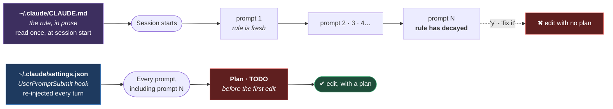

# Agent Setup

**[← Back to Main Documentation](../../README.md)**

This page explains how to configure **your own machine** so the planning rule in
[TASK_PLANNING.md](../03-rules/TASK_PLANNING.md) is actually obeyed on every request.

The files it describes are not in this repository. They live in your home directory —
`~/.claude/CLAUDE.md` and `~/.claude/settings.json` — and they apply to every project
you open, not just this one. That is deliberate, and it is the reason this is a setup
page rather than a rule: the repository cannot enforce a rule on a machine it does not
own.

It matters because the rule in `docs/03-rules/` **was not enough on its own.** That is
not a hypothetical — see [Why This Page Exists](#why-this-page-exists).

## Table of Contents

- [Why This Page Exists](#why-this-page-exists)
- [The Two Layers](#the-two-layers)
- [Step 1: Add The Rule To Your Global CLAUDE.md](#step-1-add-the-rule-to-your-global-claudemd)
- [Step 2: Add The Hook To Your Global settings.json](#step-2-add-the-hook-to-your-global-settingsjson)
- [Verifying It](#verifying-it)
- [What This Does Not Do](#what-this-does-not-do)
- [Practical Outcome](#practical-outcome)

## Why This Page Exists

This repository already carries the planning rule.
[TASK_PLANNING.md](../03-rules/TASK_PLANNING.md) declares `alwaysApply: true`, the root
`CLAUDE.md` `@import`s it, and `scripts/quality/validate-always-apply.mjs` rejects any
commit where those two disagree. By every mechanism the repository has, the rule is in
force.

It was still skipped.

In a long session, the plan was written for the large refactor at the start — and then
not for the short follow-ups that came after it. Prompts like `y`, `fix this file`, or
`do 1 and 3` read as continuations of work already planned, so the edits went ahead
with no plan and no TODO list. The TODO list went stale at that point, and a stale list
stops being a signal.

The failure is not that the rule was missing. It is **where** the rule was. A standing
rule is loaded once, at the start of a session, and its influence fades as the context
fills with code, while the pull of "just make this small change" does not fade at all.

A rule that is read once decays. A rule that is re-stated on every turn cannot.

## The Two Layers

The two files below look like the same rule written twice. They are not: they differ in
**when they are read**, which is the entire point.



**Why it is built this way.** The dotted edge is the whole diagram. Both layers state
the same requirement, so the temptation is to keep one and drop the other as
duplication — and the one that looks redundant is the hook, because the prose version
is the one a human reads. That is exactly backwards. `CLAUDE.md` is read **once**, so
by prompt N it is competing with a context window full of code; the hook is read
**every time**, so prompt N looks identical to prompt 1. Deleting the hook restores the
failure this page exists to describe, and deleting the rule only costs the human-readable
explanation of why the hook is there.

Keep both. They are not the same mechanism wearing two hats — one is a statement, and
the other is a gate.

## Step 1: Add The Rule To Your Global CLAUDE.md

Open `~/.claude/CLAUDE.md` — create it if it does not exist — and add this section. It
applies to every project on the machine, so keep it short: a long rule is a skimmed
rule.

```md
# Plan Before Implementing — No Exceptions

**Every request that will change a file starts with a work plan and a TODO list.
Post them before the first edit. This is a gate, not a preference.**

The plan states: **Goal · Success Criteria · Assumptions · Constraints · Risks.**
Then a TODO list, executed one item at a time, each self-validated before it is
marked complete.

## The rule applies hardest where it feels least necessary

The failure mode is never a big task — those get planned. It is the short
follow-up in an ongoing thread:

> "fix this file" · "remove it" · "do 1 and 3" · "y"

These read like continuations of work already planned. **They are not. Each is a
new request and each gets its own plan**, however small the edit looks.

- **A stale TODO list is worse than none.** Rewrite it at the start of every request.
- **The Assumptions line is the one that earns its keep.** Any decision the user did
  not make — a default value, a file location, which reading of an ambiguous
  instruction is right — goes in Assumptions, _before_ the code, where a "no" is
  still free.

If a request is genuinely trivial, the plan is three lines. Write the three lines.
```

This is the same requirement as [TASK_PLANNING.md](../03-rules/TASK_PLANNING.md), which
governs this repository. The global copy exists so the rule travels to every other
project on your machine, where `docs/03-rules/` does not.

## Step 2: Add The Hook To Your Global settings.json

The hook is what makes the rule unavoidable. A `UserPromptSubmit` hook runs **before
every turn begins** and injects text straight into the model's context — so the gate is
restated on prompt 50 exactly as it was on prompt 1.

Open `~/.claude/settings.json` and merge in the `hooks` key. **Merge — do not
replace.** A malformed `settings.json` silently disables every setting in that file,
including your plugins and your model choice:

```json
{
  "hooks": {
    "UserPromptSubmit": [
      {
        "hooks": [
          {
            "type": "command",
            "command": "echo \"{\\\"hookSpecificOutput\\\":{\\\"hookEventName\\\":\\\"UserPromptSubmit\\\",\\\"additionalContext\\\":\\\"PLANNING GATE - this prompt is a NEW request, even a one-word follow-up (y / fix it / do 1 and 3). Before the first file edit: post a work plan (Goal, Success Criteria, Assumptions, Constraints, Risks) and a fresh TODO list. Any decision the user did not explicitly make goes in Assumptions BEFORE the code, not in the summary after. A stale TODO list is worse than none - rewrite it every request.\\\"}}\"",
            "suppressOutput": true,
            "timeout": 5
          }
        ]
      }
    ]
  }
}
```

Three details in that block are load-bearing:

- **The escaping.** The command is a shell command inside a JSON string that must itself
  print JSON. Hence `\\\"` — a backslash-escaped quote in the settings file, which
  reaches the shell as `\"`, which `echo` prints as `"`. Get this wrong and the hook
  emits text that is not JSON, which the hook system discards without complaint.
- **`hookEventName` must be `UserPromptSubmit`.** The `additionalContext` field is what
  lands in the model's context; without the matching event name it is ignored.
- **`suppressOutput: true`** keeps the injected text out of the transcript. It is
  machinery, not conversation.

The hook fires on the **next** prompt, not the one that installed it. If it does not
appear to fire, open `/hooks` once — that reloads the configuration — or restart Claude
Code.

## Verifying It

A hook that silently does nothing is worse than no hook, so check it rather than
assuming. `jq` is not installed on a default Windows setup, so use Node — which this
repository already depends on:

```bash
node -e "const s=require('os').homedir()+'/.claude/settings.json';const c=JSON.parse(require('fs').readFileSync(s,'utf8'));console.log('parses OK');console.log(c.hooks.UserPromptSubmit[0].hooks[0].command)"
```

Two things must be true, and they are separate failures:

1. **The file parses.** If it does not, every setting in it is silently dropped — not
   just the hook.
2. **The command emits valid JSON.** Run the printed command through `bash` and pipe it
   into `node -e "let s='';process.stdin.on('data',d=>s+=d).on('end',()=>console.log(JSON.parse(s).hookSpecificOutput.hookEventName))"`. It must print
   `UserPromptSubmit`.

Run the command through **bash**, not `cmd.exe`. Claude Code runs hooks through bash,
and `cmd.exe` handles the quoting differently — testing there reports a failure that
does not exist.

Manage the hook afterwards with `/hooks`, which lists, edits, and disables it.

## What This Does Not Do

Stated plainly, so nobody assumes more than is true:

- **It does not block anything.** The hook injects a reminder; it does not reject the
  prompt or refuse the edit. It raises the odds sharply. It is not a compiler.
- **It is not checked by `npm run validate`.** The gates in
  [QUALITY_ARCHITECTURE.md](QUALITY_ARCHITECTURE.md) check files in this repository.
  `~/.claude/` is outside it, so nothing here verifies your machine is configured —
  which is why this page tells you how to check it yourself.
- **It is per-machine.** A teammate who clones this repository gets
  `docs/03-rules/TASK_PLANNING.md` and nothing else. If you want them to have the gate,
  point them at this page.

## Practical Outcome

The planning rule stops depending on how long the session has been running. A one-word
`y` on prompt 50 arrives with the same gate attached as the first request of the day,
so the plan — and specifically the Assumptions line, where an undeclared decision would
otherwise hide until the summary — comes before the code rather than after it.
