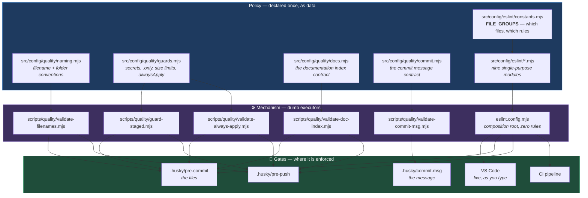
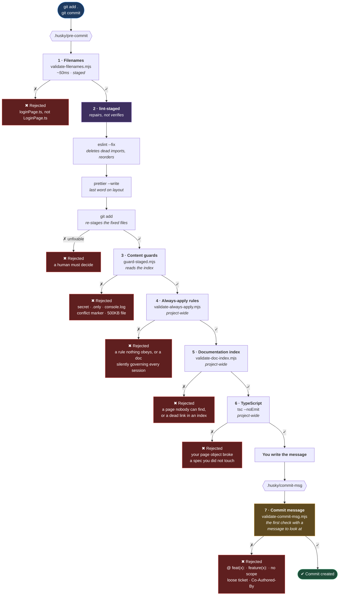
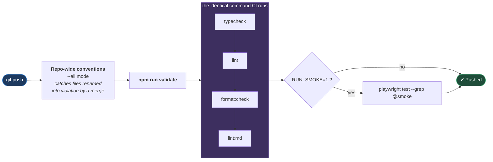
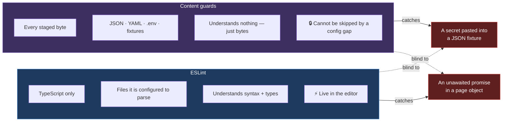
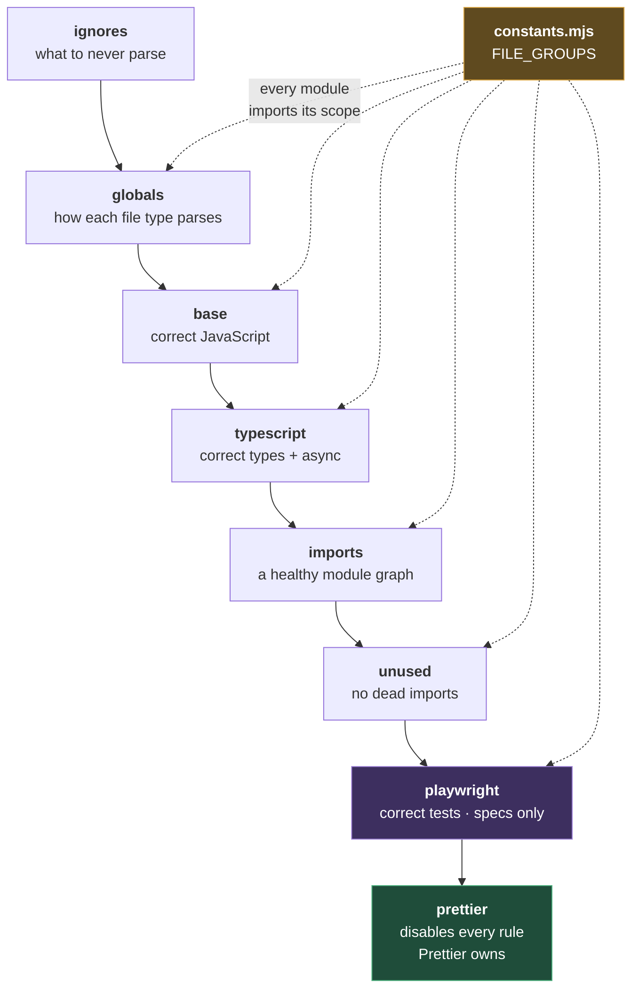
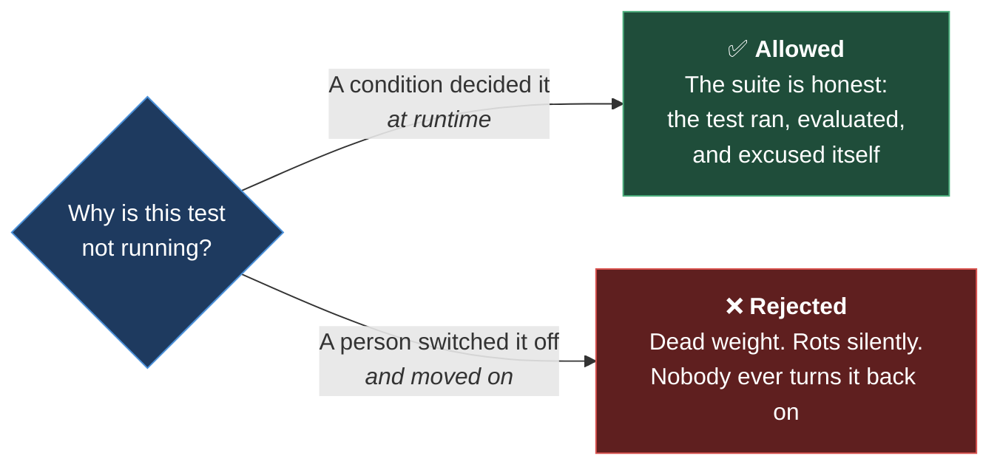

# Quality Architecture

**[← Back to Main Documentation](../../README.md)**

This document explains how the tooling fits together. It is the file to read
before changing any configuration, because almost every file in this repository
depends on at least one other, and the dependencies are not obvious from the
directory listing.

The organising idea is simple:

> **Policy is data. Mechanism is code. Nothing is enforced in two places by accident.**

Every rule the framework enforces is declared once, as data, in `src/config/`.
Everything in `scripts/` and `.husky/` is a dumb executor of that data. When a
rule appears to be enforced twice — `console.log` is banned by both ESLint and
the commit guard — that overlap is deliberate and documented, because the two
layers see different things.

## Table of Contents

- [1. The layers](#1-the-layers)
- [2. The commit path](#2-the-commit-path)
  - [Why this order](#why-this-order)
- [3. The push path](#3-the-push-path)
- [4. Why ESLint and the guards overlap](#4-why-eslint-and-the-guards-overlap)
- [5. ESLint composition](#5-eslint-composition)
  - [What each module owns](#what-each-module-owns)
- [6. The custom rule](#6-the-custom-rule)
- [7. Conventions](#7-conventions)
  - [Import ordering and JSDoc style](#import-ordering-and-jsdoc-style)
- [8. Skipping a test](#8-skipping-a-test)
- [9. Other escape hatches](#9-other-escape-hatches)
- [10. Commands](#10-commands)

---

## 1. The layers



**Why it is built this way.** Changing a convention should be a one-line edit to a
table, not a rewrite of a validator. Adding a new naming rule means appending an
object to `FILE_RULES` — `validate-filenames.mjs` never changes. That table also
turns out to be the documentation engineers actually read, so the policy and its
explanation cannot drift apart.

---

## 2. The commit path

This is what happens between `git commit` and a commit object existing.



### Why this order

**Repair before you judge.** `lint-staged` rewrites files and re-stages them, so
anything running before it is judging bytes that will not be the bytes in the
commit. The guards read the **Git index** precisely so they can judge the commit —
which means they have to run after the last thing that rewrites the index. Put them
first and they inspect a file that lint-staged is about to change.

Filenames are the exception, and can run first: lint-staged fixes contents, it never
renames a file, so its result cannot change the answer. It is also the cheapest
check in the hook, so a badly named file is rejected in ~50ms rather than after a
full lint-and-format pass.

**Step 2 repairs; it does not judge.** ESLint's `--fix` and then Prettier, re-staged
— so the commit contains the _corrected_ file, not the one you wrote. Import order,
dead imports and formatting are machine-decidable, and no engineer should be asked
to fix them by hand. Only what a machine genuinely cannot decide is escalated to a
rejection.

The order **inside** step 2 matters and is easy to get wrong: ESLint runs first
because `--fix` rewrites code (deleting imports, reordering them), which changes
formatting. Prettier runs last so it always has the final word on layout. Reverse
them and every commit leaves badly-formatted code behind.

**Steps 4, 5 and 6 are project-wide, and none can be dropped.** Each one judges
something a staged-scope check is structurally incapable of seeing:

- **Always-apply** compares two files. The edit that breaks it — deleting an
  `@import` from `CLAUDE.md` — leaves the rule's own file untouched, so a
  staged-scope check would miss the one case it exists to catch.
- **Documentation index** has the identical shape. Adding a page and forgetting to
  list it leaves the index file untouched.
- **TypeScript** errors cross file boundaries: editing `loginPage.ts` can break
  `Checkout.spec.ts` without that spec ever being staged. Types are the one thing
  lint-staged's file-scoped view cannot see — which is precisely why `tsc` is here
  and full ESLint is not.

**Step 7 is a different hook, and it has to be.** Every check in `pre-commit` runs
_before the message exists_ — there is nothing for them to look at. `commit-msg` is
the first and only moment at which the message has been written and the commit has
not yet been created.

That gap was not theoretical. This subject was committed and pushed:

```text
@ feat(quality): enforce naming, JSDoc, and agent standards
```

A shell quoting mistake put a stray `@` and a space in front of the type. All six pre-commit
checks passed it, because all six were inspecting files. The stray character is
invisible in a terminal and fatal to anything parsing the type: a changelog generator
reads that subject, fails to match a Conventional Commit, and drops the commit from
the release notes without a word. Fixing it after the push cost a force-push and a
rewrite of published history. Caught at `commit-msg`, it costs one `git commit` —
the staged files stay staged and the message stays in `.git/COMMIT_EDITMSG`.

The format is declared in `src/config/quality/commit.mjs` and documented in
[COMMIT_MESSAGES.md](../03-rules/COMMIT_MESSAGES.md).

---

## 3. The push path

`pre-commit` judges **your staged change**. `pre-push` judges **the whole
repository, exactly as CI will see it**.

That distinction is the entire point. A rebase, a merge, or a colleague's commit
can break the tree without any of _your_ files being involved, and a staged-scope
hook would never notice.



`pre-push` calls `npm run validate` — **the same script CI runs**, not a
copy-pasted list of equivalent commands. Two lists always drift; one script
cannot. A green push is therefore a genuine predictor of a green pipeline.

Smoke tests are opt-in (`RUN_SMOKE=1 git push`, or permanently via
`git config --local hooks.smoke true`). They are the only check here needing a
browser and a reachable environment, so making them mandatory would make pushing
impossible offline.

---

## 4. Why ESLint and the guards overlap

`console.log` is rejected by ESLint _and_ by `guard-staged.mjs`. This looks like
duplication. It is not — the two layers have different reach, and neither is
sufficient alone:



ESLint is precise but narrow: it only ever looks at code it was configured to
parse. The guards are crude but total: they read the staged bytes of every file,
including the JSON fixture where a leaked credential actually lands — a file no
linter would ever open.

**The corollary:** if a check _can_ be an ESLint rule, it should be, because
ESLint gives instant feedback in the editor rather than a rejection minutes later.
Which is why `no-duplicate-titles` is a custom ESLint rule (§6) rather than the
grep it is usually written as.

---

## 5. ESLint composition

`eslint.config.mjs` contains **no rules**. It only declares the order eight
single-purpose modules stack in.

Flat config is an ordered array where later blocks override earlier ones for any
file both match. So the sequence runs widest scope → narrowest:



**`prettier` is last on purpose.** Its only job is to switch off stylistic rules
that would fight the formatter, so it must be able to override everything above
it. Place it earlier and a later module could re-enable a rule Prettier owns —
and then ESLint and Prettier undo each other's work on every save.

**`constants.mjs` is the keystone.** `FILE_GROUPS` is the single answer to "which
files does this rule set apply to". Every module imports its scope from there
instead of hardcoding globs, so adding a top-level folder is one line in one file
rather than a find-and-replace across six configs.

⚠️ `FILE_GROUPS.typed` and the `include` array in `tsconfig.json` **must stay in
sync**. A file ESLint type-checks but tsconfig does not include will fail to parse
with _"The file does not match your project config"_. This is the single most
common way to break the setup.

### What each module owns

| Module           | Owns                                         | Extend it when                         |
| ---------------- | -------------------------------------------- | -------------------------------------- |
| `constants.mjs`  | `FILE_GROUPS`, repo root, tsconfig path      | You add a top-level folder             |
| `ignores.mjs`    | Paths never parsed                           | You add a generated output directory   |
| `globals.mjs`    | Parser + environment wiring                  | Parsing breaks; nothing else           |
| `base.mjs`       | Rules that would hold if TypeScript vanished | The rule needs no type info            |
| `typescript.mjs` | Rules needing the compiler                   | The rule needs type info               |
| `imports.mjs`    | Relationships _between_ modules              | The rule is about the dependency graph |
| `unused.mjs`     | Auto-deletable dead imports                  | Rarely                                 |
| `playwright.mjs` | How a spec must look                         | The rule applies only to tests         |

---

## 6. The custom rule

`src/config/eslint/rules/no-duplicate-titles.mjs` rejects two tests, or two describe
blocks, sharing a title in the same scope.

Duplicate titles matter because Playwright's HTML report, its `--grep` filter and
every CI dashboard key off the title — two tests called `"checkout works"` are
indistinguishable in a failure report.

It is a **lint rule and not a grep**, because duplication is an _AST_ property,
not a text property:

- A regex cannot tell a real `test("login")` from one inside a comment or a
  commented-out block.
- A regex has no idea which describe block a test belongs to, so two tests named
  `"adds an item"` under _different_ describes — which is perfectly legal — would
  be a false positive.

Working on the syntax tree makes both problems vanish. As a bonus, the violation
is underlined in VS Code as you type instead of surfacing at commit time.

Flat config lets a plugin be a plain object, so a house rule needs no npm package,
no build step, and no publishing. To add another: drop a module beside this one,
register it in `rules/index.mjs`, and reference it as `framework/<rule-name>`.

---

## 7. Conventions

**The conventions themselves live in
[docs/03-rules/CONVENTIONS.md](../03-rules/CONVENTIONS.md)** — every filename and
folder rule, what each one is for, and which of them are enforced. They are not
repeated here, because a rule written down twice is a rule that will eventually
disagree with itself.

What belongs on _this_ page is the mechanism. The conventions are declared as data
in `src/config/quality/naming.mjs` and executed by
`scripts/quality/validate-filenames.mjs`, which is the pattern described in §1:

- **Policy** — `naming.mjs` holds a table of rules. Each entry says which paths it
  `appliesTo` and what makes one `isValid`.
- **Mechanism** — `validate-filenames.mjs` walks the files and applies the table. It
  does not know what a page object is, and it never changes when a convention does.
- **Gate** — `.husky/pre-commit` checks the staged files; `.husky/pre-push` checks
  the whole tree with `--all`, which is what catches a file renamed into violation
  by a merge rather than by you.

Adding a convention is therefore appending one object to `FILE_RULES`. That table
also carries a `good` and a `bad` example per rule, which is what the rejection
message prints — so the policy, the enforcement, and the error a contributor
actually reads all come from the same source and cannot drift apart.

---

## 8. Skipping a test

Most frameworks ban `.skip` outright with a grep. That is a mistake, and it is
worth being precise about why: it conflates two things that look identical in
text but are opposites in meaning.



A conditional skip is a **statement of fact** — "this feature does not exist on
WebKit" — and it is self-correcting: the day the condition stops holding, the test
runs again on its own. An unconditional skip is a **decision to stop caring**, and
nothing will ever undo it. Both are `.skip`. Only one is legitimate, and a regex
cannot tell them apart.

So the rule is configured to distinguish them:

```js
"playwright/no-skipped-test": ["error", { allowConditional: true, disallowFixme: true }],
```

### ✅ Accepted — the condition decides

```ts
// Whole file, on an environment condition.
test.skip(process.platform === "win32", "clipboard API unavailable on Windows");

// One test, on a browser condition. The reason is not required, but write one.
test("uploads an avatar", async ({ page, browserName }) => {
  test.skip(browserName === "webkit", "file chooser unsupported — ABC-123");
  await profilePage.uploadAvatar("me.png");
});

// A whole describe block, via the callback form.
test.describe("payments", () => {
  test.skip(({ browserName }) => browserName === "firefox", "Stripe iframe flakes");

  test("accepts a card", async ({ page }) => {
    /* ... */
  });
});

// fixme is fine too — as long as a condition gates it.
test("legacy checkout", async ({ page, browserName }) => {
  test.fixme(browserName === "webkit", "broken since 1.61 — ABC-456");
  /* ... */
});
```

### ❌ Rejected — a person decided

```ts
test("uploads an avatar", async ({ page }) => {
  test.skip(); // no condition: switched off, forever
});

test.skip("uploads an avatar", async ({ page }) => {}); // never runs
test.describe.skip("payments", () => {}); // a whole suite, gone
test.fixme("legacy checkout", async ({ page }) => {}); // "we'll fix it later"
```

`test.fixme` deserves a note. `disallowFixme` is **off** in the plugin's defaults,
which means a suite can be quietly hollowed out one `test.fixme("...", fn)` at a
time while `no-skipped-test` reports nothing. It is turned on here. If a test is
genuinely broken, gate it on a condition and put the ticket in the reason — then
it comes back the moment the condition lifts.

### If you truly must disable a test

There is no flag for it. Delete the test and open a ticket. A deleted test is
visible in the diff and shows up in review; a skipped one is invisible and lives
forever.

---

## 9. Other escape hatches

A gate with no escape hatch gets bypassed with `--no-verify`, which is strictly
worse than no gate. Each hatch is deliberate and narrow:

| Situation                             | Hatch                                                          |
| ------------------------------------- | -------------------------------------------------------------- |
| A secret pattern false-positives      | Append `quality:allow-secret` to the line                      |
| A test is genuinely platform-specific | Conditional skip — see §8                                      |
| TODO/FIXME should block, not warn     | `SETTINGS.blockTodo = true` in `src/config/quality/guards.mjs` |
| Smoke tests should always run on push | `git config --local hooks.smoke true`                          |

There is deliberately **no** hatch for `.only`, for `console.log` in TypeScript,
or for `eslint-disable` on a Playwright rule. Those are the contract.

---

## 10. Commands

| Command                           | Does                                                         |
| --------------------------------- | ------------------------------------------------------------ |
| `npm run validate`                | Everything CI runs: typecheck → lint → format → markdown     |
| `npm run fix`                     | Auto-repair: `lint:fix` then `format`                        |
| `npm run quality` / `quality:fix` | Aliases for the two above                                    |
| `npm run verify:names`            | Filename conventions across the whole tree                   |
| `npm run verify:guards`           | Content guards across the whole tree                         |
| `npm run verify:rules`            | `alwaysApply: true` ⇔ imported by `CLAUDE.md`                |
| `npm run verify:docs`             | Every page linked from its folder's `README.md`              |
| `npm run verify:msg <file>`       | A commit message against the format (what `commit-msg` runs) |
| `npm test`                        | Playwright                                                   |
| `npm run test:smoke`              | `@smoke`-tagged tests only                                   |
