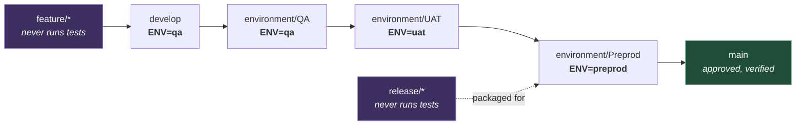
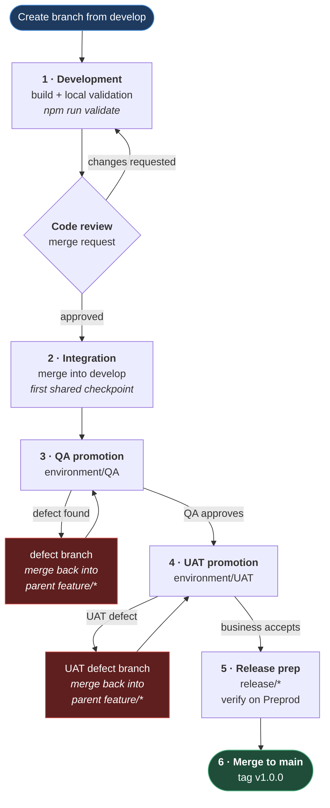

# Branching Strategy

**[← Back to Main Documentation](../../README.md)**

This page defines the branching strategy for the PRODUCT automation framework.

The goal is to keep automation work isolated, traceable, and easy to promote through the supported test environments before merging into `main`.

## Table of Contents

- [Core Principle](#core-principle)
- [Branch Model](#branch-model)
  - [Long-Lived Branches](#long-lived-branches)
  - [Working Branches](#working-branches)
- [Environment Pairing](#environment-pairing)
- [Branch Naming Rules](#branch-naming-rules)
  - [Feature Branches](#feature-branches)
  - [Story And Task Branches](#story-and-task-branches)
  - [Change Request Branches](#change-request-branches)
  - [Support Ticket Branches](#support-ticket-branches)
  - [Bug And Defect Branches](#bug-and-defect-branches)
- [Delivery Flow](#delivery-flow)
- [Branch Governance](#branch-governance)
- [Practical Outcome](#practical-outcome)

## Core Principle

`main` is the source of truth.

All new automation work starts from `develop`. From there, work is promoted through environment branches before landing in `main`:



The four branches in the chain are the only ones that execute Playwright tests, and each is locked to exactly one `ENV`. The purple branches — `feature/*` and `release/*` — never trigger a test run under any pipeline source.

**Why it is built this way.** The pairing is what makes a green pipeline mean something. If `environment/UAT` could be run with `ENV=qa`, a UAT sign-off would be evidence about the QA environment, and the promotion chain would prove nothing. CI enforces the pairing rather than trusting it: a mismatched `ENV` on a protected branch fails validation.

Automation does not run in production. `main` represents approved, verified work.

## Branch Model

### Long-Lived Branches

| Branch                | Purpose                                                                   |
| --------------------- | ------------------------------------------------------------------------- |
| `main`                | Source of truth. Contains approved, released work.                        |
| `develop`             | Integration branch for new automation feature work.                       |
| `environment/QA`      | QA validation branch. Paired with `ENV=qa`.                               |
| `environment/UAT`     | User acceptance validation branch. Paired with `ENV=uat`.                 |
| `environment/Preprod` | Final staging branch for release verification. Paired with `ENV=preprod`. |

### Working Branches

| Branch Type | Purpose                                                            |
| ----------- | ------------------------------------------------------------------ |
| `feature/*` | New automation features, enhancements, and planned fixes.          |
| `support/*` | Work linked to support-driven requirements.                        |
| `release/*` | Final packaging for Preprod verification before merging to `main`. |

## Environment Pairing

The CI pipeline enforces branch-to-environment pairing. Running a pipeline with a mismatched `ENV` on a protected branch will fail validation.

Test execution is only permitted from the four long-lived branches. Feature, support, and release branches never trigger Playwright tests under any pipeline source.

| Branch                | Allowed ENV | Test Execution |
| --------------------- | ----------- | -------------- |
| `develop`             | `qa`        | Yes            |
| `environment/QA`      | `qa`        | Yes            |
| `environment/UAT`     | `uat`       | Yes            |
| `environment/Preprod` | `preprod`   | Yes            |
| `feature/*`           | —           | Never          |
| `support/*`           | —           | Never          |
| `release/*`           | —           | Never          |

Push events to `develop`, `environment/QA`, `environment/UAT`, and `environment/PreProd` run validation only and do not trigger Playwright execution.

Merge request events run validation only. `RUN_PLAYWRIGHT_TESTS` is forced to `false` and no Playwright tests execute.

## Branch Naming Rules

`{}` indicates an optional segment.

### Feature Branches

Use for the main implementation branch for a feature, epic, or scoped automation enhancement.

Format:

```text
feature{/CR-ZZZZ}/PRODUCT-XXXXX/FeatureDescription
```

Source: `develop`

### Story And Task Branches

Use for an individual automation story under a larger feature.

Format:

```text
feature{/CR-ZZZZ}/PRODUCT-XXXXX/PRODUCT-YYYYY-StoryDescription
```

Source: parent `feature/*` branch, or `develop` for a standalone task.

Target: parent `feature/*` branch, or `develop` for standalone work.

### Change Request Branches

Use when multiple automation items belong to one change request.

Format:

```text
feature/CR-ZZZZ-CRDescription
```

Child pattern:

```text
feature/CR-ZZZZ/PRODUCT-XXXXX/PRODUCT-YYYYY-Description
```

### Support Ticket Branches

Use when the automation change comes from support work.

Format:

```text
support{/CR-ZZZZ}{/SUP-XXXXX}/PRODUCT-YYYYY-SupportTicketDescription
```

Source: `develop`

### Bug And Defect Branches

Use when defects are found while the feature is under test.

Developer bug or QA defect:

```text
feature{/CR-ZZZZ}/PRODUCT-XXXXX/PRODUCT-YYYYY-DefectDescription
```

UAT defect:

```text
feature{/CR-ZZZZ}/PRODUCT-XXXXX/UAT-YYYYY-UATDefectDescription
```

Source: the current feature branch under test.

Target: merge back into the parent feature branch before continuing promotion.

## Delivery Flow

The six stages below, and what happens when a stage rejects the work:



**Why it is built this way.** Every rejection path returns to the **parent feature branch**, never to the environment branch where the defect surfaced. Patching `environment/QA` directly would fix the symptom in one environment and leave the feature broken everywhere else — the next promotion would simply carry the same defect forward. Routing fixes back through the feature branch means the correction travels the full chain and gets re-verified at every stage.

### 1. Development And Code Review

1. Create the correct branch from `develop`.
2. Build the automation change and run relevant local validation.
3. Push the branch and open a merge request to the parent feature branch or `develop`.
4. Address review feedback before merge.

Local validation for automation work typically includes:

- `npm run validate`
- targeted Playwright execution for the affected area
- authentication setup if the scenario requires it

### 2. Feature Integration

Completed `feature/*` work is merged into `develop` for integration with other completed automation changes.

This is the first shared checkpoint for cross-feature compatibility, shared fixture impact, and environment collisions.

### 3. QA Promotion

1. Create a merge request from the `feature/*` branch to `environment/QA`.
2. Deploy and validate the automation change in QA.
3. If issues are found, fix them in the appropriate defect branch and merge back into the parent feature branch before promoting again.
4. QA approves the work before UAT promotion.

### 4. UAT Promotion

1. Create a merge request from the `feature/*` branch to `environment/UAT`.
2. Business users validate the change.
3. If UAT defects are found, fix them in a UAT defect branch and merge back into the parent feature branch.
4. Once accepted, the item is ready for Preprod.

### 5. Preprod And Release Preparation

1. Create or update a `release/*` branch for the delivery scope.
2. Promote approved `feature/*` work into the release branch.
3. Deploy the release branch to Preprod for final verification.

Example:

```text
release/1.0.0-SystemAdministration-Module
```

### 6. Release And Merge To Main

1. Finalize the approved release branch.
2. Merge into `main`.
3. Tag the release using semantic versioning.

Example tag:

```text
v1.0.0
```

## Branch Governance

- the user is responsible for creating the correct branch before any work begins — Claude must never create branches on behalf of the user, with no exceptions
- if no feature branch exists when work starts, stop and ask the user to create one before proceeding
- `feature/*` branches are owned by the feature lead developer
- environment branches are owned by designated branch owners
- do not develop directly on `develop`, environment branches, or `main`
- code review is required for all changes
- smoke testing is required at each promotion stage
- QA approval is required before UAT promotion
- business approval is required before release sign-off
- merge defect fixes back into the parent feature branch before continuing promotion

## Practical Outcome

Following this strategy keeps automation work isolated per delivery item, traceable through Jira identifiers, and promoted through real environment verification before reaching `main`.

Each environment branch reflects a known tested state, and `main` only contains work that has passed the full promotion chain.
