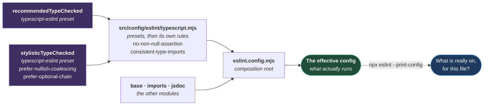

# Code Quality

**[← Back to Rules](README.md)**

This page defines the standards a method must meet before it can be committed. Two
of them: **every method carries a JSDoc block**, and a handful of **syntax rules**
decide how the body of that method is written.

Both are enforced by ESLint, not by review. `src/config/eslint/jsdoc.mjs` declares
the first and `src/config/eslint/typescript.mjs` the second, so a method that breaks
either fails `npm run lint` — underlined in the editor as you write it, and rejected
by `.husky/pre-commit` if you push past that.

For _naming_ — what a file is called and where it lives — see
[CONVENTIONS.md](CONVENTIONS.md).

## Table of Contents

- [Documentation Rules](#documentation-rules)
  - [The Format](#the-format)
  - [Tag Rules](#tag-rules)
  - [Worked Example](#worked-example)
- [Why Private Methods Too](#why-private-methods-too)
- [Why Types Are Not Written In JSDoc](#why-types-are-not-written-in-jsdoc)
- [Syntax Rules](#syntax-rules)
  - [Why ?? And Not ||](#why--and-not-)
  - [Why No Non-Null Assertion](#why-no-non-null-assertion)
- [Import Ordering](#import-ordering)
- [Where The Rules Come From](#where-the-rules-come-from)
- [What Is Enforced](#what-is-enforced)
- [Practical Outcome](#practical-outcome)

## Documentation Rules

**Every method created or modified must have a JSDoc comment. No exceptions,
including private methods and constructors.**

Specs are exempt. A test's title is its documentation, and a `@returns` tag above
`test("logs in", ...)` is noise. The rule is scoped to `src/`.

### The Format

```ts
/**
 * Describes what the method does in one sentence.
 * @param paramName - Description of the parameter.
 * @returns A promise that resolves when <what happens>.
 */
```

### Tag Rules

- **Description.** One sentence, always. It says what the method _does_, not how it
  is implemented.
- **`@param`.** One per parameter, in declaration order, each with a `-` before the
  description. Omit the tag entirely when the method takes no parameters.
- **`@returns`.** Always present on an `async` method. For `Promise<void>`, write
  `A promise that resolves when <outcome>.` Omit `@returns` only on a synchronous
  method returning `void`.
- **No types.** Never write `@param {string} name`. TypeScript already declares the
  type.

### Worked Example

```ts
/**
 * Drives the login screen.
 */
export class LoginPage {
  /**
   * Creates a page object bound to an open browser page.
   * @param page - The Playwright page this object drives.
   */
  constructor(private readonly page: Page) {}

  /**
   * Signs a user in with the supplied credentials.
   * @param username - The account's username.
   * @param password - The account's password.
   * @returns A promise that resolves when the credentials have been submitted.
   */
  async login(username: string, password: string): Promise<void> {
    await this.page.getByLabel("Username").fill(username);
    await this.page.getByLabel("Password").fill(password);
    await this.clickSubmit();
  }

  /**
   * Submits the login form.
   * @returns A promise that resolves when the submit button has been clicked.
   */
  private async clickSubmit(): Promise<void> {
    await this.page.getByRole("button", { name: "Sign in" }).click();
  }
}
```

## Why Private Methods Too

The usual argument is that a private method has no external callers, so nobody needs
its contract. That gets it backwards.

A public method's meaning is legible from its call sites — you can see what a
caller expects of it. A private one has no such witnesses, and it is usually where
the subtle logic ended up: the retry, the wait, the workaround for a flaky widget.
It is the method most in need of a sentence explaining itself, and the one least
likely to get it if the rule carves out an exception.

## Why Types Are Not Written In JSDoc

`jsdoc/no-types` rejects `@param {string} username` outright.

The type is already declared, in the signature, where the compiler checks it. A
JSDoc copy is a second declaration that nothing checks and nobody updates — so the
day the signature changes to `username: UserId`, the JSDoc still says `{string}`
and is now actively lying. Documentation that can drift silently from the code is
worse than no documentation, because it is trusted.

The description is the part a type cannot express. That is why the description is
mandatory and the type is banned.

## Syntax Rules

Most lint rules catch a mistake after you have made it. Five change how you type the
line in the first place, so they are the ones worth knowing before you start:

| Write this          | Not this           | Rule                                               |
| ------------------- | ------------------ | -------------------------------------------------- |
| `a ?? b`            | `a \|\| b`         | `@typescript-eslint/prefer-nullish-coalescing`     |
| `a?.b`              | `a && a.b`         | `@typescript-eslint/prefer-optional-chain`         |
| `import type { X }` | `import { X }`     | `@typescript-eslint/consistent-type-imports`       |
| a checked read      | `value!`           | `@typescript-eslint/no-non-null-assertion`         |
| `(): string`        | an inferred return | `@typescript-eslint/explicit-function-return-type` |

The last three are declared by hand in
[src/config/eslint/typescript.mjs](../../src/config/eslint/typescript.mjs). The first
two are not — they arrive inside a preset, which is the subject of
[Where The Rules Come From](#where-the-rules-come-from).

### Why ?? And Not ||

The two differ on exactly the values a test framework deals in.

`||` falls back on every falsy value, so `""`, `0`, and `false` all count as absent.
`timeout || 30_000` throws away a deliberate `timeout: 0`, and `retries || 3` throws
away `retries: 0` — in both cases silently, and in favour of a default the caller
explicitly overrode.

`??` falls back only on `null` and `undefined`, which is what "not configured"
actually means. The rule exists because the difference between the two only shows up
on the inputs nobody tests.

### Why No Non-Null Assertion

`value!` is you telling the compiler you know the value is there, with nothing
checking that you do. It does not make the value present — it removes the warning
that it might not be.

`src/config/environment/variables/internal/environment.urls.ts` is the worked
example. It read `process.env.PORTAL_BASE_URL!`, which claims a variable is set that
nothing had guaranteed to be set. With the assertion, an unset variable flows on as
`undefined` and surfaces later, somewhere unrelated, as a broken URL. The file now
performs a checked read instead, and an unset variable is rejected by name at the
moment it is resolved.

## Import Ordering

Import ordering is part of the repository's code quality gate. Files in `src/`
must place imports in a consistent order so the dependency graph is easy to scan and
review.

The current ESLint configuration groups imports as follows:

1. Built-in and external modules.
2. Internal modules.
3. Parent, sibling, and index imports.
4. Type-only imports.

The order is alphabetized within each group, and the rule is enforced by
`import/order` in [src/config/eslint/imports.mjs](../../src/config/eslint/imports.mjs).

## Where The Rules Come From

Most of the rules in force are never named anywhere in this repository. They arrive
inside two presets that `src/config/eslint/typescript.mjs` spreads in before it
declares a single rule of its own:



**Why it is built this way.** The presets are the floor, and adopting them wholesale
is deliberate: they are maintained by the typescript-eslint team and they improve
without anyone here doing anything. The cost is that the config no longer tells you
what is enforced. `prefer-nullish-coalescing` is an error in this repository, and
grepping the entire tree for the word "nullish" finds nothing — because the rule is
inside `stylisticTypeChecked`, at
[typescript.mjs:24](../../src/config/eslint/typescript.mjs).

This page therefore does **not** list every rule, and no page should. The two presets
are on the order of a hundred rules between them and they change with each
`typescript-eslint` release, so a hand-copied table would be a second source of truth
that nothing checks — stale at the next `npm update`, and confidently wrong in a way
a reader cannot detect. That is a worse failure than the gap it closes.

Instead: the presets are named above, the rules that shape everyday code are in
[Syntax Rules](#syntax-rules), and the effective config is interrogated directly
rather than trusted:

```bash
npx eslint --print-config src/config/environment/variables/variableValidator.ts
```

That prints every rule and its severity for that one file, presets included. It is
the only answer that cannot go out of date.

## What Is Enforced

The table below covers the JSDoc rules only. It is not the full set — see
[Where The Rules Come From](#where-the-rules-come-from) for the rest.

`src/config/eslint/jsdoc.mjs`, scoped to `src/**/*.ts`:

| Rule                                            | Rejects                                               |
| ----------------------------------------------- | ----------------------------------------------------- |
| `jsdoc/require-jsdoc`                           | A class, method, or function with no block            |
| `jsdoc/require-description`                     | A block with no sentence in it                        |
| `jsdoc/require-param`                           | A parameter with no `@param`                          |
| `jsdoc/require-param-description`               | A `@param` that names but does not describe           |
| `jsdoc/require-returns`                         | An `async` method with no `@returns`                  |
| `jsdoc/require-returns-description`             | A bare `@returns` with nothing after it               |
| `jsdoc/require-hyphen-before-param-description` | `@param name Description` — the `-` is required       |
| `jsdoc/check-param-names`                       | A `@param` naming a parameter that does not exist     |
| `jsdoc/no-types`                                | `@param {string}` — the type belongs in the signature |
| `jsdoc/check-alignment`, `empty-tags`           | A malformed or empty block                            |

`forceReturnsWithAsync` is the load-bearing option on `require-returns`. Without it,
an `async` method returning `Promise<void>` has no `return` statement, so the rule
sees nothing to document and stays silent — leaving exactly the methods whose
completion semantics a caller most needs to understand undocumented.

Check it yourself:

```bash
npm run lint
```

## Practical Outcome

Every method in `src/` states what it does, what it takes, and what it resolves to —
and the standard cannot rot, because a method without a block does not compile past
the linter. The cost is paid at the moment the method is written, which is the only
moment the author still has the context to write the sentence cheaply.
