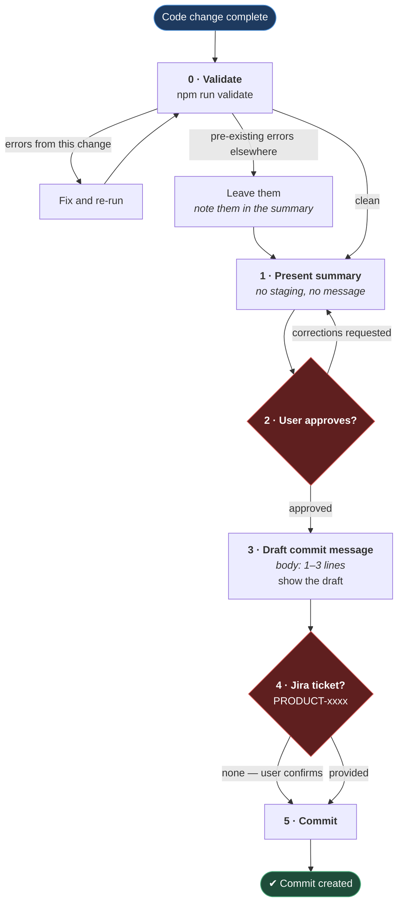

# Commit Workflow

**[← Back to Rules](README.md)**

This page defines the step-by-step workflow Claude must follow before creating a commit.

The goal is to keep the user in control of what gets committed and when. Claude should never commit autonomously without explicit user approval at each gate.

## Table of Contents

- [The Workflow](#the-workflow)
  - [Step 0: Run Validation](#step-0-run-validation)
  - [Step 1: Present Changes for Review](#step-1-present-changes-for-review)
  - [Step 2: Wait for User Approval](#step-2-wait-for-user-approval)
  - [Step 3: Draft the Commit Message](#step-3-draft-the-commit-message)
  - [Step 4: Ask for the Jira Ticket](#step-4-ask-for-the-jira-ticket)
  - [Step 5: Commit](#step-5-commit)
- [Rules](#rules)
- [Practical Outcome](#practical-outcome)

## The Workflow

Two of these steps are gates that only the user can open. They are drawn in red,
because the whole point of the workflow is that Claude stops at them:

**Why it is built this way.** The gates sit _before_ the commit message is written, not after. Once a message exists it reads like a decision already taken, and the review turns into a rubber stamp on work that feels finished. Asking for approval while the change is still just a summary keeps the user's "no" cheap — which is the only thing that makes it a real gate rather than a formality.

The Jira ticket is asked for last, after approval, for the same reason: it is bookkeeping about a change that has already been agreed, and asking earlier invites the user to approve the ticket rather than the code.

### Step 0: Run Validation

Before presenting any changes to the user, run `npm run validate`.

It composes every check the repository has — `typecheck`, `lint`, `format:check`,
`lint:md`, `verify:rules`, and `verify:docs` — so it is the same gate CI runs, under
a different name. `npm run quality` and `npm run ci` are aliases of it.

- If the check passes, proceed to Step 1.
- If errors are found that were introduced by the current change, fix them first and re-run.
- If errors exist in unrelated modules or classes, do **not** fix them. Proceed to Step 1 and include a note:

  > "All requested changes passed validation. The remaining issues are pre-existing in `<ClassName>` / `<module>` and were not introduced by this change."

### Step 1: Present Changes for Review

After completing a code change, summarize what was changed and why before doing anything else.

Do not commit. Do not stage. Do not write a commit message yet.

Present the summary clearly so the user can read and assess the changes.

### Step 2: Wait for User Approval

Ask the user explicitly whether the changes look correct and whether they approve.

Do not proceed to the next step until the user confirms approval.

If the user requests corrections, apply them and return to Step 1.

### Step 3: Draft the Commit Message

Once the user approves the changes, draft a commit message that follows the format in [COMMIT_MESSAGES.md](COMMIT_MESSAGES.md).

The body must be 1–3 lines maximum. Write only the main reason the change was made. Do not list every file or change touched.

If the user asks Claude to write a commit message directly without a prior review, do not write it immediately. First ask:

> "Do you approve the changes? Reply with Y or N."

Only draft the commit message after receiving Y.

Show the draft to the user before committing.

### Step 4: Ask for the Jira Ticket

Ask the user for the Jira ticket number in the format `PRODUCT-xxxx`.

If the user confirms they do not have a ticket number, proceed without it.

Do not guess or invent a ticket number.

### Step 5: Commit

Only after Steps 2, 3, and 4 are complete, create the commit.

## Rules

- Always run `npm run validate` after every change, before presenting results to the user.
- Never commit immediately after making changes, even if the change is small or obvious.
- Never skip the review step because the change looks straightforward.
- Never stage and commit in the same action without presenting a summary first.
- Always show the commit message draft to the user before committing.
- Always ask for the Jira ticket after approval, not before.
- If the user says "commit it" without having reviewed, still show the summary and ask for confirmation.
- If the user asks for a commit message directly, ask "Do you approve the changes? Reply with Y or N." before writing anything.

## Practical Outcome

Following this workflow ensures:

- the user is never surprised by what gets committed
- commit messages are reviewed before they enter git history
- every commit is traceable to a Jira ticket wherever one exists
- Claude does not act autonomously on changes that belong to the user
