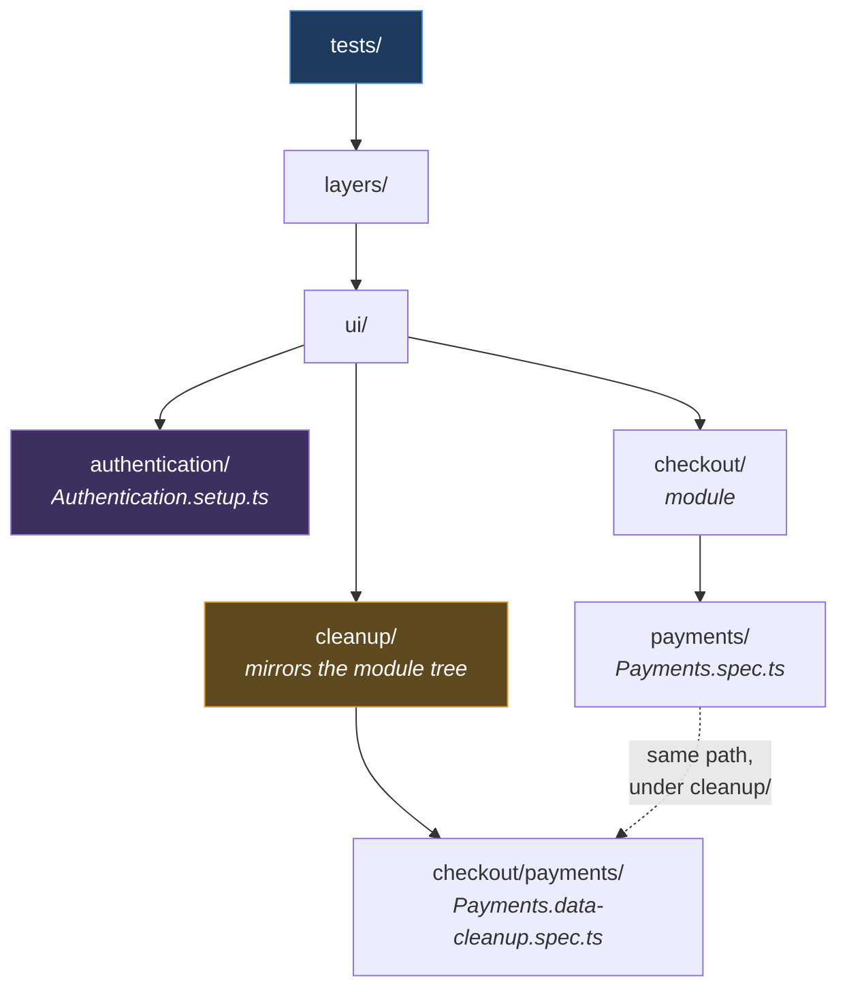

# Conventions

**[← Back to Main Documentation](../../README.md)**

This page is the single source of truth for what a file is called and where it
lives. It covers folders first, then source files, tests, and documentation.

The conventions are declared as data in `src/config/quality/naming.mjs` and enforced
by `.husky/pre-commit`, so most of this page is not advice — it is the behaviour of
a gate you will meet on your next commit.

Two rules carry almost all of it:

> **Folders are lowercase and hyphenated. Files in `src/` are camelCase; files in
> `tests/` are PascalCase.**

For _how_ that enforcement is wired together, see
[QUALITY_ARCHITECTURE.md](../02-tooling/QUALITY_ARCHITECTURE.md). This page says what
the rules are; that page says how they are executed.

## Table of Contents

- [Folders](#folders)
- [Source Files](#source-files)
  - [Why src Is camelCase And tests Is PascalCase](#why-src-is-camelcase-and-tests-is-pascalcase)
- [Test Files](#test-files)
  - [Standard Specs](#standard-specs)
  - [Authentication Setup Specs](#authentication-setup-specs)
  - [Cleanup Specs](#cleanup-specs)
  - [Test Folder Structure](#test-folder-structure)
- [Documentation Files](#documentation-files)
- [Import Ordering And Comment Style](#import-ordering-and-comment-style)
- [The Enforced Patterns](#the-enforced-patterns)
- [What Is Not Enforced](#what-is-not-enforced)
- [Practical Outcome](#practical-outcome)

## Folders

**Every folder under `src/`, `tests/`, and `scripts/` must be lowercase and
hyphen-separated.** No camelCase, no PascalCase, no underscores.

| Good                  | Bad                                  |
| --------------------- | ------------------------------------ |
| `src/test-data/`      | `src/testData/`, `src/test_data/`    |
| `src/error-handling/` | `src/errorHandling/`                 |
| `tests/checkout/`     | `tests/Checkout/`                    |
| `ui/user-profile/`    | `ui/userProfile/`, `ui/UserProfile/` |

This is the convention most often broken by habit, because the code inside these
folders is camelCase and `testData/` therefore feels natural. It is rejected.

**Why.** A path is a URL, a shell argument, and a Git identifier before it is ever a
JavaScript identifier, and case behaves differently in each. Git on Windows treats
`Checkout/` and `checkout/` as the same folder while Git on Linux and CI treats them
as two — so a tree that has drifted into both works perfectly on the machine that
created it and fails in the pipeline, with a diff that looks like nothing happened.
One lowercase rule removes the entire class of problem.

Everything outside `src/`, `tests/`, and `scripts/` — `node_modules/`, `.husky/`,
generated output — is out of scope.

## Source Files

**Everything under `src/` is camelCase.** The file names the module; the thing it
exports keeps its PascalCase name.

| Kind        | Convention               | Good                                              | Bad                                   |
| ----------- | ------------------------ | ------------------------------------------------- | ------------------------------------- |
| Page object | camelCase, `Page` suffix | `loginPage.ts`, `checkoutPage.ts`                 | `LoginPage.ts`, `loginPageObject.ts`  |
| Interface   | `i` prefix + PascalCase  | `iLogin.ts`, `iTestData.ts`                       | `ILogin.ts`, `loginInterface.ts`      |
| Enum        | camelCase + `.enum.ts`   | `userRole.enum.ts`, `environment.enum.ts`         | `UserRole.enum.ts`, `userRoleEnum.ts` |
| Types       | camelCase + `.types.ts`  | `login.types.ts`                                  | `Login.types.ts`, `loginTypes.ts`     |
| Consts      | camelCase + `.consts.ts` | `api.consts.ts`, `timeout.consts.ts`              | `Api.consts.ts`, `apiConsts.ts`       |
| Utility     | camelCase                | `dateUtils.ts`, `apiClient.ts`, `errorHandler.ts` | `DateUtils.ts`, `date-utils.ts`       |
| Tooling     | lowercase, hyphenated    | `guard-staged.mjs`, `no-duplicate-titles.mjs`     | `GuardStaged.mjs`, `guard_staged.mjs` |

The file and its export are not the same name, and that is the point:

```ts
// src/layers/ui/pages/loginPage.ts
export class LoginPage {}

// src/utils/error-handling/errorHandler.ts
export class ErrorHandler {}
```

A dotted suffix names the _kind_ of file, which is why `userRole.enum.ts` is right
and `userRoleEnum.ts` is not: the suffix is metadata about the file and belongs
where a tool can read it, not welded onto the exported name.

The rules are scoped by folder rather than by guesswork. The page-object rule applies
inside a `pages/` folder, the interface rule inside `interfaces/`, and the utility
rule inside `utils/`, `helpers/`, or `clients/`. Tooling means `.mjs` under
`src/config/` or `scripts/` — configuration and executors, not framework code, and
lowercase precisely so it never looks like something a test would import.

### Why src Is camelCase And tests Is PascalCase

The two trees hold different kinds of file, and the naming says which is which
before you open it.

A file in `src/` is a **module**: it exports something, and the import line is where
you read it. camelCase for the file and PascalCase for the export keeps the two
visibly distinct — `import { LoginPage } from "./loginPage"` tells you at a glance
which half is the file and which is the class.

A spec exports nothing. It _is_ the suite, and its name is the suite's name as it
appears in the Playwright report, in `--grep`, and on a CI dashboard. So it takes
the suite's name directly: `Login.spec.ts`, never `login.spec.ts`.

## Test Files

**Everything under `tests/` is PascalCase.**

### Standard Specs

```text
FeatureName.spec.ts
```

```text
tests/layers/ui/checkout/payments/Payments.spec.ts
```

### Authentication Setup Specs

**PascalCase, `.setup.ts` suffix.** These are not tests — they are the setup projects
that produce a signed-in storage state for a user role, and they are wired to those
roles in `playwright.config.ts`:

```text
tests/layers/ui/authentication/Authentication.setup.ts
```

The separate suffix is what keeps them out of a normal test run. A setup file named
`Authentication.spec.ts` would be collected by `npm test` as an ordinary spec and run
in whatever order the runner chose — while every test that depends on the storage
state it produces must run _after_ it, never alongside it.

### Cleanup Specs

**PascalCase, `.data-cleanup.spec.ts` suffix**, mirroring the feature's path under a
`cleanup/` root:

```text
tests/layers/ui/cleanup/checkout/payments/Payments.data-cleanup.spec.ts
```

Cleanup is a spec rather than a fixture teardown because it must be runnable on its
own — after a crashed run, a cancelled pipeline, or a suite that never reached its
teardown. Mirroring the feature's path means the cleanup for a feature is findable
from the feature, with no registry that someone has to remember to update.

### Test Folder Structure

```text
tests/layers/<layer>/<module>/<feature>/<FeatureName>.spec.ts
tests/layers/<layer>/cleanup/<module>/<feature>/<FeatureName>.data-cleanup.spec.ts
```



**Why it is built this way.** The layer sits above the module, not below it, because
the layer decides _how_ a test runs — a UI test needs a browser and a storage state,
an API test needs neither — and that is what the Playwright projects in
`playwright.config.ts` key off. Putting the module first would scatter the UI tests
across a dozen sibling folders, and no project glob could pick them out without
listing every one.

> **Scope, honestly.** `tests/` is **empty**. There is no spec, and no `.setup.ts` file
> for the `setup-auth-state` Playwright project to match. The structure above is the
> target the framework is being built towards, not a tree that exists today. It is
> written down ahead of the code so the first real spec lands in the right place
> instead of setting a precedent by accident.

## Documentation Files

| Kind      | Convention                   | Good                                            | Bad                             |
| --------- | ---------------------------- | ----------------------------------------------- | ------------------------------- |
| Doc       | UPPERCASE + underscores      | `QUALITY_ARCHITECTURE.md`, `COMMIT_MESSAGES.md` | `architecture.md`, `Notes.md`   |
| Skill doc | `<NAME>_SKILL.md` in `docs/` | `REFACTOR_SKILL.md`                             | `SKILL.md`, `refactor-skill.md` |

A bare `SKILL.md` inside `docs/` is rejected: every skill folder would produce an
identically named file, which tells you nothing in a tab bar, a grep result, or a
diff.

> **The skill-doc rule currently guards an empty category.** No page in `docs/`
> documents a skill today. The rule is kept because the moment someone writes a page
> explaining when to reach for `/refactor`, the obvious filename is `SKILL.md` — and
> that is the one name that must not be used here.

**The one exception is an executable skill** — one Claude Code actually runs. It is
not documentation, does not live in `docs/`, and must be named exactly:

```text
.claude/skills/<name>/SKILL.md
```

Claude Code discovers skills by looking for exactly that filename, so a skill named
`REFACTOR_SKILL.md`, or one placed in `docs/`, will never load however well it is
written. This is why the doc naming rules are scoped to `docs/` — widening them would
reject every working skill in the repository.

For how to _write_ a documentation page — structure, frontmatter, diagrams, the
definition of done — see [DOCUMENTATION_PROMPT_GUIDE.md](../DOCUMENTATION_PROMPT_GUIDE.md).

## Import Ordering And Comment Style

Source files in `src/` follow the same layout conventions as the lint rules:

- Imports are grouped and ordered by type: built-in and external modules first,
  then internal modules, then parent/sibling/index imports, and finally type-only
  imports.
- Imports from the same group are sorted alphabetically.
- Comments inside code should be concise, explanatory, and written as full
  sentences when they describe behavior or intent.
- JSDoc comments should avoid writing explicit types in tags such as
  `@param {string}` or `@returns {boolean}`; the signature already carries the
  type information.

This is enforced by ESLint through the import-order and JSDoc rules, so a file that
violates the ordering or comment format will be rejected before it reaches the
branch.

## The Enforced Patterns

These are the literal patterns in `src/config/quality/naming.mjs`. A file that fails
one is rejected by `.husky/pre-commit` before it reaches a branch, and again across
the whole tree by `.husky/pre-push`.

| Rule        | Pattern                                                         |
| ----------- | --------------------------------------------------------------- |
| Folder      | `^[a-z0-9]+(?:-[a-z0-9]+)*$` under `src/`, `tests/`, `scripts/` |
| Spec        | `^[A-Z][A-Za-z0-9]*(?:\.data-cleanup)?$` + `.spec.ts`           |
| Setup spec  | `^[A-Z][A-Za-z0-9]*$` + `.setup.ts`                             |
| Page object | `^[a-z][A-Za-z0-9]*Page$` + `.ts`                               |
| Interface   | `^i[A-Z][A-Za-z0-9]*$` + `.ts`                                  |
| Enum        | `^[a-z][A-Za-z0-9]*$` + `.enum.ts`                              |
| Types       | `^[a-z][A-Za-z0-9]*$` + `.types.ts`                             |
| Consts      | `^[a-z][A-Za-z0-9]*$` + `.consts.ts`                            |
| Utility     | `^[a-z][A-Za-z0-9]*$` + `.ts`                                   |
| Tooling     | `^[a-z0-9]+(?:[-.][a-z0-9]+)*\.mjs$`                            |
| Doc         | `^[A-Z0-9]+(?:_[A-Z0-9]+)*\.md$`                                |
| Skill doc   | `^[A-Z0-9]+(?:_[A-Z0-9]+)*_SKILL\.md$`                          |

Check the whole tree at any time:

```bash
npm run verify:names
```

To change a convention, edit the table in `naming.mjs`. The validator that runs it,
`scripts/quality/validate-filenames.mjs`, never changes — that separation is the
subject of [QUALITY_ARCHITECTURE.md](../02-tooling/QUALITY_ARCHITECTURE.md).

## What Is Not Enforced

Stated plainly, so nobody assumes a green commit means more than it does:

- **Folder _names_ are enforced; folder _structure_ is not.** Nothing stops a spec
  being dropped at `tests/Whatever.spec.ts`. The layer/module/feature tree above is
  held up by review, not by a hook.
- **The `Page` suffix is only checked inside a `pages/` folder.** A page object
  parked elsewhere is invisible to the rule.
- **Nothing checks that a cleanup spec's path mirrors its feature's path.** Only the
  filename is validated.
- **Nothing checks that a class name matches its file.** `loginPage.ts` exporting
  `class Checkout` passes.

Each is a candidate for a rule in `naming.mjs` once the tree is big enough for the
ambiguity to cost something. Until then they are review's job, and saying so beats
implying a guarantee that does not exist.

## Practical Outcome

A file's name tells you what it is, and its path tells you what it belongs to, before
you open either. The parts a machine can check are checked on every commit, so the
tree cannot quietly drift — and the parts it cannot check are listed above rather
than left as a false assurance.
