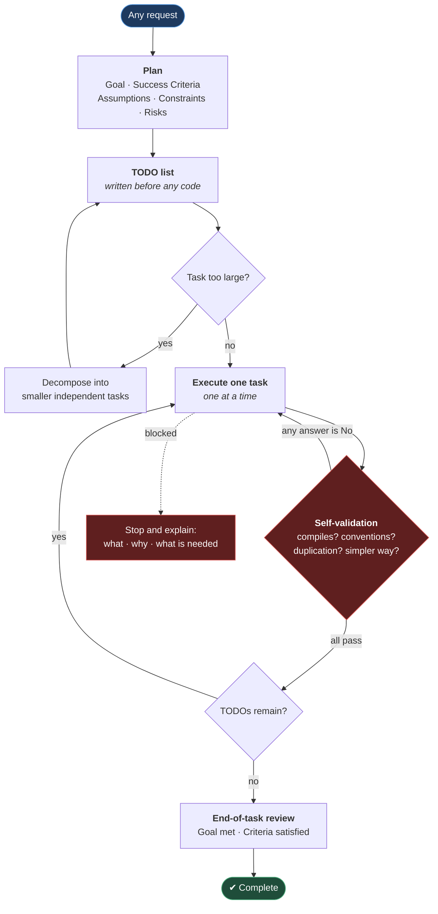

# Task Planning And Execution

**[← Back to Main Documentation](../../README.md)**

This page defines how work is planned and executed in this framework: plan before
implementing, track progress against an explicit TODO list, and validate each task
before moving to the next.

It is a standing rule rather than an on-demand skill. It applies to every request,
not to a command someone chooses to run.

## Table of Contents

- [Mandatory Workflow](#mandatory-workflow)
- [TODO List](#todo-list)
- [Break Down Large Tasks](#break-down-large-tasks)
- [Task Execution](#task-execution)
- [Continuous Progress](#continuous-progress)
- [Self-Validation](#self-validation)
- [End-of-Task Review](#end-of-task-review)
- [Golden Rule](#golden-rule)

## Mandatory Workflow

The loop below is the whole rule. Note that the only edge leaving a task runs
through validation — a task is never "done" because the code was written:



**Why it is built this way.** The two loops back into `Execute` are the load-bearing
part. Without the validation loop, "task complete" means "code written", which is
the failure this rule exists to prevent. The dashed blocked edge is the single
legitimate exit that is not completion — and it requires an explanation, so that
stopping is never silent.

For **every request**, before writing any code or making changes, create a work plan.

Every task must contain:

- **Goal** – the desired end state.
- **Success Criteria** – how completion will be measured.
- **Assumptions** – any assumptions being made.
- **Constraints** – rules that cannot be broken.
- **Risks** – potential issues that may arise.

---

## TODO List

Generate a TODO list before starting work.

Example:

```text
Goal
Improve the Playwright automation framework architecture.

Success Criteria
✓ Professional folder structure
✓ All scripts renamed consistently
✓ Husky integrated with lint-staged
✓ ESLint modularized
✓ Documentation updated

TODO

[ ] Analyze current architecture
[ ] Identify improvements
[ ] Refactor ESLint configuration
[ ] Improve npm scripts
[ ] Improve Husky
[ ] Improve lint-staged
[ ] Add filename validation
[ ] Update documentation
[ ] Verify everything works together
```

---

## Break Down Large Tasks

If a task is large, automatically decompose it into smaller, independent tasks.

Example

```text
Epic
Improve Framework

Task 1
Improve ESLint

Task 2
Improve Husky

Task 3
Improve lint-staged

Task 4
Improve package.json

Task 5
Improve documentation

Task 6
Validate architecture

Task 7
Final review
```

Never attempt to solve a large problem in one step.

---

## Task Execution

Only work on **one task at a time**.

For every completed task:

```text
✓ Completed
```

For every remaining task:

```text
[ ]
```

Example

```text
✓ Analyze project

✓ Refactor ESLint

[ ] Improve Husky

[ ] Improve lint-staged

[ ] Update documentation
```

---

## Continuous Progress

Continue executing tasks until:

- every TODO item is complete
- the Goal has been achieved
- the Success Criteria have been satisfied

Do not stop after completing only part of the work unless:

- the user requests changes
- required information is missing
- a technical blocker is encountered

If blocked, clearly explain:

- what is blocked
- why it is blocked
- what information is needed to continue

---

## Self-Validation

Before marking a task complete, verify:

- Does it compile?
- Does it follow project conventions?
- Does it introduce duplication?
- Is there a simpler solution?
- Is it maintainable?
- Does it violate SOLID?
- Does it violate DRY?
- Does it violate KISS?
- Does it integrate cleanly with the existing architecture?

If any answer is **No**, improve the solution before proceeding.

---

## End-of-Task Review

When all tasks are complete, perform a final review.

Checklist:

```text
✓ Goal achieved

✓ Success Criteria met

✓ No unfinished TODOs

✓ Naming consistent

✓ Documentation updated

✓ No duplicated logic

✓ Architecture remains modular

✓ Code follows project standards

✓ All configurations work together

✓ Ready for production
```

---

## Golden Rule

> **Never jump directly into implementation. Always plan first, create a TODO list, break large work into smaller tasks, execute tasks sequentially, continuously track progress, validate each completed task, and do not stop until the Goal and all Success Criteria have been achieved or a genuine blocker prevents further progress.**

This rule is excellent for coding assistants because it encourages deliberate planning, incremental execution, and verification, leading to more reliable and maintainable results.
