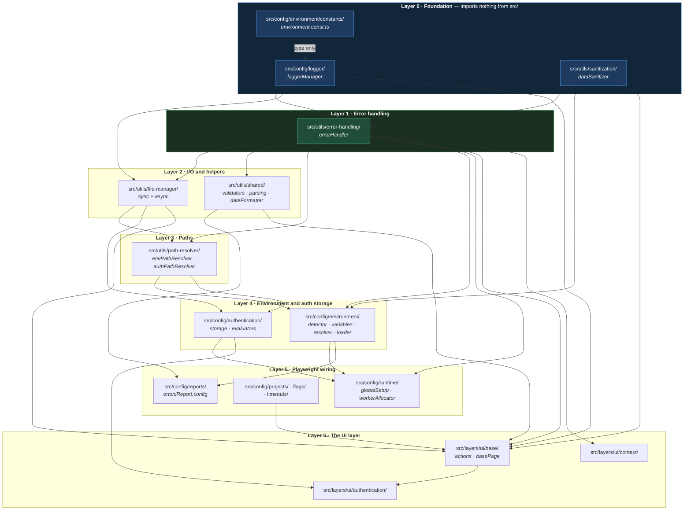
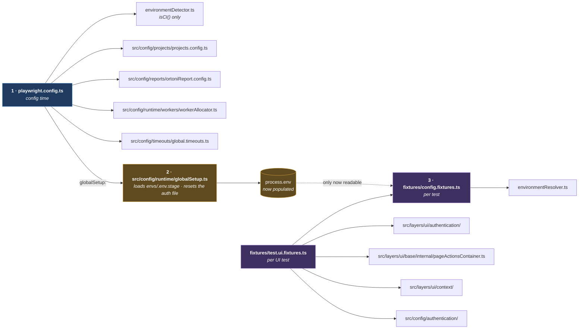
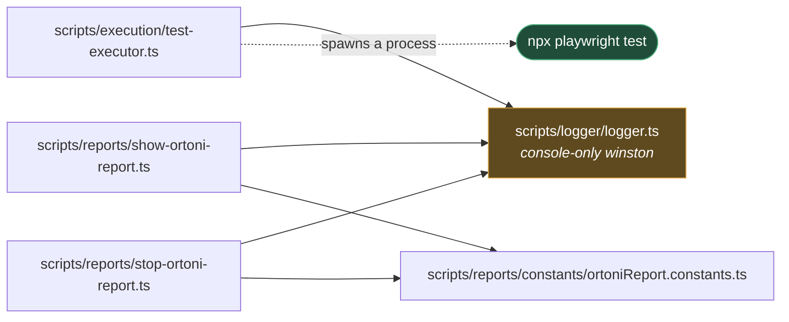

# Architecture

**[← Back to Main Documentation](../../README.md)**

This page is the map of `src/`. It shows which module imports which, the layers that
fall out of those imports, and where the graph is entered when a test actually runs.

It exists because the dependency structure is the one thing you cannot see from the
directory listing. `src/config/` and `src/utils/` and `src/layers/` look like three
peers; they are not. They are a stack, and reading a module without knowing which layer
it sits in is how a helper ends up importing something above it and the import graph
quietly grows a cycle.

**Every edge on this page was taken from an actual `import` statement.** Nothing here
is inferred from a folder name.

## Table of Contents

- [The Rule](#the-rule)
- [The Dependency Map](#the-dependency-map)
- [Why The Graph Points One Way](#why-the-graph-points-one-way)
- [The Layers](#the-layers)
- [The Two Entry Points](#the-two-entry-points)
- [scripts Is A Separate Island](#scripts-is-a-separate-island)
- [What Is Documented So Far](#what-is-documented-so-far)
- [Practical Outcome](#practical-outcome)

## The Rule

One sentence governs the whole graph:

> **A module may import from the layers below it. Never from the layer above.**

Everything else on this page is a consequence of that rule, and the layers below are
not a taxonomy someone imposed — they are what you get when you sort the real imports
by depth.

## The Dependency Map

Read it bottom-up: nothing in Layer 0 knows that Layer 6 exists.

## Why The Graph Points One Way

The shape is not an aesthetic preference. Three things force it.

**The logger has to be reachable from everywhere, so it can reach nowhere.** Almost
every module in `src/` logs, directly or through `ErrorHandler`. A module that
everything imports cannot itself import anything that might import it back — and since
`ErrorHandler` imports the logger, and everything imports `ErrorHandler`, "anything"
here means very nearly the whole tree. That is why the logger's only repository import
is a **type**: types are erased at compile time, so the dashed edge in the map above
does not exist at runtime. [LOGGING.md](foundation/LOGGING.md) covers what happens if that rule is
ever broken — there is a guard, and it throws.

**Sanitization sits beside the logger, not above it.** `DataSanitizer` imports nothing
but its own config. It could have been a utility that logged what it masked; then it
would depend on the logger, the logger's consumers would depend on it, and the two would
be tangled. Keeping it a pure transformation is what lets `ErrorHandler` compose them —
mask _then_ log — instead of one calling the other.

**Everything above Layer 1 gets error handling for free.** By the time you are writing a
file manager, a path resolver, or a UI action, `ErrorHandler.captureError` is already
below you. That is why there is no error handling _inside_ those modules — no bespoke
try/catch conventions, no per-module logger. They all call the same thing, and it is
already built.

The cost of the rule is real and worth naming: a Layer 2 module that needs something
from Layer 4 cannot have it. The value must be passed in by a caller instead. That is
why `EnvironmentResolver` arrives at `LoginCoordinator` as a constructor argument rather
than an import — the UI layer is above the environment layer, and the dependency is
inverted rather than reached for.

## The Layers

| Layer                         | What is in it                                                           | Imports from      |
| ----------------------------- | ----------------------------------------------------------------------- | ----------------- |
| 0 · Foundation                | `src/config/logger/`, `src/utils/sanitization/`, `environment.const.ts` | Nothing in `src/` |
| 1 · Error handling            | `src/utils/error-handling/`                                             | Layer 0           |
| 2 · I/O and helpers           | `src/utils/file-manager/`, `src/utils/shared/`                          | Layers 0–1        |
| 3 · Paths                     | `src/utils/path-resolver/`                                              | Layers 1–2        |
| 4 · Environment, auth storage | `src/config/environment/`, `src/config/authentication/`                 | Layers 0–3        |
| 5 · Playwright wiring         | `src/config/runtime/`, `projects/`, `flags/`, `timeouts/`, `reports/`   | Layers 1–4        |
| 6 · UI layer                  | `src/layers/ui/`                                                        | Layers 0–5        |

`src/config/timeouts/` and `src/config/flags/` are the two odd entries. Neither imports
anything from `src/` at all, so both could sit in Layer 0 — they are listed at Layer 5
because that is where they are _used_, by the Playwright projects and the UI actions.
Nothing depends on the placement.

## The Two Entry Points

The graph above is inert. Two files outside `src/` bring it to life, and they enter at
different points:

**Why it is built this way.** The two entry points do different jobs and enter the graph
at different heights, which is the reason there are two of them rather than one.

`playwright.config.ts` runs **once, before any test**, in the Playwright runner process.
It reaches into Layer 5 only — projects, timeouts, workers, the report — because it is
answering "how should this run be set up?" It never touches the UI layer, and it must
not: there is no browser yet.

**The numbered ordering is a hard constraint, not a description.** The config is
evaluated _before_ `globalSetup` runs — Playwright must read the config to discover that a
global setup exists at all — so at config time **no `.env` file has been loaded yet**. That
is why the config imports `EnvironmentDetector` and calls only `isCI()`: that answer comes
from variables the process already has. It does **not** import `EnvironmentResolver`, and
it cannot: locally, `getPortalBaseUrl()` at config time would read an empty string and
throw on every run.

The rule that falls out of it: **config time may read the process; only test time may read
the `.env` file.** Anything needing a configured value belongs in a fixture.
[ENVIRONMENT_LOADING.md](environment/LOADING.md) has the full sequence.

The fixtures run **per test**, inside the worker — after `globalSetup`, which is what makes
`EnvironmentResolver` safe there. `config.fixtures.ts` is the base every test extends, and
it reaches into Layer 4 for the environment. `test.ui.fixtures.ts` extends _that_ and adds
the UI layer on top — the browser context, the page actions, the login. A test therefore
gets the environment whether it is a UI test or not, and gets a browser only if it asked
for one.

The split is what makes a non-UI layer possible later. An API test would extend
`config.fixtures.ts` and stop there.

## scripts Is A Separate Island

`scripts/` imports **nothing** from `src/`. Not one file.

**Why it is built this way.** These files are CLI wrappers — `npm run test:ui` and
`npm run ortoni-report` run them through `tsx`. They do not participate in a test run;
they _start_ one, as a separate process. Keeping them clear of `src/` means a script
that prints "starting Playwright" does not initialize the framework's logger singleton,
does not create `logs/`, and cannot fail for a reason that belongs to the framework it
is about to launch.

That is also why `scripts/logger/logger.ts` exists as a second, unrelated Winston
instance. [LOGGING.md](foundation/LOGGING.md) sets the two side by side.

The `scripts/quality/` validators are a further island again: they are `.mjs`, they read
their policy from `src/config/quality/`, and they are the subject of
[QUALITY_ARCHITECTURE.md](../02-tooling/QUALITY_ARCHITECTURE.md) rather than this page.

## What Is Documented So Far

The map is complete. The prose behind it is not, and the gap should be visible rather
than implied:

| Layer                 | Page                                                                                                                                                              |
| --------------------- | ----------------------------------------------------------------------------------------------------------------------------------------------------------------- |
| 0 · Foundation        | [LOGGING.md](foundation/LOGGING.md), [SANITIZATION.md](foundation/SANITIZATION.md)                                                                                |
| 1 · Error handling    | [ERROR_HANDLING.md](foundation/ERROR_HANDLING.md)                                                                                                                 |
| 2 · I/O and helpers   | [FILE_MANAGERS.md](utilities/FILE_MANAGERS.md) · [SHARED_UTILS.md](utilities/SHARED_UTILS.md)                                                                     |
| 3 · Paths             | [PATH_RESOLVERS.md](utilities/PATH_RESOLVERS.md)                                                                                                                  |
| 4 · Environment       | [ENVIRONMENT_LOADING.md](environment/LOADING.md) · [ENVIRONMENT_RESOLUTION.md](environment/RESOLUTION.md) · [ENVIRONMENT_VARIABLES.md](environment/VARIABLES.md)  |
| 4 · Auth storage      | [AUTHENTICATION_STORAGE.md](execution/AUTHENTICATION_STORAGE.md)                                                                                                  |
| 5 · Playwright wiring | [PLAYWRIGHT_PROJECTS.md](execution/PLAYWRIGHT_PROJECTS.md) · [WORKER_ALLOCATION.md](execution/WORKER_ALLOCATION.md). `timeouts/` and `reports/`: not written yet. |
| 6 · UI layer          | [04-layers/ui/](../04-layers/ui/README.md) — a section of its own                                                                                                 |

For the layers with no page, **this map is all that is claimed**: the modules are named
and their edges are drawn, because both come from the import statements. Nothing on this
page describes what those modules _do_ — that waits until each one has been read and
documented properly.

**This page has to be updated when a layer changes.** A dependency map is exactly the
kind of document that rots invisibly: a wrong edge does not look wrong. If you add an
import that crosses a layer, the map is now lying, and it is the map — not the code —
that the next contributor will trust.

## Practical Outcome

Before opening a file in `src/`, you can see what it is allowed to depend on and what
depends on it. That answers the two questions that actually cost time: _where does this
value come from_ — look down the stack — and _what breaks if I change this_ — look up
it. And when you add a module, the layer it belongs to is decided by what it imports,
not by which folder felt right.
