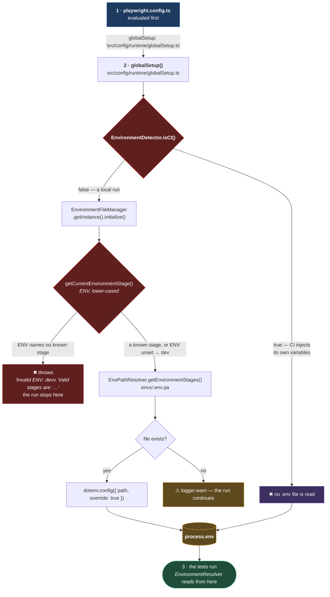

# Environment Loading

**[← Back to Environment](README.md)**

This page covers the **write** half of the environment: how a value in `envs/.env.qa`
ends up in `process.env`, and when. The code lives in
`src/config/environment/constants/`, `src/config/environment/loader/`, and
`src/utils/path-resolver/envPathResolver.ts`.

The **read** half — getting a value back out, from either a `.env` file or a CI
pipeline — is [ENVIRONMENT_RESOLUTION.md](RESOLUTION.md). The two are worth
keeping separate in your head, because **in CI this page does almost nothing**: the
loader deliberately does not run.

## Table of Contents

- [The envs Folder](#the-envs-folder)
- [The Four Stages](#the-four-stages)
- [Where The Load Happens](#where-the-load-happens)
- [Why globalSetup, And Not An Import](#why-globalsetup-and-not-an-import)
- [Why It Is Skipped In CI](#why-it-is-skipped-in-ci)
- [A Missing File Is A Warning, Not An Error](#a-missing-file-is-a-warning-not-an-error)
- [The Singleton](#the-singleton)
- [Practical Outcome](#practical-outcome)

## The envs Folder

Environment files live in `envs/`, one per stage, named `.env.<stage>`. The folder and
the base name are declared once
([environment.const.ts:4-7](../../../src/config/environment/constants/environment.const.ts#L4-L7)):

```ts
export const ENVIRONMENT_CONSTANTS = {
  ROOT: "envs",
  BASE_FILE: ".env",
} as const;
```

Only `envs/.env.example` is committed. It lists the variables a run needs, with dummy
values:

```text
# UI
PORTAL_BASE_URL=portal.base.url

PORTAL_USERNAME=portal.username
PORTAL_PASSWORD=portal.password
```

Copy it to `envs/.env.qa`, fill in the real values, and the QA stage will load it. The
real files are not committed, which is why the example exists at all — it is the only
record of what a `.env` file must contain.

The paths themselves are built by `EnvPathResolver`, which also creates `envs/` on first
access so that a fresh clone works. It is documented in
[PATH_RESOLVERS.md](../utilities/PATH_RESOLVERS.md#envpathresolver).

## The Four Stages

`dev`, `qa`, `uat`, `preprod`
([environment.const.ts:12](../../../src/config/environment/constants/environment.const.ts#L12)).
That list is the single source of truth. It types `EnvironmentStage`, it drives the
paths `EnvPathResolver` generates, and it backs the `isValidStage` type guard — so
adding a stage is one edit to one array, and every consumer follows.

There is no `prod`. Automation does not run against production, which
[BRANCHING_STRATEGY.md](../../01-rules/BRANCHING_STRATEGY.md) states as a rule; the absence
of the stage is that rule made structural.

## Where The Load Happens



**Why it is built this way.** The ordering in that diagram is the whole point, and step 1
is the part that catches people out: **`playwright.config.ts` is evaluated before
`globalSetup` runs.** Playwright has to read the config to know what a global setup even
is.

That means **no value from `envs/.env.qa` is available inside `playwright.config.ts`**. A
line like `baseURL: process.env.PORTAL_BASE_URL` in the config would read `undefined`
locally, every time, and the failure would look like a broken `.env` file rather than a
broken assumption about ordering.

The config is consistent with this. Everything it reads — `HEADED`, `WORKER_PERCENTAGE`,
`SHARD_INDEX`, `TEST_TAGS`, `REPORTER_MERGE`, `CI` — is a **real process variable**, set
by the shell or the pipeline, never by a `.env` file. Values that come from a `.env` file
are read later, per test, through `EnvironmentResolver`. That split is not incidental; it
is what the ordering forces.

## Why globalSetup, And Not An Import

The load could have been a side effect of importing the module. It is a function that
`globalSetup` calls, deliberately.

An import-time load runs when the module is first imported, and _when that happens_ is a
property of the import graph — it changes when someone reorders imports, adds a new one,
or a bundler decides to hoist. A test that passed yesterday would fail today because a
variable was read a moment before the file that defines it was loaded, and nothing in the
diff would say so.

`globalSetup` is a point in time that Playwright guarantees: after the config, before any
test. Putting the load there makes "the environment is loaded" a fact about the run rather
than a fact about the import graph.

`globalSetup` does one other thing at the same time — it writes the empty auth-state file
— and it does both concurrently with `Promise.all`
([globalSetup.ts:51-57](../../../src/config/runtime/globalSetup.ts#L51-L57)). The two are
independent; only the auth file is written unconditionally.

## Why It Is Skipped In CI

`initialize()` returns immediately when `EnvironmentDetector.isCI()` is true
([environmentFileManager.ts:48-50](../../../src/config/environment/loader/environmentFileManager.ts#L48-L50)).
No file is looked for, and none is read.

**Why.** In CI there is no `.env` file to read — the files are not committed, and they
must not be. The pipeline injects configuration as real environment variables instead,
from its own secret store. A CI run that fell back to a `.env` file would either find
nothing, or find a file someone had accidentally committed, and the second outcome is far
worse than the first.

So the two sources are mutually exclusive by design: **local runs read files, CI runs read
injected variables**, and the branch is taken once, at the top.
[ENVIRONMENT_RESOLUTION.md](RESOLUTION.md) covers the matching fork on the read
side — including the fact that CI variables carry a `CI_` prefix and local ones do not.

## A Missing File Is A Warning, Not An Error

If `envs/.env.qa` does not exist, the loader logs a warning and the run continues
([environmentFileManager.ts:178-182](../../../src/config/environment/loader/environmentFileManager.ts#L178-L182)).
It does not throw.

That looks like a swallowed failure, and it is worth being precise about why it is not.
Nothing has gone wrong _yet_: a run may not need any of the variables the file would have
provided. The failure — if there is one — happens when a variable is actually asked for,
and `VariableValidator` rejects it **by name**, saying which one is missing. See
[ENVIRONMENT_VARIABLES.md](VARIABLES.md).

Failing at load time would mean failing on the absence of a file, which is a proxy for the
real problem. Failing at read time means failing on the absence of `PORTAL_BASE_URL`,
which _is_ the real problem, and says so.

`dotenv` is called with `override: true`
([environmentFileManager.ts:130](../../../src/config/environment/loader/environmentFileManager.ts#L130)),
so the file wins over anything already in `process.env`. On a local machine that is what
you want: the `.env` file is the intended source of truth, and a stale variable left over
in a shell should not silently outrank it.

## The Singleton

`EnvironmentFileManager` is a singleton with a private constructor, and `initialize()` is
idempotent — a second call logs and returns
([environmentFileManager.ts:42-46](../../../src/config/environment/loader/environmentFileManager.ts#L42-L46)).

The instance also records which files it loaded, readable through `getLoadedFiles()`, and
logs a warning if it initialized without loading anything at all. That warning is the one
line worth grepping for when a local run behaves as though it has no configuration:
`Environment initialized but no config files were loaded` means the stage resolved, the
path was built, and nothing was there.

## Practical Outcome

On a developer machine, one file per stage under `envs/` is read once, before any test, by
a function Playwright guarantees to call at a known moment. In CI, nothing is read and the
pipeline's own variables stand. Neither run depends on the order of imports, and a missing
file produces a warning that names the file rather than an exception that names nothing.
