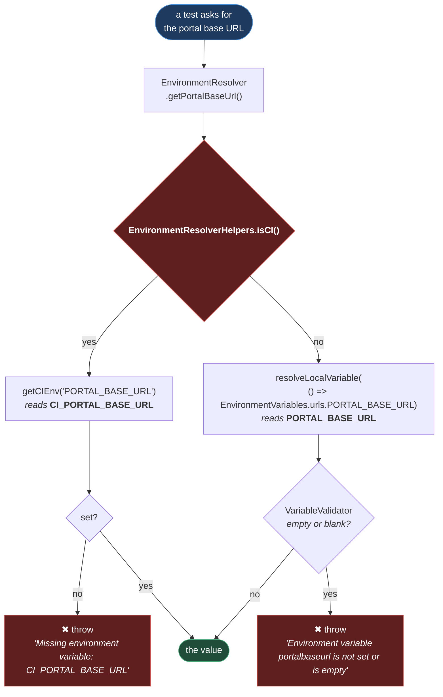

# Environment Resolution

**[← Back to Main Documentation](../../../README.md)**

This page covers `src/config/environment/resolution/` — the two questions the framework
asks about its own surroundings:

- **Which environment is this?** `EnvironmentDetector` — am I in CI, and which stage am I
  targeting.
- **Where does this value come from?** `EnvironmentResolver` — the same question answered
  differently in CI and locally.

It sits between [ENVIRONMENT_LOADING.md](LOADING.md), which puts values into
`process.env`, and [ENVIRONMENT_VARIABLES.md](VARIABLES.md), which types and
validates them on the way out.

## Table of Contents

- [EnvironmentDetector](#environmentdetector)
- [The Two Sources](#the-two-sources)
- [The CI\_ Prefix](#the-ci_-prefix)
- [EnvironmentResolver](#environmentresolver)
  - [Why The Getters Are Lazy](#why-the-getters-are-lazy)
- [What playwright.config.ts May Read](#what-playwrightconfigts-may-read)
- [Practical Outcome](#practical-outcome)

## EnvironmentDetector

Four static methods, no state, and the only module in `src/` that is allowed to have an
opinion about where the process is running.

| Method                               | Answers                                                                                                                                            |
| ------------------------------------ | -------------------------------------------------------------------------------------------------------------------------------------------------- |
| `isCI()`                             | Is this a pipeline? Checks `CI` **and** the vendor variables for GitHub, GitLab, Travis, CircleCI, Jenkins, and Bitbucket.                         |
| `getCurrentEnvironmentStage()`       | Which stage? `process.env.ENV`, then `NODE_ENV`, then `"dev"` — validated against the four stages, falling back to `dev` if it is not one of them. |
| `isQA()` / `isUAT()` / `isPreprod()` | Convenience wrappers over the above.                                                                                                               |

**Why `isCI` checks seven variables and not one.** `CI` is a convention, not a standard,
and not every runner sets it. A detector that returned `false` on a runner that only sets
`JENKINS_URL` would take the _local_ branch in a pipeline — which means it would go looking
for a `.env` file that is not committed, find nothing, and fail with a message about a
missing file rather than a missing pipeline variable. The list is long because the cost of a
false negative is a confusing failure in the one place nobody can attach a debugger.

`getCurrentEnvironmentStage()` never throws
([environmentDetector.ts:25-28](../../../src/config/environment/resolution/detector/environmentDetector.ts#L25-L28)).
An unrecognised `ENV` silently becomes `dev` rather than failing the run. That is a
deliberate leniency at _detection_ time — the strictness lives at _read_ time, where a
variable that is actually needed and actually missing is rejected by name.

## The Two Sources

Every configured value has two possible homes, and which one is real depends on where the
run is happening:



**Why it is built this way.** The branch exists because the two environments genuinely have
different sources, and neither can be made to look like the other.
[ENVIRONMENT_LOADING.md](LOADING.md) explains the write side: locally a `.env`
file is read into `process.env`; in CI nothing is read, because the pipeline has already
injected its own variables from a secret store.

The alternative — one code path, reading `process.env` blindly — would work right up until a
variable was missing, and then it would be unable to say _which_ source was supposed to have
provided it. Branching on `isCI()` means the error message can name the exact variable the
_current_ environment was expected to set, which is the difference between a five-minute fix
and an afternoon.

Both branches end in a validator. A misconfigured pipeline and an incomplete `.env` file both
fail at the moment the value is resolved — not mid-test, three steps into a flow, as an
`undefined` in a URL.

## The CI\_ Prefix

This is the detail most likely to cost someone an hour, so it gets its own section.

**The same value has a different variable name in CI than it does locally.**

| Value           | Locally, in `envs/.env.qa` | In CI, injected by the pipeline |
| --------------- | -------------------------- | ------------------------------- |
| Portal base URL | `PORTAL_BASE_URL`          | `CI_PORTAL_BASE_URL`            |
| Portal username | `PORTAL_USERNAME`          | `CI_PORTAL_USERNAME`            |
| Portal password | `PORTAL_PASSWORD`          | `CI_PORTAL_PASSWORD`            |

The prefix is applied by `toCIKey`, and `getCIEnv` composes it with the required-read
([environmentResolver.helpers.ts:110-125](../../../src/config/environment/resolution/resolver/internal/environmentResolver.helpers.ts#L110-L125)):

```ts
public static getCIEnv(key: string): string {
  return EnvironmentResolverHelpers.getRequiredEnv(
    EnvironmentResolverHelpers.toCIKey(key),
  );
}
```

So `ENV_KEYS.PORTAL.PORTAL_BASE_URL` is the string `"PORTAL_BASE_URL"`, and in CI it is read
as `"CI_PORTAL_BASE_URL"`. **A pipeline that sets `PORTAL_BASE_URL` and not
`CI_PORTAL_BASE_URL` will fail**, with `Missing environment variable: CI_PORTAL_BASE_URL` —
which at least names what it wanted.

The prefix is a namespace. A CI runner's environment is shared and crowded, and a bare
`PORTAL_USERNAME` there could collide with a variable set by an unrelated job, a base image,
or the runner itself. Prefixing puts this framework's configuration in a space nothing else
writes to.

## EnvironmentResolver

The public surface is two methods
([environmentResolver.ts](../../../src/config/environment/resolution/resolver/environmentResolver.ts)):

| Method                   | Returns                                     |
| ------------------------ | ------------------------------------------- |
| `getPortalBaseUrl()`     | The portal URL, from CI or the `.env` file. |
| `getPortalCredentials()` | A validated `{ username, password }`.       |

`EnvironmentResolverHelpers` holds the mechanics — the CI/local readers, the validator calls,
and two small string converters (`toKey`, `toMethod`) that turn a label like `"Portal Base
URL"` into the key and method name the validator reports in its errors.

The class is deliberately thin. It is the one place a test-facing consumer touches the
environment, and it is reached through a fixture rather than an import
([config.fixtures.ts:19-21](../../../fixtures/config.fixtures.ts#L19-L21)):

```ts
environmentResolver: async ({}, use) => {
  await use(new EnvironmentResolver());
},
```

Adding a new configured value means adding a key to `ENV_KEYS`, a getter to the variables
module, and a method here. The pattern does not change.

### Why The Getters Are Lazy

`getPortalBaseUrl` does not pass a _value_ to the helper. It passes a **function**
([environmentResolver.ts:19](../../../src/config/environment/resolution/resolver/environmentResolver.ts#L19)):

```ts
EnvironmentResolverHelpers.resolveLocalVariable(
  () => EnvironmentVariables.urls.PORTAL_BASE_URL,
  "Portal Base URL",
);
```

That arrow function is the load-bearing character in the line. `EnvironmentVariables.urls` is
an object of **getters**, so reading `.PORTAL_BASE_URL` executes `process.env[...]` _at the
moment it is read_ — and wrapping it in a callback defers that read until the helper actually
wants it.

Without the laziness, the read would happen when the argument was evaluated, which is fine
here but would not be if the module were ever touched before `globalSetup` had run. The
getters exist to survive exactly that, and
[ENVIRONMENT_VARIABLES.md](VARIABLES.md#why-they-are-getters) covers why.

## What playwright.config.ts May Read

`playwright.config.ts` imports exactly one thing from this module: `EnvironmentDetector`
([playwright.config.ts:2](../../../playwright.config.ts#L2)). It calls `isCI()` and uses the
answer to decide retries, `forbidOnly`, the reporter, and the video and screenshot modes.

It does **not** import `EnvironmentResolver`, and it must not.

**Why.** The config is evaluated before `globalSetup` runs, so at that moment no `.env` file
has been read. `EnvironmentDetector.isCI()` is safe there because it reads variables the
_process_ already has — `CI`, `GITHUB_ACTIONS`, and the rest are set by the runner, not by a
file. `EnvironmentResolver.getPortalBaseUrl()` would not be safe: locally it would read an
empty string and throw, on every run, before a single test had started.

This is the practical consequence of the ordering in
[ENVIRONMENT_LOADING.md](LOADING.md#where-the-load-happens), and it is the rule to
remember when adding anything to the config:

> **Config time may read the process. Only test time may read the `.env` file.**

Anything that needs a `.env` value belongs in a fixture, where `EnvironmentResolver` already
is.

## Practical Outcome

A test asks for the portal URL and gets it, without knowing or caring whether it came from a
file on a laptop or a secret in a pipeline. When it is missing, the error names the variable
the _current_ environment was supposed to set — `CI_PORTAL_BASE_URL` in a pipeline,
`PORTAL_BASE_URL` locally — rather than reporting an `undefined` several frames later. And the
one rule that keeps the whole thing coherent is that the Playwright config, which runs before
any of it is loaded, only ever asks _where am I_, never _what is configured_.
