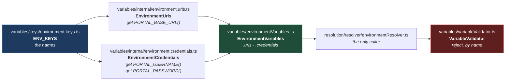

# Environment Variables

**[← Back to Main Documentation](../../../README.md)**

This page covers `src/config/environment/variables/` — the typed surface between
`process.env`, which is a bag of possibly-undefined strings, and the rest of the framework,
which needs a `string`.

Three things live here, and they are best read as three answers to one question — _how do
you read an environment variable without lying about it?_

- **`ENV_KEYS`** — the names, declared once.
- **`EnvironmentVariables`** — the reads, as lazy getters.
- **`VariableValidator`** — the rejection, by name, when a value is not there.

## Table of Contents

- [The Problem This Solves](#the-problem-this-solves)
- [ENV_KEYS](#env_keys)
- [EnvironmentVariables](#environmentvariables)
  - [Why They Are Getters](#why-they-are-getters)
- [VariableValidator](#variablevalidator)
  - [Why Not A Non-Null Assertion](#why-not-a-non-null-assertion)
  - [Sanitizing In CI](#sanitizing-in-ci)
- [Adding A Variable](#adding-a-variable)
- [Practical Outcome](#practical-outcome)

## The Problem This Solves

`process.env.PORTAL_BASE_URL` has type `string | undefined`. Every consumer therefore has to
do something about the `undefined`, and there are only three options:

| The consumer writes                 | And gets                                                           |
| ----------------------------------- | ------------------------------------------------------------------ |
| `process.env.PORTAL_BASE_URL!`      | A lie. The value may still be absent; only the warning is gone.    |
| `process.env.PORTAL_BASE_URL ?? ""` | An empty string flowing into a URL, failing later, somewhere else. |
| A checked read                      | The right answer — written out again at every call site.           |

The third is correct and nobody does it consistently, which is why this folder exists: it
does the checked read **once**, and hands out a `string`.

The first option is not hypothetical. `environment.urls.ts` used to read
`process.env.PORTAL_BASE_URL!`, and [CODE_QUALITY.md](../../01-rules/CODE_QUALITY.md#why-no-non-null-assertion)
uses that exact line as its worked example of why the non-null assertion is banned.

## ENV_KEYS

Every variable name the framework knows, in one object
([environment.keys.ts](../../../src/config/environment/variables/keys/environment.keys.ts)):

```ts
export const ENV_KEYS = {
  PORTAL: {
    PORTAL_BASE_URL: "PORTAL_BASE_URL",
    USERNAME: "PORTAL_USERNAME",
    PASSWORD: "PORTAL_PASSWORD", // quality:allow-secret — the variable's name, not its value.
  },
} as const;
```

A string like `"PORTAL_USERNAME"` is written **once**, here. Nothing else in `src/` types it
out. A typo in a variable name is otherwise undetectable — `process.env.PORTAL_USERNMAE` is
valid TypeScript that returns `undefined` forever — and centralising the names is the only
thing that turns that class of bug into a compile error.

The keys are also what the CI path builds on: `getCIEnv` prefixes them with `CI_`, so
`ENV_KEYS.PORTAL.USERNAME` is read as `CI_PORTAL_USERNAME` in a pipeline. See
[ENVIRONMENT_RESOLUTION.md](RESOLUTION.md#the-ci_-prefix).

The `PASSWORD` line carries a `quality:allow-secret` comment. It is a **variable name**, not a
value — a secret-scanning guard would otherwise flag it, and the comment records that the
exemption was a decision rather than an oversight.

## EnvironmentVariables

`EnvironmentVariables` is a two-line facade
([environmentVariables.ts](../../../src/config/environment/variables/environmentVariables.ts)) over
two grouped objects:



**Why it is built this way.** URLs and credentials are split because they are handled
differently everywhere downstream: credentials are validated as a **pair** (a username with
no password is not half-valid, it is invalid), and credentials are what
[SANITIZATION.md](../foundation/SANITIZATION.md) masks. Keeping them in separate objects means
`EnvironmentVariables.credentials` names the sensitive group, and the grouping is available to
anything that needs to treat it specially.

The facade exists so a consumer writes `EnvironmentVariables.credentials.PORTAL_USERNAME` and
imports one thing. Both underlying objects live in `internal/`, and nothing outside this folder
imports them directly.

### Why They Are Getters

Every value in both objects is a **getter**, not a property
([environment.urls.ts:16-18](../../../src/config/environment/variables/internal/environment.urls.ts#L16-L18)):

```ts
export const EnvironmentUrls = {
  get PORTAL_BASE_URL(): string {
    return process.env[ENV_KEYS.PORTAL.PORTAL_BASE_URL] ?? "";
  },
} as const;
```

This is the single most important line in the module, and it is easy to read straight past.

A plain property — `PORTAL_BASE_URL: process.env[...] ?? ""` — would be evaluated **when the
module is first imported**. And this module may well be imported before `globalSetup` has run
`dotenv`, because import order is decided by the import graph, not by the run. The value would
be captured as `""`, permanently, and no amount of loading afterwards would change it: the
`.env` file would be read correctly, `process.env` would be correct, and the framework would
still be holding the empty string it captured earlier.

A getter defers the read to the moment of access, which is always inside a test, which is
always after the load. The laziness is what makes the whole loading sequence in
[ENVIRONMENT_LOADING.md](LOADING.md) actually work.

Note also what an unset variable becomes: `?? ""`, an empty string — **not** `undefined`. That
is not sloppiness; it is the hand-off. The empty string is what `VariableValidator` is built to
reject, and it rejects it by name.

## VariableValidator

Three methods, one job: make sure a value that is supposed to be there is there
([variableValidator.ts](../../../src/config/environment/variables/variableValidator.ts)).

| Method                                                                     | Does                                                                                             |
| -------------------------------------------------------------------------- | ------------------------------------------------------------------------------------------------ |
| `getEnvironmentVariable(getValue, variableName, methodName, errorMessage)` | Calls the getter, rejects an empty or whitespace-only value **by name**, and returns a `string`. |
| `verifyCredentials({ username, password })`                                | Rejects the pair if **either** half is missing.                                                  |
| `validateEnvironmentVariable` (private)                                    | The blank check itself.                                                                          |

`getEnvironmentVariable` takes a **function**, not a value — the same laziness described above,
carried one level further so that the read happens inside the validator's own `try` block and a
failure is captured with the right context.

### Why Not A Non-Null Assertion

A checked read costs four lines and a non-null assertion costs one character, so the assertion
is tempting. What it buys is silence, not safety.

`process.env.PORTAL_BASE_URL!` tells the compiler the value is present. It does not make it
present. When it is absent, `undefined` flows onward, and the failure surfaces somewhere
unrelated — as a navigation to the string `"undefined"`, or a login with an empty password that
the application rejects for a reason that has nothing to do with the real cause. The stack trace
points at the symptom.

The validator inverts that: the failure happens **at the moment the value is resolved**, and the
message names the variable. `Environment variable portalbaseurl is not set or is empty` is
actionable in the time it takes to read it.

That variable name comes from `toKey("Portal Base URL")`, which is why it appears lowercased and
without spaces — the human-readable label is turned into the reported key by
`EnvironmentResolverHelpers`.

### Sanitizing In CI

One behaviour is easy to miss: `getEnvironmentVariable` passes string values through
`DataSanitizer.sanitizeString` **only when running in CI**
([variableValidator.ts:29-33](../../../src/config/environment/variables/variableValidator.ts#L29-L33)).

`sanitizeString` strips ANSI escape sequences, quotes, backslashes, and angle brackets. It does
not mask anything — see [SANITIZATION.md](../foundation/SANITIZATION.md#the-four-public-methods). The effect
is defensive cleaning of a value that arrived from a pipeline's secret store, where quoting is a
common source of corruption, rather than any kind of secrecy.

It is worth knowing simply because it means **a value can differ between a local run and a CI
run**: a URL containing a quote would keep it locally and lose it in CI.

## Adding A Variable

The pattern is fixed, and it is four edits:

1. Add the name to `ENV_KEYS`.
2. Add a **getter** to `EnvironmentUrls` or `EnvironmentCredentials`.
3. Add a method to `EnvironmentResolver` that branches on `isCI()` — see
   [ENVIRONMENT_RESOLUTION.md](RESOLUTION.md#environmentresolver).
4. Add the variable to `envs/.env.example`, so the next person knows it is needed.

And in CI, set it **with the `CI_` prefix**. Forgetting step 4 is the one with no error
message — the example file is the only record of what a `.env` must contain.

## Practical Outcome

A consumer asks for `PORTAL_BASE_URL` and receives a `string` — never `undefined`, never an
empty string that will fail somewhere else. The variable's name is written once, so a typo is a
compile error rather than a permanent `undefined`. The read happens when it is asked for rather
than when the module happened to be imported, so it cannot be captured before the `.env` file is
loaded. And when the value genuinely is not configured, the run stops at that moment and says
which variable it wanted.
