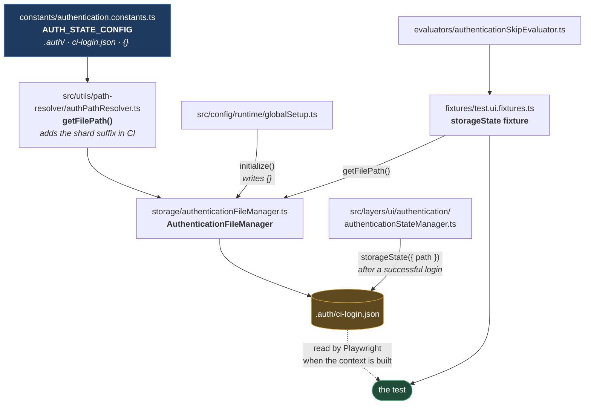

# Authentication Storage

**[← Back to Main Documentation](../../../README.md)**

This page covers `src/config/authentication/` — the **file** that holds a signed-in session,
and the code that resolves, resets, and writes it.

It is deliberately not about _logging in_. The login flow — who drives the form, when it runs,
what the coordinator does — is [04-layers/ui/AUTHENTICATION.md](../../04-layers/ui/AUTHENTICATION.md).
This page is the storage underneath it: one file on disk, and the four questions worth asking
about it. Where does it live, what is in it, who writes it, and who is allowed to ignore it.

## Table of Contents

- [The File](#the-file)
- [Who Touches It](#who-touches-it)
- [Why It Is Emptied Before Every Run](#why-it-is-emptied-before-every-run)
- [One File Per Shard](#one-file-per-shard)
- [The Skip Evaluator](#the-skip-evaluator)
- [Credentials](#credentials)
- [Practical Outcome](#practical-outcome)

## The File

Everything about its location is declared as data, in one object
([authentication.constants.ts](../../../src/config/authentication/constants/authentication.constants.ts)):

```ts
export const AUTH_STATE_CONFIG = {
  ROOT_DIRECTORY: ".auth",
  CI_AUTH_FILE: "ci-login.json",
  EMPTY_STATE: "{}",
  CI_SHARD_PREFIX: "ci-login-shard-",
} as const;
```

So the file is `.auth/ci-login.json`, and its empty form is the literal string `{}`.

Its contents are not this framework's format — it is whatever
`page.context().storageState()` produces: the cookies and `localStorage` of a signed-in
browser context. Playwright writes it, and Playwright reads it back when a context is created
with `storageState: <path>`.

`.auth/` is gitignored and is created on first access rather than being expected to exist, so a
fresh clone runs without it. That, and the construction of the path itself, belongs to
`AuthenticationPathResolver` — see [PATH_RESOLVERS.md](../utilities/PATH_RESOLVERS.md#authenticationpathresolver).

## Who Touches It



**Why it is built this way.** Three different callers need the path — global setup, the state
manager after a login, and the fixture that hands it to each test — and they run in three
different processes at three different times. None of them may compute it themselves.

If the path were built independently in each place, a change to the shard suffix would have to
land in three files, and getting it wrong in one of them produces the worst class of bug
available here: the login writes to one path and the tests read from another, so every test
starts signed out and fails as though the credentials were wrong. `AuthenticationPathResolver`
is the single answer, and `AuthenticationFileManager` is the only thing that calls it.

## Why It Is Emptied Before Every Run

`globalSetup` calls `AuthenticationFileManager.initialize()`, which writes the string `{}` to
the file ([authenticationFileManager.ts:58-77](../../../src/config/authentication/storage/authenticationFileManager.ts#L58-L77)).
The setup project then overwrites it with a real session a moment later.

Writing an empty file, only to replace it, looks like waste. It does two things:

**It guarantees the path exists.** Playwright resolves `storageState` when it builds a browser
context, and a path pointing at nothing is an error. The file must be there and must be valid
JSON before any test runs — hence `{}`, the smallest valid storage state, which Playwright
reads as "no cookies, no local storage".

**It makes a stale session impossible.** Without the reset, yesterday's `ci-login.json` would
still be on disk. If the setup project then failed — a network blip, a bad password — the
browser projects would fall over to yesterday's file. With a session that had since expired,
the tests would run, hit a login wall, and fail with errors about missing elements. The real
cause would be a setup failure two hundred lines earlier in the log.

Emptying the file first means a failed login produces tests that are _definitely_ signed out,
which fails loudly, rather than tests that are _maybe_ signed in, which fails confusingly.

`initialize()` is guarded by an `initialized` flag and is a no-op on a second call; `reset()`
clears the flag, and `resetSync()` is the blocking variant for a context where `await` is not
available.

## One File Per Shard

In a sharded CI run the filename carries the shard index — `.auth/ci-login-shard-2.json` rather
than `.auth/ci-login.json`. How that name is constructed, and when the suffix applies, is
[PATH_RESOLVERS.md](../utilities/PATH_RESOLVERS.md#the-shard-suffix).

**Why it changes at all.** Every shard is a separate Playwright process, and every shard runs its own
`setup-auth-state` project. Without the suffix, all of them would log in and write to the same
path at the same time. A storage-state file half-written by one shard and read by another is
not a session — it is truncated JSON, and the failure would be intermittent, unreproducible
locally, and different on every run. Giving each shard its own file removes the race rather
than trying to survive it.

## The Skip Evaluator

`AuthenticationSkipEvaluator` answers one question for the `storageState` fixture: should this
test start signed out?

It reads the tags from **two** sources and unions them
([authenticationSkipEvaluator.ts:32-38](../../../src/config/authentication/evaluators/authenticationSkipEvaluator.ts#L32-L38)):
Playwright's structured `testInfo.tags`, and any `@token` written inline in the test's title
path. Everything is lowercased before matching against `@skip-auth`.

**Why both sources.** A tag can legitimately be declared either way — `test("logs in",
{ tag: "@skip-auth" }, …)` or `test("@skip-auth logs in", …)` — and they are equally natural to
write. If only one were read, a test that _looks_ tagged would silently start signed in, and
the login test would be asserting against a session it did not create. That failure would be
deeply confusing, and the fix is to read both places, which costs one line.

Where the fixture uses this — and why overriding Playwright's own `storageState` option is what
makes the decision per-test rather than per-project — is
[04-layers/ui/AUTHENTICATION.md](../../04-layers/ui/AUTHENTICATION.md#the-fixtures-are-where-it-is-wired).

## Credentials

`Credentials` is an interface with two fields
([credentials.types.ts](../../../src/config/authentication/types/credentials.types.ts)):

```ts
export interface Credentials {
  username: string;
  password: string;
}
```

It lives here, in `config/authentication/`, rather than beside the environment code that
produces it — and that is the right home despite the environment resolver being the thing that
builds one. The type is the shared vocabulary between the environment layer, which reads
credentials from a `.env` file or a CI variable, and the UI layer, which types them into a
form. Neither owns it; both import it.

Note that `password` is a plain `string` and nothing about the type marks it as sensitive. The
masking is not the type's job — it happens where the value is _written down_, in
[SANITIZATION.md](../foundation/SANITIZATION.md), and the field name `password` is what triggers it.

## Practical Outcome

One file holds one signed-in session, at a path that three separate processes compute the same
way because only one of them computes it. It is reset to a valid empty state before every run,
so a failed login can never be masked by a stale one. Each CI shard gets its own copy, so no
two of them race. And a test that must start signed out says so in a tag, in either of the two
places a tag can be written.
