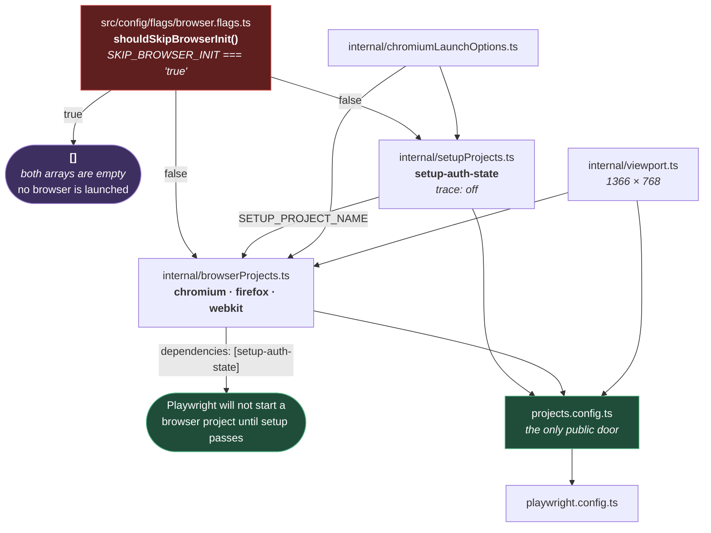

# Playwright Projects

**[← Back to Execution](README.md)**

This page covers `src/config/projects/` and `src/config/flags/` — the code that builds the
`projects` array `playwright.config.ts` hands to Playwright.

A **project** is a named configuration a test runs under: which browser, which viewport,
which launch flags, and what must have finished first. This framework does not write them
out in the config file. It builds them, because two of the decisions — whether a browser is
launched at all, and how big a video is — cannot be written as literals without going stale.

## Table of Contents

- [The Projects That Exist](#the-projects-that-exist)
- [How They Are Assembled](#how-they-are-assembled)
- [The Flag That Empties Everything](#the-flag-that-empties-everything)
- [The Setup Project](#the-setup-project)
- [The Browser Projects](#the-browser-projects)
- [Chromium-Only Launch Flags](#chromium-only-launch-flags)
- [The Viewport Derives The Video Size](#the-viewport-derives-the-video-size)
- [Practical Outcome](#practical-outcome)

## The Projects That Exist

`playwright.config.ts` composes its `projects` array from three sources
([playwright.config.ts:75-86](../../../playwright.config.ts#L75-L86)):

| Project                         | Where it is defined             | Runs                                                 |
| ------------------------------- | ------------------------------- | ---------------------------------------------------- |
| `setup-auth-state`              | `internal/setupProjects.ts`     | Files matching `*.setup.ts`. Logs in once.           |
| `api`                           | `playwright.config.ts` directly | `tests/layers/api/**`                                |
| `db`                            | `playwright.config.ts` directly | `tests/layers/db/**`                                 |
| `chromium`, `firefox`, `webkit` | `internal/browserProjects.ts`   | Everything else. Each depends on `setup-auth-state`. |

`api` and `db` are written inline because they are two lines each and need nothing built —
no browser, no viewport, no launch options. The browser projects need all three, which is
why they are assembled in code.

## How They Are Assembled



**Why it is built this way.** Everything real lives under `internal/`, and
`projects.config.ts` re-exports three names and nothing else
([projects.config.ts](../../../src/config/projects/projects.config.ts)). The comment in that file
states the intent plainly: nothing outside the folder should depend on _how_ a project is
assembled — only on the projects themselves.

That matters because assembly is exactly what changes. The launch flags, the viewport, the
setup dependency: each is a decision that gets revisited. Behind the facade, revisiting one
touches one file and no import anywhere else.

## The Flag That Empties Everything

`shouldSkipBrowserInit()` is three lines and it is the most consequential function in this
folder ([browser.flags.ts](../../../src/config/flags/browser.flags.ts)):

```ts
export function shouldSkipBrowserInit(): boolean {
  return process.env.SKIP_BROWSER_INIT?.toLowerCase() === "true";
}
```

When it returns `true`, **both** `setupProjects` and `browserProjects` evaluate to `[]`
([setupProjects.ts:34](../../../src/config/projects/internal/setupProjects.ts#L34),
[browserProjects.ts:14](../../../src/config/projects/internal/browserProjects.ts#L14)). The
projects array Playwright receives contains only `api` and `db`.

**Why an empty array rather than a skipped test.** An API test needs no browser, and the
expensive part is not running the browser tests — it is `setup-auth-state`, which launches
Chromium, navigates to the portal, and logs in. On an API-only run that is a browser launch
and a full login performed to produce a storage state nothing will read.

Removing the projects entirely means Playwright never schedules them. There is nothing to
skip, because there is nothing there.

The flag is not usually set by hand. `scripts/execution/test-executor.ts` sets it: `api` and
`db` are in its `NON_BROWSER_LAYERS` set, so `npm run test:api` exports
`SKIP_BROWSER_INIT=true` before invoking Playwright
([test-executor.ts:27-35](../../../scripts/execution/test-executor.ts#L27-L35)). An explicit
`SKIP_BROWSER_INIT` in the environment overrides the layer default.

`browserProjects.ts` also drops the dependency when the flag is set
([browserProjects.ts:11](../../../src/config/projects/internal/browserProjects.ts#L11)) — there is
nothing to wait for when the setup project is not part of the run. Since the browser projects
are themselves gone, this is belt and braces; it matters only if the two arrays are ever
gated separately.

## The Setup Project

```ts
export const SETUP_PROJECT_NAME = "setup-auth-state";
```

It matches `/.*\.setup\.ts/`, and it is the project that logs in once so that no other test
has to. The full flow — what it produces, who reads it, and how a test opts out — is
[04-layers/ui/AUTHENTICATION.md](../../04-layers/ui/AUTHENTICATION.md).

Two things about it belong here, in the projects folder:

**The name is a shared constant, not a string.** `browserProjects.ts` imports
`SETUP_PROJECT_NAME` to declare its dependency
([browserProjects.ts:3](../../../src/config/projects/internal/browserProjects.ts#L3)). A project
dependency in Playwright is matched by name, so a typo in either place would not fail — it
would silently produce browser projects that depend on nothing, run before the login, and
fail as though the application had signed them out. One constant makes the two impossible to
disagree.

**It is the only project with `trace: "off"`.** It is also the only project that ever types a
real password, and a trace records a `fill()` value verbatim and cannot be sanitized. The
reasoning is set out in full at
[AUTHENTICATION.md](../../04-layers/ui/AUTHENTICATION.md#why-the-setup-project-records-no-trace)
and is not repeated here — but if you are editing `setupProjects.ts` and wondering whether the
`NO_TRACE` constant is worth keeping, read that section before you remove it.

## The Browser Projects

Three: `chromium`, `firefox`, `webkit`. Each takes the shared viewport, each declares
`dependencies: [setup-auth-state]`, and only Chromium takes the launch flags
([browserProjects.ts:17-35](../../../src/config/projects/internal/browserProjects.ts#L17-L35)).

The `dependencies` line is what makes the login-before-tests ordering a fact rather than a
convention. Playwright will not start `chromium` until `setup-auth-state` has passed — and if
setup fails, the browser projects do not run at all, which is the correct outcome: every one
of them would have failed anyway, and they would have failed with an error about being signed
out rather than an error about the login.

## Chromium-Only Launch Flags

`chromiumLaunchOptions` is applied to the Chromium project and the setup project, and to
nothing else ([chromiumLaunchOptions.ts](../../../src/config/projects/internal/chromiumLaunchOptions.ts)).

**This is a hard constraint, not a preference.** The flags are Chromium CLI switches —
`--disable-background-timer-throttling`, `--no-first-run`, and so on. Firefox and WebKit
reject unknown launch options and **fail to launch**. Moving these into the global `use` block
in `playwright.config.ts` would break two of the three browsers, and the failure would be a
browser that never starts rather than a test that fails, which is a much less obvious thing to
debug.

The flags fall into two groups:

- **Always applied** — the throttling and backgrounding switches keep a headless Chromium from
  slowing down timers in a window it thinks is not visible, which is exactly the situation
  every headless test is in. The rest (`--disable-extensions`, `--no-first-run`,
  `--disable-default-apps`, `--disable-translate`) remove first-run UI and background
  machinery that a test never wants.
- **CI only** — `--no-sandbox` and `--disable-dev-shm-usage` are appended when `CI` is set
  ([chromiumLaunchOptions.ts:14](../../../src/config/projects/internal/chromiumLaunchOptions.ts#L14)).
  They exist for containers: the sandbox needs privileges a CI container usually lacks, and
  `/dev/shm` is typically too small in one, which makes Chromium crash under memory pressure.
  Neither is wanted locally — `--no-sandbox` removes a real security boundary, and there is no
  reason to pay that on a developer machine.

## The Viewport Derives The Video Size

The viewport is `1366 × 768`, shared by every browser project and by the global `use` block.
The video size is **not** written down
([viewport.ts](../../../src/config/projects/internal/viewport.ts)):

```ts
const VIDEO_SCALE = 0.6;

export const resolvedVideoSize: ViewportSize = {
  width: Math.round(resolvedViewport.width * VIDEO_SCALE),
  height: Math.round(resolvedViewport.height * VIDEO_SCALE),
};
```

Videos are recorded at 60% of the viewport to keep CI artifacts small. Deriving the size
rather than writing `{ width: 820, height: 461 }` is the whole point: a hard-coded video size
is correct only for the viewport it was calculated against, and the day someone changes the
viewport to `1920 × 1080`, the videos silently start recording at the wrong aspect ratio —
letterboxed or squashed, still perfectly valid files, and nobody notices until they watch one.

Two numbers that must stay in proportion should not be two numbers. Here, one is a function of
the other, and the proportion cannot drift.

## Practical Outcome

`npm run test:ui` gets three browsers, each with a viewport, each waiting on a login that
happens once. `npm run test:api` gets neither a browser nor a login, because the projects that
would have provided them do not exist in that run. The Chromium flags stay on Chromium, so
Firefox and WebKit still start. And the video size follows the viewport, so changing one
cannot quietly corrupt the other.
