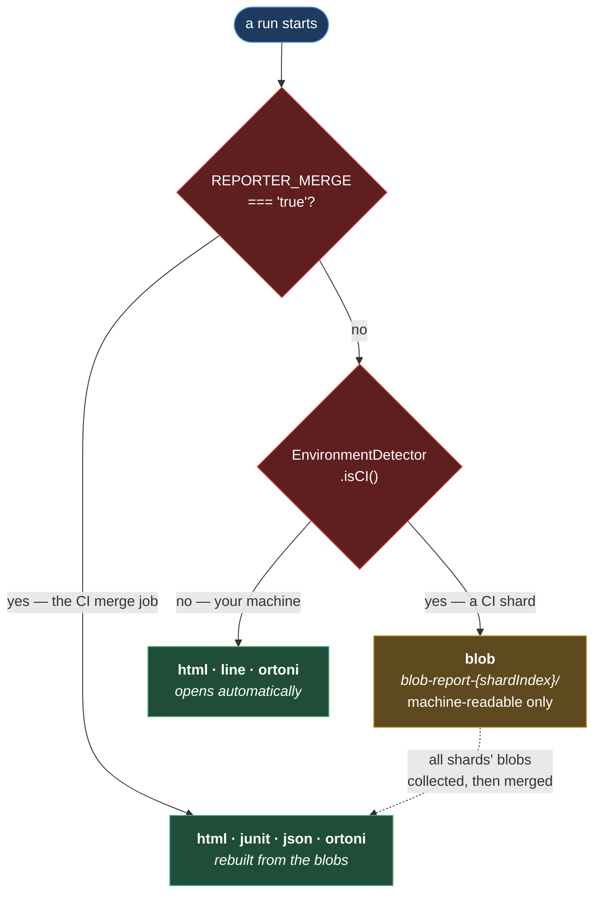

# Reporting

**[← Back to Execution](README.md)**

This page covers `src/config/reports/` and the two CLI scripts in `scripts/reports/`. They are
one feature seen from two ends: the config decides what gets _produced_ during a run, and the
scripts _serve_ it afterwards.

Three reporters are in play — Playwright's own HTML, its `blob`, and
[Ortoni](https://github.com/ortoniKC/ortoni-report), which renders a friendlier summary. Which
of them runs depends entirely on where the run is happening, and that decision is the most
important thing on this page.

## Table of Contents

- [Which Reporters Run Where](#which-reporters-run-where)
- [Why Blob In CI](#why-blob-in-ci)
- [The Ortoni Config](#the-ortoni-config)
  - [The Title Is Still A Placeholder](#the-title-is-still-a-placeholder)
- [Serving The Report](#serving-the-report)
  - [Why The Port Is Probed First](#why-the-port-is-probed-first)
  - [Why The CLI Is Spawned Directly](#why-the-cli-is-spawned-directly)
- [Stopping A Stranded Server](#stopping-a-stranded-server)
- [Practical Outcome](#practical-outcome)

## Which Reporters Run Where

`playwright.config.ts` picks from three sets
([playwright.config.ts:51-55](../../../playwright.config.ts#L51-L55)):



**Why it is built this way.** A sharded CI run is `n` separate Playwright processes that know
nothing about each other. Each one sees only its slice of the suite — so each one's HTML report
would be a _partial_ report, and four partial reports are worse than none: every one of them
looks complete, and none of them is.

`blob` exists for exactly this. It is not a report a human reads; it is a machine-readable dump
of what one shard saw. A later job collects all of them and merges them into a single true
report, which is what `REPORTER_MERGE=true` triggers — the same config, re-entered with no
tests to run, purely to rebuild `html`, `junit`, `json` and Ortoni from the combined blobs.

The dashed edge in the diagram is the whole point: the shards do not produce reports, they
produce _material_ for one.

Locally there is no sharding and no merge step, so the report is generated directly — and
Ortoni opens it in a browser the moment the run finishes.

## The Ortoni Config

`reportConfig` ([ortoniReport.config.ts](../../../src/config/reports/ortoniReport.config.ts)) is
a plain object. Three of its fields are computed rather than fixed, and each answers a question
a report has to answer about itself:

| Field                | Value                                                        | Why                                                                        |
| -------------------- | ------------------------------------------------------------ | -------------------------------------------------------------------------- |
| `open`               | `"never"` in CI, `"always"` locally                          | A CI runner has no browser to open, and no human waiting.                  |
| `testType`           | `TEST_TAGS` with the leading `@` stripped, or `"Functional"` | A filtered run should say what it filtered on: `@smoke` → `"smoke tests"`. |
| `authorName`         | `os.userInfo().username`                                     | Who ran it.                                                                |
| `meta["Test Cycle"]` | `DateFormatter.formatMonthYear()` → `Jul, 2026`              | Which cycle the run belongs to.                                            |
| `folderPath`         | `ortoni-report`                                              | Always the same, never sharded.                                            |

The comment at the top of the file explains the last one: the Ortoni report is generated
**once** — locally per run, or in CI during the merge phase — so it never needs a per-shard
output directory the way `blob` does.

`formatMonthYear` is the one method of `DateFormatter` that produces something a human reads
rather than a filename. [../utilities/SHARED_UTILS.md](../utilities/SHARED_UTILS.md#dateformatter)
covers the rest.

### The Title Is Still A Placeholder

```ts
title: "<Project Name> Automation Report",
projectName: "<Project Name>",
```

**The report currently announces itself as `<Project Name> Automation Report`** — angle
brackets and all. It is a scaffold value that has never been filled in, and it will appear at
the top of every report the framework generates until someone changes those two lines.

It is called out here rather than quietly fixed because naming the product is a decision, not
a typo.

## Serving The Report

```bash
npm run ortoni-report        # serve it
npm run ortoni-report:stop   # reclaim the port afterwards
```

Both are `tsx` scripts under `scripts/reports/`, and both import
[the console-only logger](../foundation/LOGGING.md#the-second-logger-in-scripts), not the
framework's. They share one file of constants
([ortoniReport.constants.ts](../../../scripts/reports/constants/ortoniReport.constants.ts)) —
the candidate ports `2004, 2006, 2008, 2009`, the report directory, and the loopback host —
because a `show` script and a `stop` script that disagreed about which ports to use would be
worse than useless.

### Why The Port Is Probed First

`show-ortoni-report.ts` does not simply start the server. It **probes** each candidate port by
binding to it, takes the first one that is free, and passes it explicitly to the CLI
([show-ortoni-report.ts:52-69](../../../scripts/reports/show-ortoni-report.ts#L52-L69)). If all
four are taken it asks the OS for a random free port.

**Why.** The `ortoni-report` CLI does not retry when its port is in use — it fails. And the
common case for a taken port is _another Ortoni report you forgot to close_, which makes
"the command failed" a maddening thing to debug.

One detail in `probePort` is load-bearing and easy to "fix" wrongly: it passes **no host** to
`listen`. That mirrors how the CLI itself binds — all interfaces, dual-stack. Forcing
`127.0.0.1` here would report a port as free on Windows when another process holds
`0.0.0.0`/`[::]` on it, and the server would then fail to start on a port this script had just
declared usable.

### Why The CLI Is Spawned Directly

The script resolves `ortoni-report`'s own `cli.js` and runs it with the current Node binary,
rather than shelling out to `npx ortoni-report`
([show-ortoni-report.ts:83-99](../../../scripts/reports/show-ortoni-report.ts#L83-L99)).

Two reasons, both recorded in the code: passing arguments with `shell: true` triggers Node's
`DEP0190` deprecation warning, and Windows will not spawn a `.cmd` shim without a shell. Going
straight to the JavaScript entry point sidesteps both.

## Stopping A Stranded Server

The report server is a foreground process meant to be ended with Ctrl+C. Close the terminal
instead and it keeps listening, holding the port — and the next `npm run ortoni-report` lands
on the next candidate port, then the next.

`stop-ortoni-report.ts` reclaims them. It finds whatever is listening on each candidate port
and kills it, using `netstat` + `taskkill` on Windows and `lsof` + `kill` elsewhere
([stop-ortoni-report.ts:20-47](../../../scripts/reports/stop-ortoni-report.ts#L20-L47)).

It is deliberately blunt — it kills whatever holds the port, not just processes it can prove
are Ortoni. That is a real trade: if you happen to be running something else on `2004`, this
will stop it. The ports were chosen to be unusual for that reason, and the script reports every
PID it kills, so a surprise is at least a visible one.

Finding nothing is a normal outcome and says so rather than failing.

## Practical Outcome

A local run ends with a report that opens itself. A sharded CI run produces blobs that merge
into one true report rather than four partial ones that each look complete. And the two commands
that serve and stop the report agree about which ports they are talking about, so a report
server you forgot to close is one command away from being reclaimed rather than a mystery about
why the port is busy.
