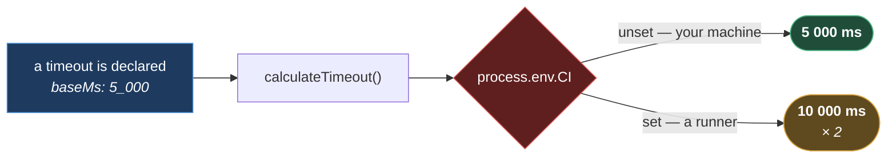

# Timeouts

**[← Back to Execution](README.md)**

This page covers `src/config/timeouts/`. Every wait the framework performs takes its
duration from here — not from a number typed at the call site.

There are two reasons for that, and the second is the interesting one. The first is the
obvious one: a magic `5000` in an action tells you nothing about why five seconds was the
right answer. The second is that **CI is slower than your laptop**, and every timeout has to
absorb that without anyone remembering to think about it.

## Table of Contents

- [The Multiplier](#the-multiplier)
- [The Two Groups](#the-two-groups)
- [Global Timeouts](#global-timeouts)
- [UI Timeouts](#ui-timeouts)
- [Six Of The Ten Are Unused](#six-of-the-ten-are-unused)
- [Adding A Timeout](#adding-a-timeout)
- [Practical Outcome](#practical-outcome)

## The Multiplier

The whole module rests on one four-line function
([timeoutCalculator.ts](../../../src/config/timeouts/internal/timeoutCalculator.ts)):

```ts
export function calculateTimeout(options: TimeoutCalculatorOptions): number {
  const { baseMs, isCI = false, multiplier = 2 } = options;

  return isCI ? baseMs * multiplier : baseMs;
}
```

**Every timeout in the framework is doubled in CI.** Nothing else happens.



**Why it is built this way.** A CI runner is a shared, throttled, usually-containerised
machine competing with other jobs. The same page that renders in 800 ms locally can take
three seconds there — not because anything is broken, but because the hardware is. A suite
tuned to a laptop is a suite that goes red in the pipeline for reasons that have nothing to
do with the application.

The naive fix is to raise every timeout until CI is green. That works, and it ruins the local
run: a genuine hang now takes 30 seconds to report instead of 5, and every developer waits.
Worse, a local regression that _doubles_ a page's load time — which is a real bug you want to
see — sails under the raised limit and nobody notices.

Scaling by environment keeps both honest. Locally the limits stay tight, so slowness is
visible. In CI they relax, so shared hardware is not mistaken for a defect.

**The multiplier is `2` and nothing overrides it today.** `TimeoutCalculatorOptions` accepts a
`multiplier`, but no caller passes one — every timeout in the framework takes the default. The
parameter exists for the timeout that eventually needs `3`, not because any currently does.

Note that `isCI` here is a plain `!!process.env.CI`
([global.timeouts.ts:4](../../../src/config/timeouts/global.timeouts.ts#L4)), **not**
`EnvironmentDetector.isCI()` — so it checks the one variable rather than the seven that
[../environment/RESOLUTION.md](../environment/RESOLUTION.md#environmentdetector) checks. On a
runner that sets only `JENKINS_URL`, the timeouts would not scale. It is a gap, and it is
worth knowing about before you debug a mysteriously flaky pipeline.

## The Two Groups

| File                 | Holds                                                          | Read by                |
| -------------------- | -------------------------------------------------------------- | ---------------------- |
| `global.timeouts.ts` | `GLOBAL_TIMEOUTS` — the two limits Playwright itself enforces. | `playwright.config.ts` |
| `ui.timeouts.ts`     | `UI_TIMEOUTS` — ten named waits for element interactions.      | The UI action layer    |

Both import `calculateTimeout` and nothing else. Neither imports anything from `src/`, which
is why [DEPENDENCY_MAP.md](../DEPENDENCY_MAP.md#the-layers) notes they could sit at Layer 0 — they
are filed at Layer 5 because that is where they are _used_.

## Global Timeouts

Two values, both consumed by `playwright.config.ts`
([global.timeouts.ts](../../../src/config/timeouts/global.timeouts.ts)):

| Name     | Local | In CI | What it limits                                  |
| -------- | ----- | ----- | ----------------------------------------------- |
| `test`   | 165 s | 330 s | A single test, start to finish.                 |
| `expect` | 50 s  | 100 s | How long a Playwright assertion keeps retrying. |

`165_000` is a deliberate-looking number, and it is: it is long enough for a full UI journey
through a slow enterprise portal, and short enough that a hung test does not stall a worker
for the rest of the run.

The file also exports `TEST_TIMEOUT` and `EXPECT_TIMEOUT` as destructured aliases. **Nothing
imports them** — `playwright.config.ts` reads `GLOBAL_TIMEOUTS.test` and `.expect` directly.
They are convenience exports with no consumer.

## UI Timeouts

Ten named waits ([ui.timeouts.ts](../../../src/config/timeouts/ui.timeouts.ts)). The values
are local; double each for CI.

| Name           | Base   | For                                                                 |
| -------------- | ------ | ------------------------------------------------------------------- |
| `default`      | 50 s   | The general wait for a UI validation or a slow page-state check.    |
| `validation`   | 45 s   | An alias used when a wait is specifically a validation.             |
| `short`        | 5 s    | Quick DOM changes — a class appearing, an attribute flipping.       |
| `settle`       | 300 ms | A tiny pause for an animation after an element becomes interactive. |
| `notification` | 6 s    | Toasts and popups, which should appear promptly or not at all.      |
| `calendar`     | 10 s   | A date dialog opening and settling.                                 |
| `toggle`       | 20 s   | A toggle control settling after interaction.                        |
| `table`        | 10 s   | Polling a grid, or waiting for its first row.                       |
| `pollInterval` | 800 ms | How often a poll re-checks — not how long it waits.                 |
| `frame`        | 30 s   | Frame discovery, which is slower than a plain element check.        |

**Why name them at all, rather than pass numbers?** Because the name records the _reason_. A
reviewer reading `timeout: UI_NOTIFICATION_TIMEOUT` can tell whether 6 seconds is defensible
for a toast. A reviewer reading `timeout: 6000` cannot tell what is being waited for, and so
cannot tell whether the number is right — which means the number never gets challenged, and
grows every time something is flaky.

`pollInterval` is the odd one and its comment says why: it scales in CI _without_ inflating
the assertion default it sits inside. Doubling how often you check is not the same as doubling
how long you are willing to wait, and conflating them is how a poll ends up hammering a page
it should be gently observing.

## Six Of The Ten Are Unused

Stated plainly, because a table of ten timeouts reads as ten timeouts in service:

| Used today                | By                                                   |
| ------------------------- | ---------------------------------------------------- |
| `frame`                   | `FrameActions.waitForFrame`                          |
| `default`, `pollInterval` | `ElementWaits.waitForUIToStabilize`                  |
| `short`                   | `ElementWaits.waitForAttributeValue`, `waitForClass` |

**`validation`, `settle`, `notification`, `calendar`, `toggle` and `table` are imported by
nothing.** They are declared, exported, and never read.

That is not a criticism — they were written ahead of the page objects that will use them, and
`tests/` is still empty. But it does mean their values have never been exercised against a
real application, and the first spec that reaches for `UI_TABLE_TIMEOUT` is also the first
thing that will discover whether 10 seconds was the right guess.

## Adding A Timeout

1. Add an entry to `UI_TIMEOUTS` (or `GLOBAL_TIMEOUTS`), wrapped in `calculateTimeout`.
2. Add it to the destructured export block at the bottom of the file.
3. Import the named constant where you need it. Never type the number.

The `calculateTimeout` wrapper is not optional. A raw `baseMs: 5_000` written straight into
the object is a timeout that does **not** scale in CI — and it will look identical to every
other line in the file while behaving differently in the one environment where it matters.

## Practical Outcome

Every wait in the framework has a name that says what it is waiting for, a single declared
value, and automatic headroom on the machine that needs it. A local run stays tight, so a
slowdown is a signal rather than noise. A CI run gets twice the patience without anyone
editing a number. And when a timeout does need changing, it is changed once, in the file
whose only job is to hold it.
