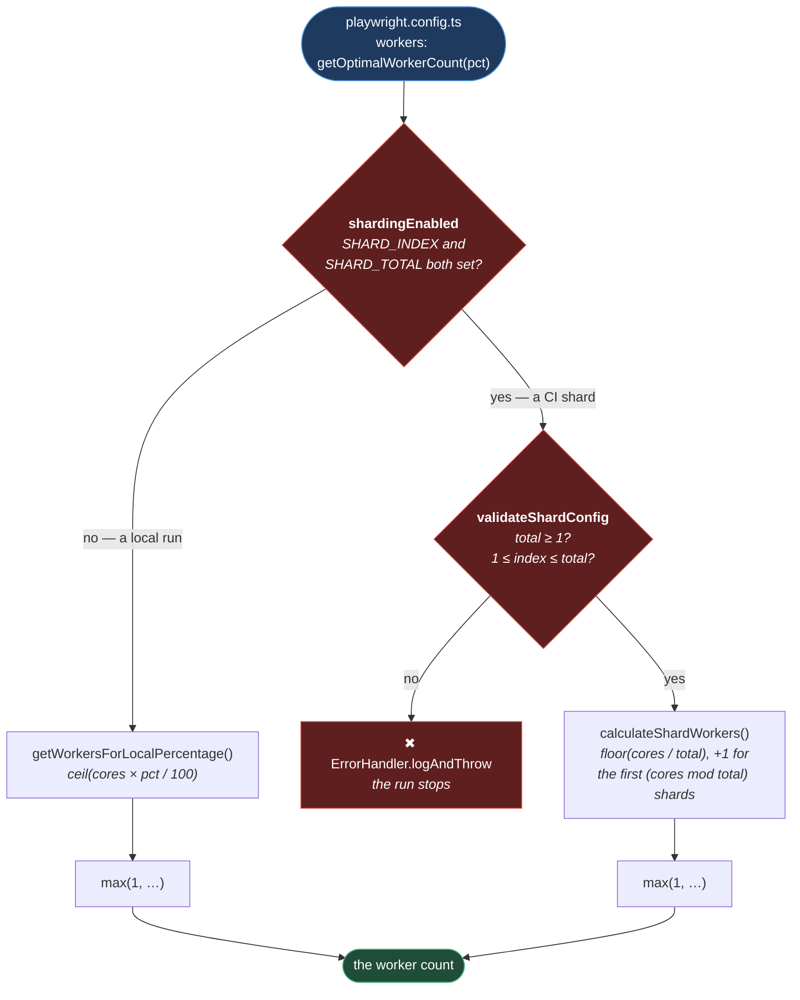

# Worker Allocation

**[← Back to Execution](README.md)**

This page covers `src/config/runtime/workers/` — one class, `WorkerAllocator`, whose entire
job is to answer a single question `playwright.config.ts` asks once per run:

> **How many workers should this run use?**

Playwright's own default is a fraction of the CPU count, which is a reasonable answer for a
machine running nothing else. It is the wrong answer for a laptop that is also running an IDE,
a browser, and a video call — and it is the wrong answer in CI, where the run is split across
shards and each shard sees the whole machine but is only doing a fraction of the work.

## Table of Contents

- [The Two Modes](#the-two-modes)
- [Local: A Percentage Of The Machine](#local-a-percentage-of-the-machine)
- [CI: A Fair Split Per Shard](#ci-a-fair-split-per-shard)
  - [Distributing The Remainder](#distributing-the-remainder)
- [Why An Invalid Shard Config Throws](#why-an-invalid-shard-config-throws)
- [Practical Outcome](#practical-outcome)

## The Two Modes



**Why it is built this way.** The two branches exist because _a core_ means something
different in each. Locally, the machine is shared with the human using it, so the question is
"what fraction may I take?" In CI the machine is the run's alone, so the question is "what
fraction of it is _mine_?" — and the answer depends on how many shards are competing for it.

Both paths end at `Math.max(MIN_WORKERS, …)`, so the answer is never zero. A run with zero
workers executes no tests and reports success, which is the single worst outcome available to
a test framework: a green pipeline that tested nothing.

The mode is chosen by whether **both** shard variables are set
([workerAllocator.ts:26-28](../../../src/config/runtime/workers/workerAllocator.ts#L26-L28)). One
without the other is treated as not sharding at all, which is the safe reading — a half-set
shard configuration is more likely a mistake than an intent.

## Local: A Percentage Of The Machine

`playwright.config.ts` resolves the percentage before it asks for a count
([playwright.config.ts:20-23](../../../playwright.config.ts#L20-L23)):

```ts
const workerPercentage = WorkerAllocator.resolveWorkerPercentage(
  process.env.WORKER_PERCENTAGE,
  10,
);
```

**The default is 10%.** On an 8-core machine that is one worker. The default is deliberately
low: the common local case is running a handful of tests while doing something else, and a
test run that takes the whole machine makes the machine unusable while it does.

`WORKER_PERCENTAGE` raises it, and it accepts exactly five values — `10`, `25`, `50`, `75`,
`100` — enforced both by the type `AllocatorPercentage` and by a runtime check
([workerAllocator.ts:121-123](../../../src/config/runtime/workers/workerAllocator.ts#L121-L123)).

**Why an enum of five and not any number.** The type exists for code that sets the value; the
runtime check exists because `WORKER_PERCENTAGE` arrives as a string from a shell, where the
type system has no reach. And a rejected value is better than an accepted one here:
`WORKER_PERCENTAGE=1000` would silently allocate ten times the machine's cores, and
`WORKER_PERCENTAGE=0` would allocate none. Both are typos. Both are caught by name, with the
valid options listed in the error.

The count is `ceil`, not `floor` — 10% of 4 cores is 1 worker, not 0.

## CI: A Fair Split Per Shard

When a CI job is sharded, each shard is a separate process running a slice of the suite, and
each one sees the _whole_ machine. If each took Playwright's default, `n` shards would
collectively try to run `n ×` the machine's capacity, and every shard would slow down.

So a shard takes only its share
([workerAllocator.ts:70-78](../../../src/config/runtime/workers/workerAllocator.ts#L70-L78)):

```ts
const baseWorkersPerShard = Math.floor(this.totalCores / shardTotal);
const remainingCores = this.totalCores % shardTotal;
const zeroBasedIndex = shardIndex - 1;

return zeroBasedIndex < remainingCores ? baseWorkersPerShard + 1 : baseWorkersPerShard;
```

### Distributing The Remainder

Cores rarely divide evenly by shards, and the leftover is not thrown away — it is handed to
the earliest shards, one each.

On an **8-core machine with 3 shards**: base is `floor(8/3) = 2`, remainder is `8 % 3 = 2`.

| Shard | Gets      | Why                                                  |
| ----- | --------- | ---------------------------------------------------- |
| 1     | 3 workers | Index 0 < remainder 2 — gets one of the spare cores. |
| 2     | 3 workers | Index 1 < remainder 2 — gets the other.              |
| 3     | 2 workers | Index 2 is not < 2 — base only.                      |

Total: 8. Every core is allocated, and no shard is more than one worker away from any other.

**Why bother, when the alternative is two idle cores?** Because a sharded run is only as fast
as its slowest shard. Discarding the remainder would leave capacity unused on the machine that
is the bottleneck, and the wall-clock time of the whole job — which is the number anyone
actually cares about — would be longer for no reason. The `+1` costs one comparison.

Note that `SHARD_INDEX` is **one-based** here, matching Playwright's own `--shard=1/3`
notation, and is converted to zero-based inside the calculation. That conversion is the
easiest thing in this file to get wrong.

## Why An Invalid Shard Config Throws

`validateShardConfig` rejects a `SHARD_TOTAL` below 1, and any `SHARD_INDEX` outside
`1..SHARD_TOTAL`
([workerAllocator.ts:48-62](../../../src/config/runtime/workers/workerAllocator.ts#L48-L62)). It
calls `ErrorHandler.logAndThrow`, so the run stops before a test executes.

**Why stop rather than fall back to a sane default.** An invalid shard configuration means the
pipeline is not doing what its author thinks it is doing. `SHARD_INDEX=4` of `SHARD_TOTAL=3`
is not a worker-count problem — it is a _shard that does not exist_, and Playwright will give
it a slice of the suite that no other shard is covering, or none at all. Quietly allocating
one worker to it would produce a green run with a hole in its coverage, and nothing anywhere
would say so.

This is the same principle as the environment validator: a misconfiguration should fail at the
moment it is read, naming what was wrong, rather than being smoothed over into a plausible run
that proves nothing. It is worth noting that the run stops in CI, which is the one place a
missing slice of coverage is hardest to spot.

## Practical Outcome

A local run takes a tenth of the machine unless you tell it otherwise, so running tests does
not mean stopping work. A sharded CI run divides the machine evenly among the shards, spare
cores included, so the job finishes as fast as the hardware allows. And a shard configuration
that cannot be right stops the run instead of producing a pass that covers less than it claims.
