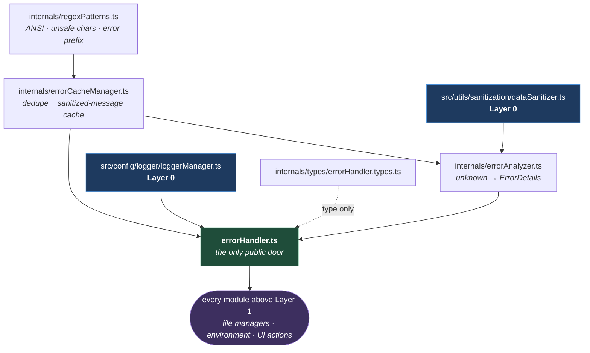
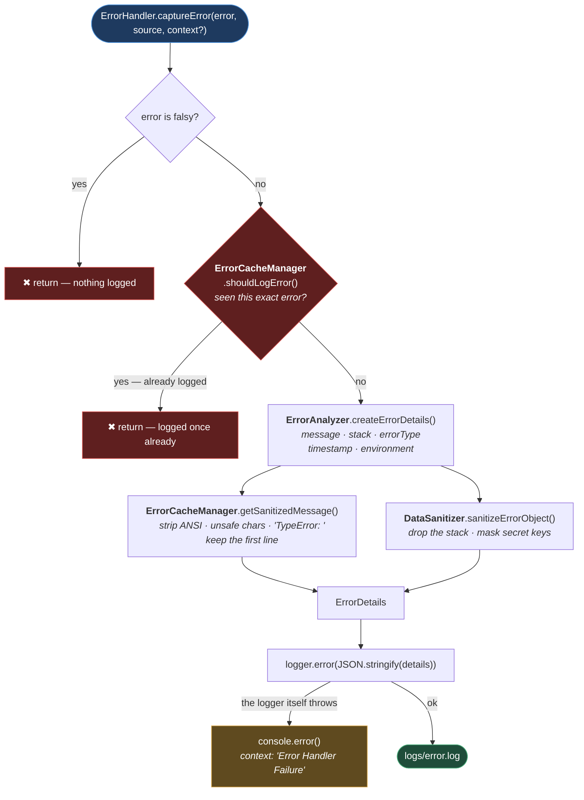

# Error Handling

**[← Back to Main Documentation](../../../README.md)**

This page explains what happens to an error between the moment it is caught and the
moment it appears in `logs/error.log`. The code lives in
`src/utils/error-handling/`.

`ErrorHandler` is the most-imported module in the framework — the file managers, the
environment resolver, the worker allocator, every UI action, and the login coordinator
all route their failures through it. It sits directly on top of the two modules
documented before it: it logs through [LOGGING.md](LOGGING.md), and it masks through
[SANITIZATION.md](SANITIZATION.md).

## Table of Contents

- [What It Is For](#what-it-is-for)
- [The Files](#the-files)
- [How The Files Fit Together](#how-the-files-fit-together)
- [The Capture Path](#the-capture-path)
- [The Same Error Is Logged Once](#the-same-error-is-logged-once)
- [What Ends Up In The Log](#what-ends-up-in-the-log)
  - [Playwright Assertion Failures](#playwright-assertion-failures)
- [The Public API](#the-public-api)
- [Why It Never Throws](#why-it-never-throws)
- [Practical Outcome](#practical-outcome)

## What It Is For

A `catch` block has a value of type `unknown` and a decision to make. Left to itself,
every call site makes that decision differently — one logs `error.message`, one logs
the whole object, one swallows it — and the result is a log file where the same failure
looks like three different things.

`ErrorHandler.captureError` is the single answer. Hand it the caught value and the name
of the place it came from, and it produces one structured JSON entry with a consistent
shape, with secrets masked and with the noise removed:

```ts
try {
  await this.loadEnvironmentFile();
} catch (error) {
  ErrorHandler.captureError(error, "loadEnvironmentFile", "Environment setup");
  throw error;
}
```

That pattern — capture, then rethrow — is the one used throughout `src/`. `ErrorHandler`
records; it does not decide whether the test should keep going.

## The Files

| File                                                             | Responsibility                                                                            |
| ---------------------------------------------------------------- | ----------------------------------------------------------------------------------------- |
| `src/utils/error-handling/errorHandler.ts`                       | The public API: `captureError`, `logAndThrow`, `log`, `clearErrorCache`.                  |
| `src/utils/error-handling/internals/errorAnalyzer.ts`            | Turns an `unknown` into an `ErrorDetails` object. Extracts message, stack, type, matcher. |
| `src/utils/error-handling/internals/errorCacheManager.ts`        | Deduplicates errors, and caches sanitized messages.                                       |
| `src/utils/error-handling/internals/regexPatterns.ts`            | The three regexes used to clean a message: ANSI codes, unsafe characters, error prefixes. |
| `src/utils/error-handling/internals/types/errorHandler.types.ts` | `ErrorDetails`, `MatcherResult`, `MatcherError`.                                          |

## How The Files Fit Together

The diagram below is the **import** chain — who depends on whom. The one after it is the
**runtime** path, which is a different picture: it is the order things happen in, and it
crosses out of this module twice.



**Why it is built this way.** Everything except `errorHandler.ts` lives under
`internals/`, and nothing outside this folder imports any of it. That is the point of the
layout: `ErrorHandler` is a facade, and the four files behind it can be reorganised —
split, merged, rewritten — without a single import elsewhere in `src/` changing. A caller
that reached past it to `ErrorAnalyzer` would turn an implementation detail into a public
contract, which is exactly what the folder name is there to discourage.

Note the two edges arriving from **Layer 0**. This module is the first thing in the
framework that composes anything: it is where the logger and the sanitizer, which know
nothing about each other, are finally put together. [DEPENDENCY_MAP.md](../DEPENDENCY_MAP.md)
places it in the wider graph.

## The Capture Path



**Why it is built this way.** Sanitization happens on the way _out_, at the last
possible moment, and it happens in two separate places because there are two separate
risks. The message and the stack are free text and go through
`getSanitizedMessage`; the error's remaining properties are structured data and go
through `DataSanitizer.sanitizeErrorObject`. Neither pass would catch what the other
does.

The two red exits are the ones a reader must know about, because both mean **a call to
`captureError` produced no log line at all**. That is the intended behaviour, not a
bug — but it makes "I called captureError and nothing appeared" a thing that happens,
and the next section is the reason it does.

## The Same Error Is Logged Once

`ErrorCacheManager.shouldLogError` hashes the error — its stack, or its
`name:message` if it has none — and keeps the hash in a `Set`. If the hash is already
there, `captureError` returns without logging
([errorCacheManager.ts:57-68](../../../src/utils/error-handling/internals/errorCacheManager.ts#L57-L68)).

The consequence is worth being blunt about: **the same failure, thrown from the same
line, is logged the first time and silently ignored afterwards, for the lifetime of the
process.** A test that retries three times on the same broken selector produces one
error entry, not three.

**Why it is built this way.** A Playwright failure is rarely a single event. One broken
selector fails in a `beforeEach`, then in the retry, then in the teardown, and every
layer between the action and the test catches it, logs it, and rethrows — so a single
root cause can write the same 2,000-character stack into `error.log` a dozen times. The
signal is not improved by the repetition; it is buried by it. Deduplicating on the stack
hash means `logs/error.log` has one entry per distinct failure, which is what makes it
readable at all.

The cost is that the log does not tell you _how often_ something failed. If you need
that, the Playwright report has it — the retry count is its job, not the logger's.

Two caches are involved, both capped at 5,000 entries:

| Cache               | Holds                                | When it is full                                        |
| ------------------- | ------------------------------------ | ------------------------------------------------------ |
| `loggedErrors`      | A hash per error already logged      | Evicts the oldest 40% (`EVICTION_RATIO`)               |
| `sanitizedMessages` | Original message → sanitized message | Stops caching. Sanitization still runs, just uncached. |

`ErrorHandler.clearErrorCache()` empties both. It exists for secret rotation: a cached
sanitized message computed under an old set of credentials should not outlive them.

## What Ends Up In The Log

`ErrorAnalyzer.createErrorDetails` produces an `ErrorDetails` object
([errorHandler.types.ts:5-19](../../../src/utils/error-handling/internals/types/errorHandler.types.ts#L5-L19)),
and `ErrorHandler` writes it as indented JSON:

| Field         | Always present | Notes                                                                 |
| ------------- | -------------- | --------------------------------------------------------------------- |
| `source`      | Yes            | Whatever the caller passed. Usually the method name.                  |
| `message`     | Yes            | Sanitized. **First line only** — a stack's worth of lines is dropped. |
| `timestamp`   | Yes            | ISO 8601.                                                             |
| `environment` | Yes            | `process.env.ENV`, defaulting to `qa`.                                |
| `context`     | No             | Omitted entirely when the caller does not pass one.                   |
| `stack`       | No             | Sanitized, truncated to 2,000 characters.                             |
| `errorType`   | No             | The constructor name — `TypeError`, `TimeoutError`.                   |

The `message` is deliberately reduced: `getSanitizedMessage` strips ANSI colour codes,
removes `"`, `'`, `\`, `<`, `>`, drops a leading error-type prefix such as the
`TypeError:` that Node puts at the front of the message, and then keeps only the first line
([errorCacheManager.ts:32-38](../../../src/utils/error-handling/internals/errorCacheManager.ts#L32-L38)).
The detail is not lost — it is in `stack`, one field over. The point is that
`message` stays a single scannable sentence.

### Playwright Assertion Failures

A failed `expect()` does not throw an ordinary `Error`. It throws one carrying a
`matcherResult` — an object holding what was expected, what was received, and whether
it passed.

`ErrorAnalyzer` detects that shape and flattens it
([errorAnalyzer.ts:175-190](../../../src/utils/error-handling/internals/errorAnalyzer.ts#L175-L190)),
lifting `matcherName`, `expected`, `received`, `pass`, and `log` into the top level of
the entry — and then **deletes the raw `matcherResult`**
([errorAnalyzer.ts:51-52](../../../src/utils/error-handling/internals/errorAnalyzer.ts#L51-L52)) so the
same information is not written twice, once flat and once nested.

That is the difference between an assertion failure that reads

```json
{ "matcherName": "toHaveText", "expected": "Welcome", "received": "Sign in" }
```

and one that dumps a nested matcher blob into the log for a human to unpack.

## The Public API

| Method                                  | What it does                                                                     |
| --------------------------------------- | -------------------------------------------------------------------------------- |
| `captureError(error, source, context?)` | Logs a caught value. **Does not rethrow** — the caller decides.                  |
| `logAndThrow(source, message)`          | Logs a new `Error` and throws it. Return type `never`.                           |
| `log(source, message)`                  | Logs a new `Error` without throwing. For a failure worth recording, not raising. |
| `clearErrorCache()`                     | Empties both caches. For secret rotation.                                        |

`logAndThrow` is the one to reach for when a precondition fails and there is nothing
sensible to continue with — an unset environment variable, a missing auth file. It
guarantees the failure is recorded before it propagates, which a bare `throw new Error`
does not.

## Why It Never Throws

`captureError` is wrapped in a `try`/`catch`, and the fallback inside that catch is
itself wrapped in a `try`/`catch`
([errorHandler.ts:81-94](../../../src/utils/error-handling/errorHandler.ts#L81-L94)). If the logger
fails, it degrades to `console.error`. If that fails, nothing is raised.

**Why it is built this way.** `captureError` is called from inside `catch` blocks. An
error handler that throws while handling an error replaces the original failure with its
own — and the original, the one that actually broke the test, is gone. The whole purpose
of the module is to make failures legible, and the one thing that would defeat that is
for it to destroy the failure it was handed. So it swallows its own errors, on purpose,
and marks them with `context: "Error Handler Failure"` so they are recognisable if they
ever surface.

This is the only place in the framework where swallowing an error is correct, and it is
correct precisely because it is the error handler.

## Practical Outcome

Every failure in `src/` goes to one place and comes out looking the same: a JSON object
naming where it came from, what happened, when, and against which environment — with
credentials masked, terminal escape codes stripped, Playwright's matcher output
flattened into readable fields, and the same failure recorded once no matter how many
layers caught it on the way up. A contributor reading `logs/error.log` reads a list of
distinct problems, not a transcript of one problem echoing.
