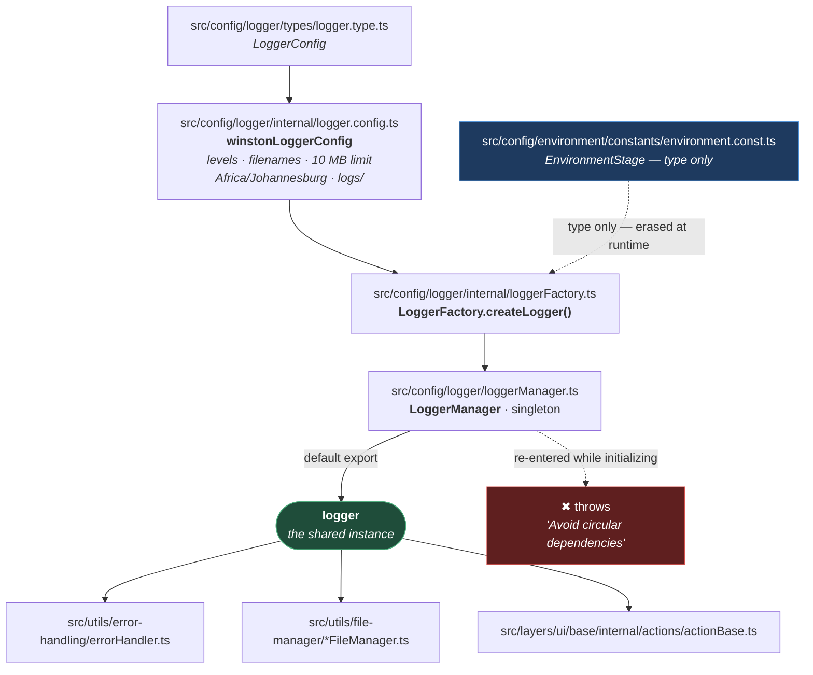

# Logging

**[← Back to Main Documentation](../../../README.md)**

This page explains how logging works in the framework. The code lives in
`src/config/logger/`, and a second, separate logger lives in `scripts/logger/`.

Logging matters here more than in most projects because it is the **bottom of the
dependency graph**. `ErrorHandler` logs, the file managers log, and every UI action
logs — so almost everything in `src/` depends on the logger, and the logger can
afford to depend on almost nothing. That constraint shapes every decision below.

## Table of Contents

- [What The Logger Is](#what-the-logger-is)
- [The Files](#the-files)
- [How It Is Assembled](#how-it-is-assembled)
- [Why Each Level Gets Its Own File](#why-each-level-gets-its-own-file)
- [The Console Level Follows The Environment](#the-console-level-follows-the-environment)
- [Why The Logger Imports Almost Nothing](#why-the-logger-imports-almost-nothing)
- [The Second Logger, In scripts](#the-second-logger-in-scripts)
- [Using It](#using-it)
- [Practical Outcome](#practical-outcome)

## What The Logger Is

One Winston logger, created once, shared by every module in `src/` that needs to
write a line.

It writes to two places at the same time:

- **Files**, under `logs/` at the repository root — one file per level, plus a file
  for uncaught exceptions and one for unhandled promise rejections.
- **The console**, at a level that depends on which environment the run is targeting.

It is exported as a ready-made instance, so a caller imports it and uses it. There
is no `getLogger()` to call and no configuration to pass:

```ts
import logger from "../../config/logger/loggerManager.js";

logger.info("Storage state written");
```

## The Files

| File                                          | Responsibility                                                                               |
| --------------------------------------------- | -------------------------------------------------------------------------------------------- |
| `src/config/logger/types/logger.type.ts`      | The `LoggerConfig` shape. All fields `readonly`.                                             |
| `src/config/logger/internal/logger.config.ts` | The settings themselves — levels, filenames, size limit, timezone, log directory.            |
| `src/config/logger/internal/loggerFactory.ts` | Builds the Winston instance: transports, formats, exception and rejection handlers.          |
| `src/config/logger/loggerManager.ts`          | The singleton. Creates the logger once, guards re-entry, and exports the instance.           |
| `scripts/logger/logger.ts`                    | A **separate** console-only Winston logger, used by the CLI scripts. Unrelated to the above. |

`internal/` is not an accident of layout. `logger.config.ts` and `loggerFactory.ts`
are implementation: nothing outside `src/config/logger/` imports either of them.
The one door into this module is `loggerManager.ts`.

## How It Is Assembled



**Why it is built this way.** The chain is one-directional and it ends in a single
instance, because a logger with two instances is a logger that loses lines: two
Winston loggers pointed at the same `logs/error.log` are two file handles writing to
one file, and the interleaving is nobody's intent.

The dashed failure edge is the part worth understanding. `LoggerManager.getLogger()`
is called at module load — the default export is
`LoggerManager.getLogger()` evaluated at import time
([loggerManager.ts:61](../../../src/config/logger/loggerManager.ts#L61)) — so if any module
in the logger's own import chain were to import the logger back, `getLogger()` would
be re-entered while it was still constructing the instance and would recurse until the
stack ran out. The `isInitializing` flag turns that into a named error instead
([loggerManager.ts:25-29](../../../src/config/logger/loggerManager.ts#L25-L29)). It converts a
stack overflow, which tells you nothing, into a sentence that names the cause.

## Why Each Level Gets Its Own File

`logs/` ends up holding `debug.log`, `info.log`, `warn.log`, `error.log`, and each
one contains **only** messages of that level.

That is not what a Winston file transport does by default. A transport's `level`
option is a **threshold**, not an equality test: a transport set to `debug` accepts
`debug` _and everything more severe_, so `debug.log` would end up containing every
line the framework ever logs, and `error.log` would be the only file worth opening.

The `levelFilter` format at
[loggerFactory.ts:249-251](../../../src/config/logger/internal/loggerFactory.ts#L249-L251) is
what makes the files disjoint. It is a Winston format that returns `false` for any
message whose level does not match exactly, and a format returning `false` drops the
message:

```ts
private static levelFilter(level: LogLevel): winston.Logform.Format {
  return format((info) => (info.level === level ? info : false))();
}
```

The payoff is that `logs/warn.log` is a list of warnings and nothing else — which is
the only reason a per-level file is more useful than one combined log.

Two files are produced outside that scheme, by
[loggerFactory.ts:26-27](../../../src/config/logger/internal/loggerFactory.ts#L26-L27):
`exceptions.log` for uncaught exceptions and `rejections.log` for unhandled promise
rejections. Winston writes these itself, when the process is already failing.

Each file transport is capped at 10 MB (`logFileLimit`), and timestamps are rendered
in `Africa/Johannesburg` via Luxon, so a log line's time matches the wall clock of
the person reading it rather than the CI runner's UTC.

## The Console Level Follows The Environment

The files always get everything. The **console** does not:

| `ENV`     | Console level | What you see while the suite runs    |
| --------- | ------------- | ------------------------------------ |
| `dev`     | `debug`       | Everything.                          |
| `qa`      | `debug`       | Everything.                          |
| `uat`     | `info`        | Progress, warnings, errors.          |
| `preprod` | `warn`        | Warnings and errors only.            |
| unset     | `debug`       | Everything — `ENV` defaults to `qa`. |

That mapping is `getConsoleLogLevel` at
[loggerFactory.ts:233-242](../../../src/config/logger/internal/loggerFactory.ts#L233-L242), and the
environment is read straight from `process.env.ENV` at
[loggerFactory.ts:165](../../../src/config/logger/internal/loggerFactory.ts#L165).

**Why it is built this way.** The console is for the human watching the run and the
files are for the person investigating afterwards, and those two readers want opposite
things. Debug output is what you want locally and noise you have to scroll past on a
`preprod` verification run. Turning the console down as the environment gets closer to
production costs nothing, because the detail is still on disk in `logs/debug.log` —
the level is a filter on attention, not on what is recorded.

## Why The Logger Imports Almost Nothing

The logger's only import from this repository is the `EnvironmentStage` **type**
([loggerFactory.ts:6](../../../src/config/logger/internal/loggerFactory.ts#L6)). Everything else
it uses is Node, Winston, or Luxon.

That is a deliberate position, not a coincidence. A `type` import is erased by the
TypeScript compiler and does not exist at runtime, so the logger has **no runtime
dependency on any other module in `src/`** — and since the logger is imported by
`ErrorHandler`, which is in turn imported by nearly everything, any runtime import it
acquired would be a candidate for the circular-import failure the `isInitializing`
guard exists to name.

The practical consequence, and the reason this page comes first in the section: the
logger can be read, understood, and documented without reference to anything else in
the framework. Nothing else in `src/` can say that.

## The Second Logger, In scripts

[scripts/logger/logger.ts](../../../scripts/logger/logger.ts) is a different logger. It is a
Winston instance too, but it shares no code with the one above:

|           | `src/config/logger/`                 | `scripts/logger/logger.ts`                                                                                             |
| --------- | ------------------------------------ | ---------------------------------------------------------------------------------------------------------------------- |
| Writes to | Files under `logs/`, and the console | The console only                                                                                                       |
| Level     | Per level, per environment           | Fixed at `info`                                                                                                        |
| Format    | Timestamped, per-level files         | Colorized, `winston.format.simple()`                                                                                   |
| Imports   | Winston, Luxon, Node, one type       | Winston, and nothing else                                                                                              |
| Used by   | Everything in `src/`                 | `scripts/execution/test-executor.ts`, `scripts/reports/show-ortoni-report.ts`, `scripts/reports/stop-ortoni-report.ts` |

**Why both exist.** The `scripts/` files are CLI wrappers, run through `tsx` by npm
scripts like `npm run test:ui` and `npm run ortoni-report`. They are not part of a test
run — they _start_ one. The effect of the split is that those wrappers import nothing
from `src/`: a script that prints "starting Playwright" does not create a `logs/`
directory, does not initialize the framework's singleton, and cannot be the thing that
trips the circular-import guard before the suite has even begun.

The cost is that "the logger" is ambiguous until you look at the import line. When
reading a file under `scripts/`, `logger` is the console-only one; anywhere in `src/`,
it is the singleton.

## Using It

Import the default export and call it. There is nothing to initialize:

```ts
import logger from "../../config/logger/loggerManager.js";

logger.debug("Resolved 4 workers");
logger.error("Login failed");
```

`LoggerManager` is also exported by name, for the one case the default export cannot
cover — `LoggerManager.resetLogger()` closes the instance and clears it, so the next
`getLogger()` builds a fresh one.

**Prefer `ErrorHandler` over `logger.error`.** A raw `logger.error` writes exactly the
string you hand it, with no sanitization and no deduplication.
[ERROR_HANDLING.md](ERROR_HANDLING.md) explains what you give up.

## Practical Outcome

There is one logger, it is configured in one file, and it is impossible to get a second
one by accident. Each level lands in its own file, so `logs/error.log` is a list of
errors rather than a haystack; the console adjusts to the environment, so a `preprod`
run is quiet and a local run is not; and the logger sits at the bottom of the
dependency graph with nothing runtime beneath it, which is what allows every other
module in the framework to log without thinking about import order.
