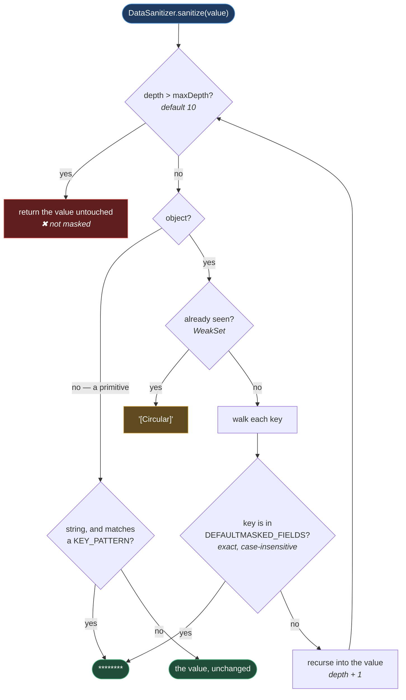
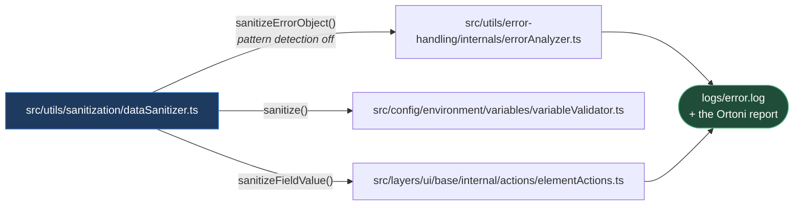

# Sanitization

**[← Back to Foundation](README.md)**

This page explains how the framework keeps credentials, tokens, and personal data out
of the things it writes down. The code lives in `src/utils/sanitization/`.

It matters because of where the output goes. A Playwright failure carries the state
that produced it, and the framework writes that state to `logs/error.log` and into an
Ortoni HTML report — artifacts that get committed to a CI job, downloaded, and pasted
into a ticket. A password that reaches an error message reaches all three.

## Table of Contents

- [What It Does](#what-it-does)
- [The Files](#the-files)
- [Two Independent Mechanisms](#two-independent-mechanisms)
  - [Sensitive Keys](#sensitive-keys)
  - [Value Patterns](#value-patterns)
- [The Sanitize Path](#the-sanitize-path)
- [The Four Public Methods](#the-four-public-methods)
- [What It Does Not Catch](#what-it-does-not-catch)
- [Who Calls It](#who-calls-it)
- [Practical Outcome](#practical-outcome)

## What It Does

`DataSanitizer` takes a value — a string, an object, an array, an error — and returns
the same shape with sensitive parts replaced by `********`
(`MASK_PLACEHOLDER`).

It is a pure transformation. It does not log, it does not throw, and it holds no
state, which is why it sits at the very bottom of the dependency graph beside the
logger: [dataSanitizer.ts](../../../src/utils/sanitization/dataSanitizer.ts) imports nothing
from this repository except its own configuration file.

## The Files

| File                                                     | Responsibility                                                                                         |
| -------------------------------------------------------- | ------------------------------------------------------------------------------------------------------ |
| `src/utils/sanitization/internals/sanitizationConfig.ts` | The policy, as data: `MASK_PLACEHOLDER`, `KEY_PATTERNS`, `DEFAULTMASKED_FIELDS`, `SanitizationParams`. |
| `src/utils/sanitization/dataSanitizer.ts`                | The mechanism: recursive walk, key matching, pattern matching, masking.                                |

The split is the same one the repository uses everywhere: **policy as data, mechanism
in code**. Adding a field name to mask is an edit to a list in
`sanitizationConfig.ts`; `dataSanitizer.ts` does not change.

## Two Independent Mechanisms

The single most useful thing to know about this module is that it masks for **two
unrelated reasons**, and they behave differently. A value is masked if either fires.

### Sensitive Keys

If the **name of a field** is in `DEFAULTMASKED_FIELDS`, its value is replaced —
whatever the value is.

The list at
[sanitizationConfig.ts:34-52](../../../src/utils/sanitization/internals/sanitizationConfig.ts#L34-L52)
covers `email`, `username`, `password`, `apiKey`, `secretKey`, `authorization`, `auth`,
`authentication`, `token`, `accessToken`, `refreshToken`, `bearerToken`, `cookie`,
`jwt`, and three Playwright accessible-name strings: `Email input`, `Username input`,
`Password input`.

Those last three are the interesting ones. They are not object keys — they are the
labels the UI actions use to find a field on the page, and they are in the list so that
`ElementActions` can ask "is the thing I am about to type into a secret?" and log
`********` instead of the value. That is `sanitizeFieldValue`, and it is why the list
contains what looks like prose.

**Matching is exact and case-insensitive**
([dataSanitizer.ts:231-234](../../../src/utils/sanitization/dataSanitizer.ts#L231-L234)). `PASSWORD`
is masked, `Password` is masked, and **`userPassword` is not** — the key must equal an
entry in the list, not contain one. This is the module's sharpest edge and it is worth
reading twice.

### Value Patterns

Independently, any **string value** that matches one of `KEY_PATTERNS` is masked, no
matter what field it sits in
([sanitizationConfig.ts:16-29](../../../src/utils/sanitization/internals/sanitizationConfig.ts#L16-L29)):

| Pattern       | Catches                                              |
| ------------- | ---------------------------------------------------- |
| Email address | `someone@example.com`, anywhere in the string        |
| JWT           | Three dot-separated base64url segments               |
| Base64        | 20+ characters of base64 alphabet, optionally padded |
| Bearer token  | `Bearer <token>`, case-insensitive                   |
| Access token  | `access_token=` followed by 20+ word characters      |

When a pattern matches, the **entire value** is replaced — not the matching substring.
A message reading `Login failed for user@corp.com` becomes `********`, not
`Login failed for ********`.

Pattern detection is on by default and can be turned off per call via
`enablePatternDetection`. One caller does exactly that, and
[Who Calls It](#who-calls-it) explains why.

## The Sanitize Path

**Why it is built this way.** The two guards on the left — depth and the `WeakSet` —
are there because the input is untrusted in **shape**, not just in content. The
sanitizer is handed values of type `unknown` from `catch` blocks, and an arbitrary
object may be nested to any depth or hold a reference back to itself; a naive recursive
walk over one either blows the stack or never terminates. `processValue`
([dataSanitizer.ts:139-162](../../../src/utils/sanitization/dataSanitizer.ts#L139-L162)) checks both
before it touches anything, and marks a cycle as `[Circular]` rather than following it.

The red edge is the honest part of the picture. Hitting `maxDepth` returns the value
**unmasked** rather than throwing or masking wholesale — so a secret nested more than
ten levels deep is not protected. That is a silent failure mode, and a page that drew
only the happy path would be hiding it.

## The Four Public Methods

| Method                                 | Use it for                                                                                    |
| -------------------------------------- | --------------------------------------------------------------------------------------------- |
| `sanitize(data, config?)`              | The general case. Any value, any shape. Both mechanisms active.                               |
| `sanitizeFieldValue(fieldName, value)` | One field, by name. Returns `{ displayValue, isSensitive }` — the caller decides what to log. |
| `sanitizeErrorObject(obj)`             | An error. **Drops `stack` and disables pattern detection.**                                   |
| `sanitizeString(value)`                | A plain string. Strips ANSI escapes, quotes, backslashes, and angle brackets. No masking.     |

`sanitizeString` is the odd one: it does not mask anything. It removes terminal colour
codes and characters that would break the JSON a log line is embedded in. It is
hygiene, not secrecy.

## What It Does Not Catch

Stated plainly, because a sanitizer that is trusted for more than it does is worse than
none:

- **Substrings of key names.** `userPassword`, `password_confirm`, and `oldToken` are
  not in the list and are not matched by it. Only exact names are.
- **Anything deeper than `maxDepth`.** Ten levels, then it stops looking.
- **Secrets that look like nothing.** A password of `hunter2` in a field called `value`
  matches no key and no pattern, and passes through untouched.
- **Values already stringified.** Once an object has been through `JSON.stringify`, its
  keys are text. Key matching no longer applies; only the value patterns can fire.

There is also a false positive worth knowing about: the Base64 pattern matches any
unbroken run of 20 or more base64 characters, so a long alphanumeric correlation ID or
a hash can be masked to `********` even though it is not a secret. That trade is
deliberate — a masked ID is an inconvenience and a logged token is an incident — but it
does mean a mask in a log is not proof that something sensitive was there.

## Who Calls It

**Why it is built this way.** Every arrow into the sanitizer sits immediately _before_
something is written down — none of them sit at the boundary where data enters the
framework. That is the correct place for it: sanitizing on the way in would mean the
framework could no longer _use_ the password it just masked. The value has to stay real
right up to the moment it is recorded, and be masked exactly there.

`ErrorAnalyzer` is the one caller that turns pattern detection **off**
([dataSanitizer.ts:66](../../../src/utils/sanitization/dataSanitizer.ts#L66)). By the time it runs,
the error's `message` and `stack` have already been sanitized separately by
`ErrorCacheManager`, and it is walking the error's remaining properties — where a
second pass of pattern matching would add cost without adding protection.
[ERROR_HANDLING.md](ERROR_HANDLING.md) covers that flow.

## Practical Outcome

A credential that ends up inside an error object, a validated environment variable, or
a form field the tests type into is replaced with `********` before it reaches
`logs/`, the console, or the HTML report — and the rules for what counts as a secret
live in one list that a contributor can extend without reading the code that applies
it. The limits are real and are listed above rather than implied away: the sanitizer
is a net with a known mesh, not a guarantee.
