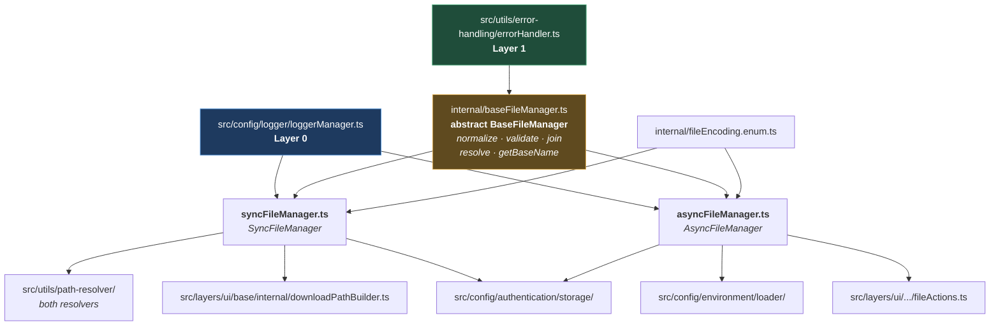
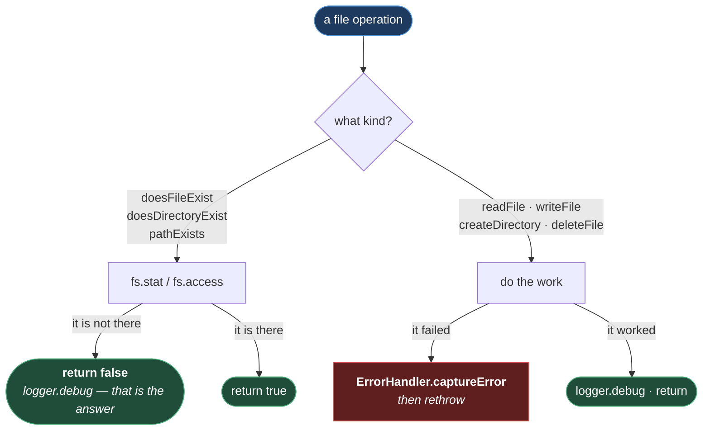

# File Managers

**[← Back to Utilities](README.md)**

This page covers `src/utils/file-manager/`. Every file the framework reads or writes — the
`.env` file, the auth state, a download — goes through one of two classes here, and neither
of them is `fs`.

The reason is not abstraction for its own sake. Node's `fs` gives you a raw path, an
exception you have to catch, and no log line. This module adds three things to every
operation: the path is **normalised and checked**, the failure is **captured through
`ErrorHandler`**, and the outcome is **logged**. Doing that once, here, is why no caller
anywhere else in `src/` has a `try`/`catch` around a `writeFileSync`.

## Table of Contents

- [The Shape](#the-shape)
- [The Base Class](#the-base-class)
  - [Why normalize Rejects Null Bytes](#why-normalize-rejects-null-bytes)
- [Sync And Async, And Why Both](#sync-and-async-and-why-both)
- [Reads Return False, Writes Throw](#reads-return-false-writes-throw)
- [A Write Creates Its Own Directory](#a-write-creates-its-own-directory)
- [FileEncoding](#fileencoding)
- [Practical Outcome](#practical-outcome)

## The Shape



**Why it is built this way.** The two managers are twins, not variants. They expose nearly
the same method names — `doesFileExist`, `readFile`, `writeFile`, `createDirectory`,
`checkAccess` — with the same argument order, differing only in that one returns `T` and the
other returns `Promise<T>`.

That symmetry is deliberate: a caller that has to switch from sync to async should change the
class name and add an `await`, and nothing else. Everything they genuinely share — the path
guards, the name helpers — lives in `BaseFileManager`, so it cannot drift between the two.

## The Base Class

`BaseFileManager` is abstract and holds no I/O at all. It contributes two protected guards
that every operation in both subclasses calls first, and a handful of public path helpers
(`resolve`, `join`, `getBaseName`, `getBaseNameWithExtension`, `getExtension`) that are just
`path` with a check in front.

| Guard                           | Rejects                                                                                                                                   |
| ------------------------------- | ----------------------------------------------------------------------------------------------------------------------------------------- |
| `normalize(inputPath)`          | An empty path, and a path containing a **null byte**. Then resolves it to an absolute path.                                               |
| `validate(filePath, paramName)` | An empty argument. And — when the parameter is named `filePath` — a path ending in a `/` or `\`, because that is a directory, not a file. |

`getAccessModeDescription` turns an `fs.constants` bitmask into words — `"exists, readable"`
— so an access failure reports what was actually being asked for rather than the number `4`.

### Why normalize Rejects Null Bytes

```ts
if (inputPath.includes("\0")) {
  throw new Error("Path contains null bytes");
}
```

A null byte in a path is the **poison null byte** attack: in some runtimes a string like
`"safe.txt\0.png"` is truncated at the null by the underlying C library, so a check that
inspected the extension would see `.png` while the filesystem opened `safe.txt`. Node itself
rejects these now, but it rejects them with a `TypeError` from deep inside `fs` — this rejects
them at the boundary, by name, before a path built from untrusted input goes anywhere near the
disk.

It is cheap, and it is the kind of check that is only ever added _before_ it is needed.

## Sync And Async, And Why Both

Async is the default and the one to reach for. Sync exists because **some callers cannot
await**, and that is a fact about where they sit, not a preference:

| Caller                                    | Why it must be synchronous                                                                               |
| ----------------------------------------- | -------------------------------------------------------------------------------------------------------- |
| `EnvPathResolver.rootPath`                | A **getter**. A getter cannot be `async`; its whole value is being readable as a property.               |
| `AuthenticationPathResolver.getRootDir()` | Called from `getFilePath()`, which the `storageState` fixture and `globalSetup` both call synchronously. |
| `AuthenticationFileManager.resetSync()`   | Exists explicitly for a context where `await` is not available.                                          |
| `DownloadPathBuilder.createFilePath()`    | Builds a path string. Making it async would make every caller of it async.                               |

The pattern in all four: **path construction is synchronous, file content is asynchronous.**
Resolving where a file lives, and making sure its directory exists, happens inline; reading or
writing its contents is awaited.

Making the resolvers async would have pushed `await` up through `EnvironmentVariables`'
getters and into `playwright.config.ts` — which is not a place you can await. The sync class
is what stops that spreading.

## Reads Return False, Writes Throw

The asymmetry is the most important behaviour in this module, and it is easy to mistake for
inconsistency:



**Why it is built this way.** A question and a command fail differently.

`doesFileExist("envs/.env.qa")` returning `false` is not a failure — it is **the answer to the
question that was asked**. The environment loader asks it precisely because the file might not
be there ([ENVIRONMENT_LOADING.md](../environment/LOADING.md#a-missing-file-is-a-warning-not-an-error)),
and throwing would force every caller to wrap a `try`/`catch` around a question whose negative
answer is completely normal. So these log at `debug` and return `false`.

`writeFile` failing _is_ a failure. Nobody calls it hoping it might not work. It captures
through `ErrorHandler` — so the failure is structured, sanitized, and in `logs/error.log` — and
then **rethrows**, because the caller asked for a file to exist and it does not.

Two methods sit slightly awkwardly between the two: `checkAccess` and
`SyncFileManager.ensureDirectoryExists` both capture the error _and_ return a value rather than
throwing. That is a defensible middle — the caller gets a boolean and the failure is still
recorded — but it does mean a failed `checkAccess` writes an entry to `error.log` for something
the caller may be entirely relaxed about.

## A Write Creates Its Own Directory

`writeFile` and `createFile`, in both classes, call `ensureDirectoryExists` (sync) or
`createDirectory` (async) on the parent before writing
([syncFileManager.ts:137-138](../../../src/utils/file-manager/syncFileManager.ts#L137-L138)).

This removes an entire class of bug from every caller. Nothing in `src/` has to check whether
`.auth/` or `downloads/` exists before writing into it, and no caller can forget to. `mkdir` is
recursive, so a nested path works on the first attempt.

`writeFile` also rejects `null` or `undefined` content by name — using the `keyName` argument,
so the error says _which_ file was being written rather than reporting a path. That is why
`writeFile` takes a `keyName` at all; it is purely for the error message.

## FileEncoding

An enum of four: `UTF8`, `BASE64`, `ASCII`, `HEX`
([fileEncoding.enum.ts](../../../src/utils/file-manager/internal/fileEncoding.enum.ts)). It
defaults to `UTF8` on every read and write, and in practice `UTF8` is the only one used —
`AuthenticationFileManager` passes it explicitly.

It is an enum rather than a raw string so that a typo (`"utf-8"`, `"utf8 "`) is a compile
error rather than a runtime one, which is the one thing an encoding argument is prone to.

## Practical Outcome

Every path the framework touches is normalised and checked before it reaches the disk. Every
write creates its own parent directory, so no caller checks first. Every failure lands in
`logs/error.log` in the same structured shape, without a single `try`/`catch` at any call
site. And a caller can tell, from the return type alone, whether it is asking a question that
may legitimately be answered "no" or issuing a command that must succeed.
