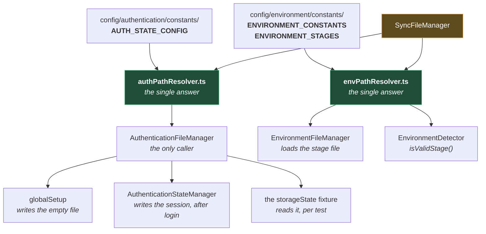

# Path Resolvers

**[← Back to Utilities](README.md)**

This page covers `src/utils/path-resolver/`. Two classes, each answering one question:

- **`EnvPathResolver`** — where is the `.env` file for a given stage?
- **`AuthenticationPathResolver`** — where is the auth state file for this run?

Neither reads or writes anything. They compute a string, and that is the entire point: a path
is a **shared fact** between processes that never meet, and the moment two of them compute it
separately they can disagree.

## Table of Contents

- [Why A Path Gets Its Own Class](#why-a-path-gets-its-own-class)
- [EnvPathResolver](#envpathresolver)
- [AuthenticationPathResolver](#authenticationpathresolver)
  - [The Shard Suffix](#the-shard-suffix)
- [Both Create Their Directory On First Access](#both-create-their-directory-on-first-access)
- [Both Are Default Exports — Name Them Consistently](#both-are-default-exports--name-them-consistently)
- [Practical Outcome](#practical-outcome)

## Why A Path Gets Its Own Class

The auth state file makes the argument on its own. Three separate things need its path, and
they run at three different times, in three different processes:



**Why it is built this way.** If `globalSetup`, the state manager, and the fixture each built
the auth path themselves, a change to the shard suffix would have to land identically in three
files. Get it wrong in one and the login writes to one path while the tests read from another
— so every test starts signed out and fails as though the credentials were rejected. The
symptom points at the login; the cause is a string.

One resolver makes that disagreement impossible to express. The constants sit above it, so
even the _filename_ is not typed out here — it comes from `AUTH_STATE_CONFIG`.

Both resolvers are built on `SyncFileManager` rather than `path`, which is what gives them the
normalisation and the guards described in [FILE_MANAGERS.md](FILE_MANAGERS.md). And both are
synchronous because their callers cannot await — a getter and a Playwright config are both
places where `await` is not available.

## EnvPathResolver

Two public methods
([envPathResolver.ts](../../../src/utils/path-resolver/envPathResolver.ts)):

| Method                   | Returns                                                                                         |
| ------------------------ | ----------------------------------------------------------------------------------------------- |
| `getEnvironmentStages()` | A record of every stage to its file path: `{ dev: "…/envs/.env.dev", qa: "…/envs/.env.qa", … }` |
| `isValidStage(value)`    | A **type guard** — narrows an `unknown` to `EnvironmentStage`.                                  |

It builds the record by mapping over `ENVIRONMENT_STAGES` and joining `ROOT` with
`BASE_FILE` + the stage name, so `envs/.env.qa` is never written down as a literal anywhere.
Adding a stage is one entry in one array, and the path appears with it.

`isValidStage` is what makes `EnvironmentDetector.getCurrentEnvironmentStage()` safe: an
arbitrary `ENV` from the shell is checked against the real list before it is treated as a
stage, and falls back to `dev` if it is not one. The type guard means the _compiler_ then knows
it is an `EnvironmentStage`, with no cast.

The stage files themselves, and what happens when one is missing, are
[ENVIRONMENT_LOADING.md](../environment/LOADING.md).

## AuthenticationPathResolver

Two public methods, and a private `execute` wrapper
([authPathResolver.ts](../../../src/utils/path-resolver/authPathResolver.ts)):

| Method                | Returns                                                     |
| --------------------- | ----------------------------------------------------------- |
| `getFilePath()`       | The absolute path to the auth state file — **shard-aware**. |
| `getEmptyAuthState()` | The string `"{}"`, from `AUTH_STATE_CONFIG.EMPTY_STATE`.    |

Every method body is wrapped in `execute(methodName, errorMessage, operation)`, which is a
three-line `try`/`catch` that captures through `ErrorHandler` and rethrows
([authPathResolver.ts:51-62](../../../src/utils/path-resolver/authPathResolver.ts#L51-L62)). It
exists so the three methods do not each carry an identical `try`/`catch` — the error context is
passed in as data instead of repeated as code.

### The Shard Suffix

`getFilePath()` returns a different filename when the run is sharded
([authPathResolver.ts:20-25](../../../src/utils/path-resolver/authPathResolver.ts#L20-L25)):

| `SHARD_INDEX` / `SHARD_TOTAL` | File                          |
| ----------------------------- | ----------------------------- |
| Neither set                   | `.auth/ci-login.json`         |
| Both set, index 2             | `.auth/ci-login-shard-2.json` |

The suffix appears only when **both** variables are present — the same both-or-neither test
`WorkerAllocator` uses to decide whether a run is sharded at all
([WORKER_ALLOCATION.md](../execution/WORKER_ALLOCATION.md#the-two-modes)). Two independent modules agreeing
on what "sharded" means is not a coincidence worth relying on, but it is the current behaviour
and both read the same two variables.

**Why the filename changes at all** — every shard is a separate process running its own login,
so without the suffix they would all write to one path simultaneously. That reasoning, and what
a half-written storage-state file does to a run, is
[AUTHENTICATION_STORAGE.md](../execution/AUTHENTICATION_STORAGE.md#one-file-per-shard). This page is only
about _where the string comes from_.

## Both Create Their Directory On First Access

Each resolver caches its root directory in a static field, and creates the directory the first
time it is asked for:

```ts
private static get rootPath(): string {
  if (this.rootDir === null) {
    this.rootDir = SyncFileManager.resolve(ENVIRONMENT_CONSTANTS.ROOT);
    SyncFileManager.ensureDirectoryExists(this.rootDir);
  }
  return this.rootDir;
}
```

**Why create it here, rather than expecting it to exist.** `.auth/` is gitignored
([.gitignore:13](../../../.gitignore#L13)) and holds a live session, so it is never committed — a
fresh clone does not have it. A framework that assumed the directory existed would fail on a
new machine with `ENOENT` for a folder the user has never heard of, before a single test ran.

`envs/` is the milder case: the folder _is_ present in a clone, because `envs/.env.example` is
checked in — `.gitignore` ignores `.env*` but un-ignores that one file. The real stage files
are not. So the directory check there is defensive rather than load-bearing, and the two
resolvers use the same pattern because there is no reason for them to differ.

Creating the directory on first access is what makes a fresh clone run rather than fail on a
missing folder that nothing told the user to create.

**Why cache it.** The getter is called on every path resolution, and the directory check is a
filesystem call. Caching the resolved root means the `ensureDirectoryExists` happens once per
process, not once per lookup. The cache is per-process, which is the correct scope — a new
Playwright worker is a new process and does its own check.

## Both Are Default Exports — Name Them Consistently

Each resolver is a **default** export, which means the importer chooses the name it is known
by:

```ts
import EnvPathResolver from "../../../utils/path-resolver/envPathResolver.js";
```

That freedom is worth using carefully. Both importers of `envPathResolver.ts` call it
`EnvPathResolver`, and they should keep doing so: the moment one of them picks a different
name, grepping for the class finds some of its call sites and not others, and it starts to look
like two classes rather than one.

The rule is not enforced by anything. It costs nothing to follow and it is invisible when
broken, which is the combination worth writing down.

## Practical Outcome

Where the `.env` file lives, and where the auth state lives, is each computed by exactly one
class, from constants, and cached. Three processes that never meet agree on the auth path
because none of them works it out. The directories are created on first use, so a fresh clone
runs. And adding an environment stage means adding one string to one array — the path follows.
