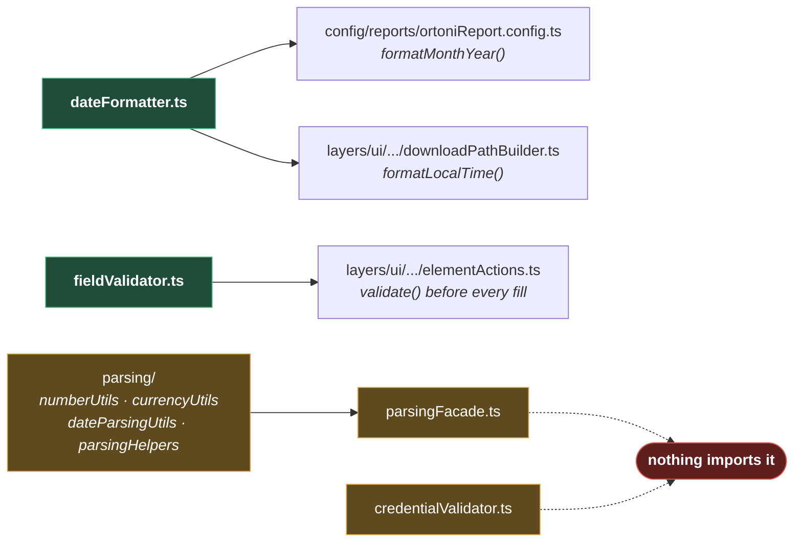

# Shared Utils

**[← Back to Utilities](README.md)**

This page covers `src/utils/shared/` — a folder of small, dependency-light helpers that do not
belong to any one area of the framework.

It is the folder most likely to be misread, so the honest summary comes first: **two of these
are used, and the rest are not.** `DateFormatter` and `FieldValidator` are wired into running
code. `CredentialValidator`, `ParsingFacade`, and everything under `parsing/` are written,
tested by nothing, and called by nothing. That is a fine state for a framework that has not
written its first test yet — but a page that presented all five as though they were load-bearing
would be lying, and you would find out the hard way.

## Table of Contents

- [What Is Actually Used](#what-is-actually-used)
- [DateFormatter](#dateformatter)
  - [Why The Timestamp Has No Separators](#why-the-timestamp-has-no-separators)
- [FieldValidator](#fieldvalidator)
- [The Parsing Suite](#the-parsing-suite)
  - [Why A Facade Over Four Files](#why-a-facade-over-four-files)
  - [The this-void Signature](#the-this-void-signature)
- [CredentialValidator](#credentialvalidator)
- [Practical Outcome](#practical-outcome)

## What Is Actually Used



**Why it is built this way — or rather, why it is in this state.** The parsing suite is
domain-shaped: it parses currency, percentages, and CBM (cubic-metre) values out of table
cells. That is the work of a test asserting against a grid in a real application, and no such
test exists yet. The suite was written ahead of the tests that will use it.

That is a legitimate order to build in. What it means for you today is that **these functions
have never run**, and the first spec to call one is also the first thing that will find out
whether it works.

## DateFormatter

Four static methods, no dependencies at all — not even `ErrorHandler`
([dateFormatter.ts](../../../src/utils/shared/dateFormatter.ts)):

| Method                      | Returns                                                       |
| --------------------------- | ------------------------------------------------------------- |
| `formatLocalTime()`         | The current local time as `20260714143000`.                   |
| `formatDate(date)`          | The same format, for a supplied `Date`.                       |
| `generateId(prefix = "IT")` | `IT-20260714143000` — a timestamped identifier.               |
| `formatMonthYear(date?)`    | `Jul, 2026`. Used for the Ortoni report's "Test Cycle" field. |

`formatLocalTime` is what makes a downloaded file unique:
`DownloadPathBuilder` appends it to every filename, so a second run of the same test cannot
overwrite the first run's evidence ([PAGE_ACTIONS.md](../../04-layers/ui/PAGE_ACTIONS.md#downloads)).

### Why The Timestamp Has No Separators

`formatLocalTime` and `formatDate` join their parts with an empty string, so the output is
`20220722143000` rather than `2022-07-22 14:30:00`.

That is deliberate, and it is a consequence of where the value is used: **inside filenames.**
A colon is illegal in a Windows filename, and a space is a nuisance in a shell — so a
timestamp destined for `downloads/report_<timestamp>.csv` cannot carry either. The compact form
is safe everywhere and still sorts chronologically as a string.

It is not a general-purpose date formatter, and it should not be reached for when a human has
to read the result. `formatMonthYear` is the one that produces something legible, and it is
used for exactly that — the report's "Test Cycle" heading.

## FieldValidator

One method, and it runs on every keystroke the framework types
([fieldValidator.ts](../../../src/utils/shared/fieldValidator.ts)):

```ts
public static validate(
  value: string,
  method: string,
  { allowEmpty = false }: FieldValidationOptions = {},
): string {
  const trimmed = value?.trim() ?? "";
  if (!allowEmpty && !trimmed) {
    ErrorHandler.logAndThrow(method, "Input value cannot be empty");
  }
  return trimmed;
}
```

`ElementActions.fillElement` and `typeDigitsSequentially` both call it before touching the page,
and **they type the trimmed value it returns**, not the value they were given.

**Why it throws by default.** Filling a field with an empty string is almost never what a test
meant to do — it usually means the value it was passing came from an unset variable, or a
lookup that returned nothing. Playwright would accept it happily, clear the field, and the test
would fail several steps later on an assertion that made no sense.

Failing at the fill, naming the calling method, points at the mistake. `allowEmpty: true` is
there for the case where clearing a field genuinely _is_ the intent.

The `?.` and `??` in `value?.trim() ?? ""` handle a `null` arriving from an untyped source
despite the signature saying `string` — a belt-and-braces read for a value that crosses the
boundary from test data.

## The Parsing Suite

Five files, one public class. Nothing imports the public class.

| File                                 | Holds                                                                                                                                           |
| ------------------------------------ | ----------------------------------------------------------------------------------------------------------------------------------------------- |
| `parsing/internal/parsingHelpers.ts` | `normaliseStringValue` (non-breaking spaces → spaces, collapse whitespace, trim), `stripCommas`, `baseNumericValue`.                            |
| `parsing/numberUtils.ts`             | `parseNumber`, `parseLeadingNumber`, `parsePercentage`, `parseCbm`, `sumNumbers`, `calculateCbmSum`, `roundToTwoDecimals`, `assertValidNumber`. |
| `parsing/currencyUtils.ts`           | `parseCurrency`, `parseCurrencyArray`.                                                                                                          |
| `parsing/dateParsingUtils.ts`        | `isValidDate` — validates `dd MMM yyyy`, e.g. `24 Feb 2026`.                                                                                    |
| `parsingFacade.ts`                   | Re-exposes all of the above as one class.                                                                                                       |

The problem they exist to solve is real: text read out of a web page is not a number.
`" 1,234.50 "` has a non-breaking space, a thousands separator, and padding, and
`Number()` on it returns `NaN`. Every helper here funnels through `normaliseStringValue` first
— which is why the non-breaking space (` `), the character a browser emits and a human
cannot see, is handled once, in one place, rather than being the reason one assertion in twenty
fails inexplicably.

`dateParsingUtils.isValidDate` is stricter than `new Date(value)` deliberately: it parses
`dd MMM yyyy` by hand and then **re-checks that the constructed date matches the input**
([dateParsingUtils.ts:50-56](../../../src/utils/shared/parsing/dateParsingUtils.ts#L50-L56)). That
round-trip is what rejects `31 Feb 2026`, which JavaScript's own `Date` would silently roll
forward to 3 March.

### Why A Facade Over Four Files

`ParsingFacade` adds no logic. Every method delegates one call deeper.

The value it offers is a single import for a test author — `ParsingFacade.parseCurrency(...)`
rather than knowing whether that lives in `currencyUtils` or `numberUtils` — while the
implementation stays split into files small enough to reason about. The split is for the
maintainer; the facade is for the caller.

Whether that trade is worth a fifth file is a fair question, and one worth revisiting when the
first test actually uses it.

### The this-void Signature

Nearly every method in the parsing suite is declared `(this: void, …)`:

```ts
public static parseNumber(this: void, value: string): number
```

That annotation says the function does not use `this`, which makes it **safe to pass as a bare
reference**. It is what allows:

```ts
return values.map(NumberUtils.parseNumber);
```

Without it, `map` would call the function with `this` unbound, and TypeScript's
`no-unsafe-*` rules would object. It is a small thing that makes the functions composable, and
it is the reason the suite reads as a set of plain functions that happen to live on classes.

## CredentialValidator

Also unused, and the most interesting of the three because of what it is _for_
([credentialValidator.ts](../../../src/utils/shared/credentialValidator.ts)).

It guards against one specific mistake: running the tests with the credentials from
`envs/.env.example` still in place. Those values are literally `portal.username` and
`portal.password`, and `validateNotPlaceholder` matches exactly that pattern:

```ts
private static PLACEHOLDER_PATTERN = /^portal\.(username|password)$/;
```

**Why that is worth a class.** Copying `.env.example` to `.env.qa` and forgetting to fill it in
is the single most likely first-run mistake anyone will make with this framework. Without this
guard, the tests would submit `portal.username` to a real login form, get rejected, and fail
with "invalid credentials" — which is _true_, and tells you nothing about the actual mistake.

With it, the failure says: _Username is still a placeholder ("portal.username"). Update env
credentials._

Its JSDoc suggests the intended call site — `LoginPage.fillUsernameInput` — a page object that
does not exist yet. **This is a guard waiting for the first login page to be written**, and
whoever writes it should wire this in.

## Practical Outcome

Two helpers are doing real work today: every value the framework types into a field is trimmed
and checked first, and every downloaded file carries a timestamp that keeps runs from
overwriting each other. The rest of the folder — the parsing suite, the placeholder guard — is
built and waiting for the first spec, and this page says so rather than letting you assume
otherwise. When that spec arrives, `CredentialValidator` is the one to wire in first: it turns
the most likely first-run mistake into a sentence that names it.
