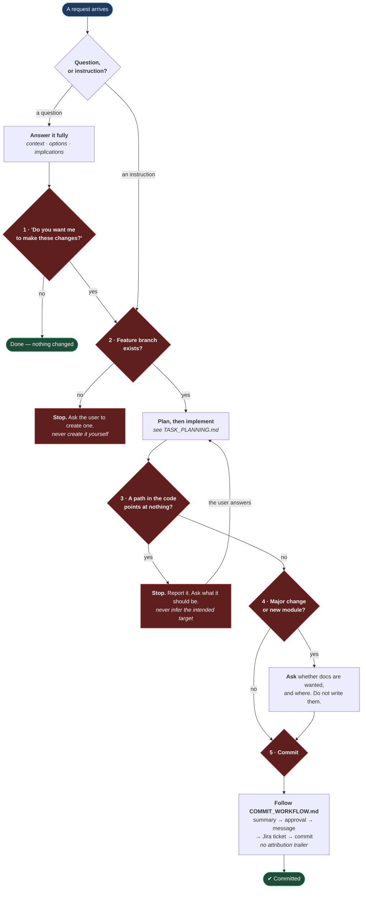

# Agent Rules

**[← Back to Main Documentation](../../README.md)**

This page governs how an AI assistant behaves in this repository. It is about
**conduct**, not about code: what the assistant may do on its own, and where it must
stop and ask.

Every rule here exists because the failure it prevents is expensive and quiet. An
agent that acts on a question instead of answering it has already changed the code
by the time you realise you only wanted to know something.

The rules on _naming_ live in [CONVENTIONS.md](./CONVENTIONS.md); the rules on
_writing a method_ live in [CODE_QUALITY.md](./CODE_QUALITY.md).

## Table of Contents

- [The Gates](#the-gates)
- [Answer Before Acting](#answer-before-acting)
- [Never Guess A Broken Path](#never-guess-a-broken-path)
- [Never Create A Branch](#never-create-a-branch)
- [Never Commit Without Approval](#never-commit-without-approval)
- [Never Add An Attribution Trailer](#never-add-an-attribution-trailer)
- [Ask Before Writing Documentation](#ask-before-writing-documentation)
- [Practical Outcome](#practical-outcome)

## The Gates

Five points where the assistant must stop. They are drawn in red because stopping
at them is the entire rule:



**Why it is built this way.** Every gate sits _before_ the irreversible act, never
after. That is what makes it a gate rather than a notification. Asking "shall I
commit?" once a commit exists, or "shall I document this?" once the page is written,
presents the user with finished work and turns their approval into a rubber stamp —
saying no now means throwing something away, so they say yes. The gates are placed
where "no" is still free.

## Answer Before Acting

When the user asks a **question**, do not modify code or files.

1. Answer the question fully.
2. Explain the relevant context, options, and implications.
3. Then ask: _"Do you want me to make these changes?"_

Only modify anything after an explicit confirmation.

A question is a question even when the answer obviously implies an edit. "Why is
this test flaky?" is a request for a diagnosis, not a licence to rewrite the test —
and an assistant that supplies both has destroyed the evidence the user was asking
about.

## Never Guess A Broken Path

**When an import, a path, or a reference points at something that does not exist,
stop and ask. Do not infer what it was meant to point at.**

This gate fires in the middle of the work rather than at a fixed point in the
request, so it has no natural moment to be remembered — which is exactly why it is
written down. Report the finding:

- the file and line holding the reference
- what it points at, and the fact that nothing is there
- what you believe was intended, as a **question**, not as an edit

Then wait.

**Why.** A path that points at nothing is evidence, and the assistant is not the one
who can read it. It has at least three meanings, and they demand opposite responses:

| What the broken path might mean     | What is actually needed          |
| ----------------------------------- | -------------------------------- |
| A typo in the import                | Fix the import                   |
| The file has not been written yet   | Write the file — or stop and ask |
| The file exists, in the wrong place | Move the file, not the import    |

Only the author knows which. An assistant that picks the nearest plausible target
and rewrites the import has chosen the first reading by default, silently — and if
the truth was the second or third, the "fix" is worse than the error it removed. The
red squiggle was pointing at a real gap; now it is gone, the code compiles, and the
gap is still there with nothing left to announce it.

This is the same failure as [Answer Before Acting](#answer-before-acting), wearing a
different disguise. The compiler asked a question. It did not ask for an edit.

The rule holds however obvious the intended target looks. `../../../../utils/` when
`../../../utils/` exists is almost certainly an off-by-one — and "almost certainly"
is not a standard anyone should be committing against.

## Never Create A Branch

**The user creates the branch. The assistant never does. No exceptions.**

If no feature branch exists when a task starts, stop and ask the user to create one
before doing anything else.

The naming rules and the promotion chain are in
[BRANCHING_STRATEGY.md](./BRANCHING_STRATEGY.md).

## Never Commit Without Approval

The full workflow — lint check, summary, approval, draft message, Jira ticket,
commit — is defined in [COMMIT_WORKFLOW.md](./COMMIT_WORKFLOW.md), and the message
format in [COMMIT_MESSAGES.md](./COMMIT_MESSAGES.md). It is not repeated here.

Two points bear restating because they are the ones most often eroded:

- **"Commit it" is not approval.** Even when the user says "commit", the summary and
  the confirmation still come first.
- **Never stage and commit in one action**, however small or obvious the change.

## Never Add An Attribution Trailer

Commits must be clean. No `Co-Authored-By` line, for any agent — Claude, Codex,
Copilot, or otherwise.

Do not add the trailer by hand, do not pass `--co-author`, and do not let a tool
append one.

This is enforced twice, on purpose.

`.claude/settings.json` stops Claude Code adding the trailer in the first place:

```json
{
  "includeCoAuthoredBy": false
}
```

And `.husky/commit-msg` rejects any commit message containing one, whoever or whatever
wrote it. The setting is a preference and preferences can be toggled, a different tool
can be used, or a trailer can be pasted in by hand — a rule enforced only by the
agent's own good behaviour is not enforced at all. The hook is the gate; the setting
just means you rarely meet it.

The reason for the rule: git history records who authored a change, and an attribution
trailer on every commit makes that record say "an agent was involved" and nothing more.
It is noise in `git log`, in `git blame`, and in every release note generated from them.

## Ask Before Writing Documentation

After a major change or a new module, **do not write or update documentation
immediately.**

First ask the user:

- whether documentation should be added at all
- where it should go

Only write it after an explicit yes. When writing it, follow
[DOCUMENTATION_PROMPT_GUIDE.md](../DOCUMENTATION_PROMPT_GUIDE.md).

The reason is that unrequested documentation is not free. It has to be reviewed, it
has to be kept true as the code moves, and a page nobody asked for is the first to
rot — at which point it is worse than the blank space it filled, because someone
will trust it.

## Practical Outcome

The user stays in control of the three things that are expensive to undo: what lands
in git history, what branch it lands on, and what the documentation claims. The
assistant does the work; it does not decide when the work is finished.
