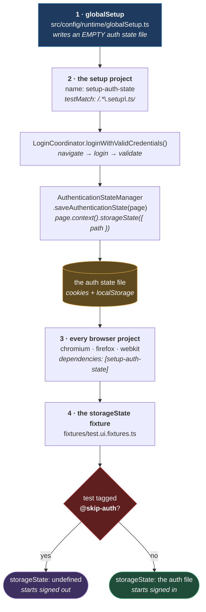
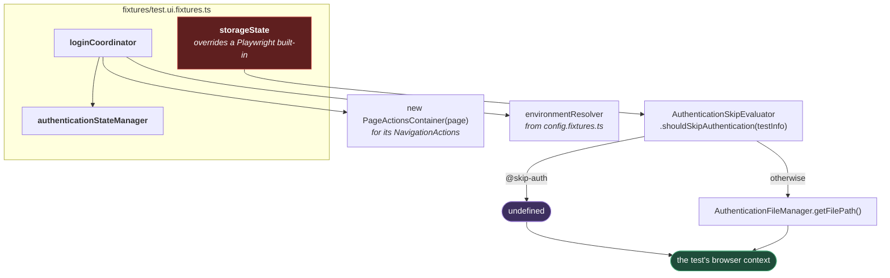

# Authentication

**[← Back to Main Documentation](../../../README.md)**

This page explains how a test arrives at the application already signed in. The code lives
in `src/layers/ui/authentication/`, but the flow reaches beyond it — into
`src/config/authentication/`, the Playwright projects, and `globalSetup`.

The premise is that **logging in is not part of most tests**. A checkout test is about
checkout; performing a login first makes it slower, and makes it fail for a reason that has
nothing to do with checkout. So the login happens **once**, its result is written to a file,
and every other test starts from that file.

## Table of Contents

- [The Storage-State Lifecycle](#the-storage-state-lifecycle)
- [LoginCoordinator](#logincoordinator)
  - [Why It Does Not Extend BasePage](#why-it-does-not-extend-basepage)
  - [Why The Private Helper Is Told Its Caller](#why-the-private-helper-is-told-its-caller)
- [The LoginExecutor Contract](#the-loginexecutor-contract)
- [The Fixtures Are Where It Is Wired](#the-fixtures-are-where-it-is-wired)
- [Skipping Authentication](#skipping-authentication)
- [Why The Setup Project Records No Trace](#why-the-setup-project-records-no-trace)
- [Sharding](#sharding)
- [What Is Not Built Yet](#what-is-not-built-yet)
- [Practical Outcome](#practical-outcome)

## The Storage-State Lifecycle

Four stages, in this order, every run:



**Why it is built this way.** Stage 1 looks redundant — why write an _empty_ file before
writing a real one? Because Playwright resolves `storageState` for a project when the run is
configured, and a path that does not exist is an error before any test has had the chance to
create it. `AuthenticationFileManager.initialize()`
([globalSetup.ts:30-41](../../../src/config/runtime/globalSetup.ts#L30-L41)) guarantees a valid,
empty state file exists at that path. The setup project then overwrites it with a real one.

It also means a run can never silently reuse yesterday's session: the file is reset at the
start of every run, so an expired storage state cannot survive into a run that would then
fail with a confusing "you are not logged in" error deep inside an unrelated test.

Stage 3 is what makes the ordering a fact rather than a hope.
[browserProjects.ts:24](../../../src/config/projects/internal/browserProjects.ts#L24) gives every
browser project `dependencies: [SETUP_PROJECT_NAME]`, so Playwright itself refuses to start
`chromium` until `setup-auth-state` has passed. The two names must agree, which is why
`SETUP_PROJECT_NAME` is a shared constant rather than a string typed twice.

## LoginCoordinator

`LoginCoordinator` sequences the login: navigate to the portal, drive the form, validate the
outcome, and — on the success path — save the state.

| Method                                               | Does                                                                                          |
| ---------------------------------------------------- | --------------------------------------------------------------------------------------------- |
| `navigateToPortal()`                                 | Reads the base URL from the `EnvironmentResolver` and navigates.                              |
| `loginWithValidCredentials(executor, credentials?)`  | Logs in, asserts success, **saves the auth state.** Credentials default to the environment's. |
| `loginWithInvalidCredentials(executor, credentials)` | Submits the credentials, asserts the rejection, **saves nothing.**                            |

The asymmetry in the signatures is deliberate. Valid credentials are optional, because "a
valid login" in practice means _the environment's_ credentials, and defaulting to them means
the setup file does not have to fetch them. Invalid credentials are required, because there
is no default wrong password — the credentials under test _are_ the test
([loginCoordinator.ts:78-81](../../../src/layers/ui/authentication/loginCoordinator.ts#L78-L81)).

Only the success path calls `AuthenticationStateManager`. A rejected login has no session
worth persisting, and saving one would overwrite the good state with a signed-out one.

### Why It Does Not Extend BasePage

It would be easy to make `LoginCoordinator extend BasePage` and get the whole action toolkit
for free. The class deliberately does not
([loginCoordinator.ts:10-19](../../../src/layers/ui/authentication/loginCoordinator.ts#L10-L19)).

It takes only the helpers it actually uses — a `Page`, a `NavigationActions`, an
`EnvironmentResolver`, an `AuthenticationStateManager` — and holds no locators at all.

**Why.** Extending `BasePage` would put `elementActions` on a coordinator's public surface,
and the next "just one quick field fill" would land here instead of in the page object. The
coordinator _coordinates_; the element work belongs to the `LoginExecutor`. Keeping the
toolkit off its surface is what stops that boundary eroding one convenient method at a time.

Note also that `EnvironmentResolver` arrives as a **constructor argument**, not an import
([loginCoordinator.ts:31](../../../src/layers/ui/authentication/loginCoordinator.ts#L31)). The
UI layer sits above the environment layer, so the dependency is inverted rather than reached
for — see [ARCHITECTURE.md](../../03-core/ARCHITECTURE.md).

### Why The Private Helper Is Told Its Caller

Both public methods delegate to a private `executeLoginFlow`, and both pass
`resolveCurrentMethod()` into it rather than letting it resolve its own source
([loginCoordinator.ts:64](../../../src/layers/ui/authentication/loginCoordinator.ts#L64)).

If the helper resolved the stack itself, it would find `executeLoginFlow` — the one name a
reader of the error log does not need. Each public method names _itself_, from the stack, so
the value cannot drift when the method is renamed. This is the second of the two functions in
`callerSource.ts`, and [PAGE_ACTIONS.md](PAGE_ACTIONS.md#two-functions-opposite-directions)
sets the pair side by side.

## The LoginExecutor Contract

`LoginCoordinator` never touches the login form. It calls an interface
([loginExecutor.types.ts:11-30](../../../src/layers/ui/authentication/types/loginExecutor.types.ts#L11-L30)):

```ts
export interface LoginExecutor {
  login(credentials: Credentials): Promise<void>;
  validateSuccess(): Promise<void>;
  validateFailure(): Promise<void>;
}
```

The page object that drives the form implements this, and the coordinator drives the page
object.

**Why it is an interface and not two callbacks.** It used to be two callbacks — a `loginFn`
and a `validateFn`. Both had the type `() => Promise<void>`, which means passing the
**failure** validator to the **success** path compiled cleanly, and nothing tied the two
functions to the same page object.

Naming the contract makes both mistakes impossible to express. `validateSuccess` and
`validateFailure` are distinct members of one object, so they cannot be swapped, and they
cannot come from two different places.

## The Fixtures Are Where It Is Wired

`fixtures/test.ui.fixtures.ts` is not just a convenience layer over the classes above. It is
the file that decides, **per test**, whether that test is signed in — and it does so by
overriding a fixture Playwright already owns.



**Why it is built this way.** `storageState` is **Playwright's own option**, not a fixture
this framework invented — and overriding it in `test.extend` is the whole trick. Playwright
resolves it when it builds the context for each test, so returning a path for one test and
`undefined` for the next produces a signed-in browser and a signed-out browser _in the same
project, in the same run_.

The alternative would be a second Playwright project for signed-out tests, with its own
`use: { storageState: undefined }`. That works, and it is worse: a login test would then have
to be _moved into another project_ rather than tagged, the projects would double, and every
`--project=` invocation would need to know about both. The fixture override makes the
decision per test, where the test itself can express it in one tag.

Note also what `loginCoordinator` does to get its navigation helper
([test.ui.fixtures.ts:41](../../../fixtures/test.ui.fixtures.ts#L41)): it constructs a
`PageActionsContainer` purely to pull `navigation` out of it. The coordinator needs exactly
one of the seven action classes, and this is how it gets one without inheriting the other six
— the same boundary [Why It Does Not Extend BasePage](#why-it-does-not-extend-basepage)
describes, honoured at the wiring site as well as in the class.

## Skipping Authentication

A test that must start signed out — the login test itself, a registration flow, a
permissions check — tags itself `@skip-auth`.

`AuthenticationSkipEvaluator.shouldSkipAuthentication(testInfo)` reads the tag, and the
`storageState` fixture returns `undefined` instead of the auth file path
([test.ui.fixtures.ts:57-66](../../../fixtures/test.ui.fixtures.ts#L57-L66)).

The evaluator reads the tag from **two** places and unions them
([authenticationSkipEvaluator.ts:32-38](../../../src/config/authentication/evaluators/authenticationSkipEvaluator.ts#L32-L38)):
Playwright's structured `testInfo.tags`, and any `@token` written inline in the test's title
path. Both are read because a tag may legitimately be declared either way, and a test that
_looks_ tagged but starts signed in would fail for a reason its author would never guess.
Everything is lowercased before matching, so `@Skip-Auth` works too.

## Why The Setup Project Records No Trace

The `setup-auth-state` project sets `trace: "off"`, alone among the projects
([setupProjects.ts:31](../../../src/config/projects/internal/setupProjects.ts#L31)).

**Why.** It is the only project that ever handles a real username and password — every other
test reuses the storage state it produces. So it is the only project where a trace could
capture a secret, and a trace captures it completely.

A trace cannot be sanitized. `locator.fill(value)` is recorded verbatim, twice: once in the
action's params and once in the call log. The DOM snapshots hold the input's value too,
including on a `type="password"` field. Playwright's trace options are `{ mode, snapshots,
screenshots, sources, attachments }` — there is no mask, so there is no configuration that
keeps the trace and hides the value.

This is a different channel from the one `DataSanitizer` guards.
[SANITIZATION.md](../../03-core/foundation/SANITIZATION.md) covers the framework's own logs and its
report step titles; the trace is written by Playwright, underneath all of that.

Video and screenshots deliberately keep the global settings: the browser renders a password
field as dots, so the password is not legible in either. The username is — it is typed into a
plain text input — and that residual exposure is accepted.

The cost is real and was accepted knowingly: **if the login itself breaks, it must be
debugged without a trace.** Run it headed. That is a worse debugging experience for one spec,
in exchange for a password that never reaches an artifact a CI job might upload or archive.

## Sharding

In a sharded CI run each shard writes its own auth file.
`AuthenticationPathResolver.getFilePath()` appends the shard index when `SHARD_INDEX` and
`SHARD_TOTAL` are both set
([authPathResolver.ts:20-23](../../../src/utils/path-resolver/authPathResolver.ts#L20-L23)), and
falls back to the single shared file otherwise.

Every shard runs its own setup project, so without this they would all be writing to one path
at once — and a storage-state file half-written by one shard and read by another is a session
that belongs to nobody.

## What Is Not Built Yet

Stated plainly, because this page describes a flow whose first and last steps do not exist:

- **There is no `.setup.ts` file.** `tests/` is empty, so the `setup-auth-state` project's
  `testMatch: /.*\.setup\.ts/` currently matches nothing.
- **There is no `LoginExecutor` implementation.** `src/layers/ui/pages/` does not exist, so
  nothing implements `login`, `validateSuccess`, or `validateFailure`.

Everything else on this page is built: the coordinator, the state manager, the skip
evaluator, the file manager, the project dependencies, and the fixtures. What is missing is
the page object that drives the form and the setup spec that calls the coordinator — and
those are the two pieces a contributor writes first.

## Practical Outcome

A test author writes a test about the feature, and it runs signed in. A test that must not be
signed in writes `@skip-auth` and it is not. The password is typed exactly once per run, in
the one project that records no trace of it, and every other test inherits a session from a
file. The ordering is enforced by Playwright's own project dependencies rather than by a
convention someone has to remember.
