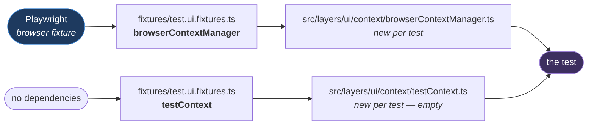
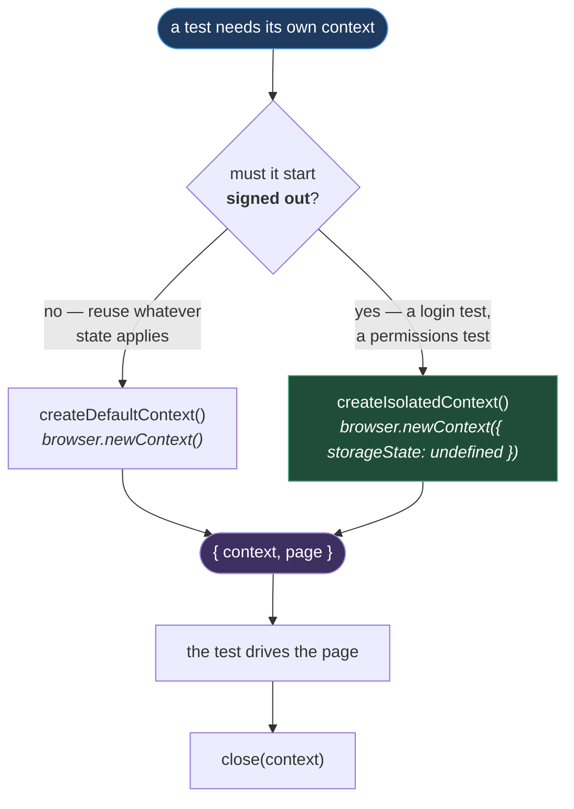

# Context

**[← Back to Main Documentation](../../../README.md)**

This page covers `src/layers/ui/context/`. Two small classes, both handed to a test as a
fixture, both concerned with the word _context_ in a different sense:

- **`BrowserContextManager`** — the browser's notion: a fresh, isolated browser context
  with its own cookies and storage.
- **`TestContext`** — the test's notion: a key/value store for a value produced in one step
  and needed in another.

They share a folder because they share a lifetime. Both are created per test, and both are
gone when it ends.

## Table of Contents

- [Where They Come From](#where-they-come-from)
- [BrowserContextManager](#browsercontextmanager)
  - [Default Versus Isolated](#default-versus-isolated)
  - [Waiting For A New Tab](#waiting-for-a-new-tab)
- [TestContext](#testcontext)
  - [Why get Throws](#why-get-throws)
- [Practical Outcome](#practical-outcome)

## Where They Come From

Neither class is constructed by a test. Both arrive as fixtures
([test.ui.fixtures.ts:23-29](../../../fixtures/test.ui.fixtures.ts#L23-L29)):



**Why it is built this way.** Both fixtures call `new` on every test, and that is the whole
isolation story. A `TestContext` declared once at module scope would be shared by every test
in the file — and a value one test wrote would still be there for the next, which is a
passing test that depends on the test before it. Constructing it in the fixture makes
leakage impossible rather than merely discouraged.

Nothing in `src/layers/ui/context/` enforces this. The guarantee is in the fixture, and the
fixture is the only thing that builds these classes.

## BrowserContextManager

It wraps a `Browser` and produces contexts. Four methods, and the only one with a decision
in it is which context you ask for.

### Default Versus Isolated



The two methods differ by exactly one option
([browserContextManager.ts:21-37](../../../src/layers/ui/context/browserContextManager.ts#L21-L37)):
`createIsolatedContext` passes `storageState: undefined` explicitly; `createDefaultContext`
passes nothing at all. Both then open a page and return the pair.

**Why the explicit `undefined` is the point.** The suite's whole design is that tests do
_not_ log in — they inherit a signed-in storage state produced once, which is the subject of
[AUTHENTICATION.md](AUTHENTICATION.md). That is exactly wrong for the test that _is_ the
login: a login test must begin with nothing, or it is asserting against a session it did not
create.

`storageState: undefined` is how a test says "give me a browser that has never seen this
application". Stating it explicitly, rather than trusting a default, is what makes the
intent survive a change to the surrounding configuration.

Both methods return a `BrowserContextWithPage` — a `{ context, page }` pair — because a
context with no page is useless and the caller would immediately open one. Returning both
removes a step nobody would want to skip.

`close(context)` is a null-guarded `context.close()`. It is safe to call on an
already-closed context, so a teardown does not have to track whether it already ran.

### Waiting For A New Tab

`clickAndWaitForNewPage`
([browserContextManager.ts:57-64](../../../src/layers/ui/context/browserContextManager.ts#L57-L64))
handles the one browser interaction that a `Locator` cannot express: a click that opens a
tab.

It races the click against the context's `page` event, waits for the new page to load, and
returns it. The `Promise.all` is the load-bearing part — registering the listener _after_ the
click would miss an event that has already fired, and the test would hang waiting for a tab
that opened a millisecond ago.

## TestContext

A `Record<string, unknown>` with six methods: `set`, `get`, `has`, `remove`, `clear`, `keys`.

It exists for a value that one part of a test produces and another needs — an order number
generated at checkout and asserted on the confirmation page, an ID returned by a form and
used by the cleanup. Passing it in a local variable works until the two parts are in
different page objects, or different steps, and then it does not.

### Why get Throws

`get` does not return `undefined` for a missing key. It throws
([testContext.ts:25-30](../../../src/layers/ui/context/testContext.ts#L25-L30)):

```ts
public get<T>(key: string): T {
  if (!(key in this.data)) {
    ErrorHandler.logAndThrow(resolveCurrentMethod(), `Key "${key}" does not exist.`);
  }
  return this.data[key] as T;
}
```

The source is named from the stack via `resolveCurrentMethod()`, not written as a literal — the
same reasoning as everywhere else in the UI layer
([PAGE_ACTIONS.md](PAGE_ACTIONS.md#two-functions-opposite-directions)). A hard-coded `"get"` is
a string nothing checks, and it is wrong the first time the method is renamed.

**Why it is built this way.** The signature is `get<T>(key): T` — the caller names the type
it expects and gets it, with no `undefined` in the union and therefore no check to write. A
version that returned `T | undefined` would put a null check at every call site, and the
first person to find that tedious would reach for `!`, which
[CODE_QUALITY.md](../../01-rules/CODE_QUALITY.md) rejects for exactly this reason.

So the absence is caught at the point it happens. A missing key is a bug in the test — the
value was never written, or the key is misspelled — and failing there names the key. Returning
`undefined` would push the failure to wherever that value was finally used, as a `TypeError`
about a property of undefined, several frames from the mistake.

`has(key)` is the checked read for the case where absence is legitimate.

## Practical Outcome

A test that must start signed out gets a browser that has never seen the application, by
saying so in one call. A test that needs to carry a value across its own steps gets a store
that is empty at the start of every test and cannot leak into the next one. And a key that
was never set fails by name, at the moment it is asked for, rather than as an
`undefined` three frames away.
