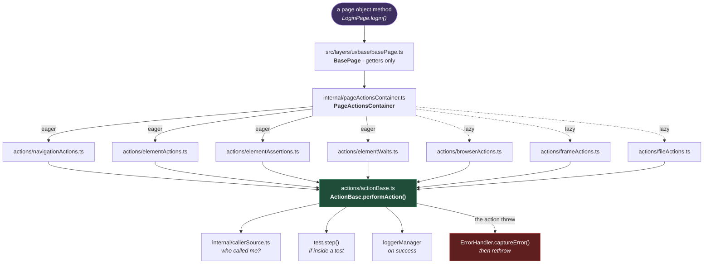

# Page Actions

**[← Back to Main Documentation](../../../README.md)**

This page explains the action layer: the code a page object calls instead of calling
Playwright directly. It lives in `src/layers/ui/base/`.

Everything here exists to answer one question — _what happened, and who asked for it?_ A
raw `await button.click()` that fails produces a Playwright error and nothing else: no log
line, no step in the report, and no indication of which page-object method was driving.
The action layer wraps every interaction so that all three come for free, and so that no
caller has to remember to arrange them.

## Table of Contents

- [The Shape Of The Layer](#the-shape-of-the-layer)
- [Every Action Goes Through performAction](#every-action-goes-through-performaction)
- [The Caller Names Itself, From The Stack](#the-caller-names-itself-from-the-stack)
  - [Two Functions, Opposite Directions](#two-functions-opposite-directions)
- [The Seven Action Classes](#the-seven-action-classes)
- [The Container, And Why Three Are Lazy](#the-container-and-why-three-are-lazy)
- [BasePage](#basepage)
- [Why FrameActions Is Not A Mirror](#why-frameactions-is-not-a-mirror)
- [Downloads](#downloads)
- [Practical Outcome](#practical-outcome)

## The Shape Of The Layer



**Why it is built this way.** Every one of the seven classes extends `ActionBase`, and
`ActionBase` has exactly one useful method. That is the whole design: the action classes
hold no error handling, no logging, and no reporting of their own — they describe _what to
do_ and hand it to `performAction`, which decides _what happens around it_.

The alternative — each class doing its own try/catch and its own logging — is the version
where six classes get it right and the seventh forgets, and nobody notices until a failure
in that one class produces a silent test.

## Every Action Goes Through performAction

`ActionBase.performAction`
([actionBase.ts:30-53](../../../src/layers/ui/base/internal/actions/actionBase.ts#L30-L53)) takes
the work as a callback and wraps four things around it:

| It does                 | Which means                                                        |
| ----------------------- | ------------------------------------------------------------------ |
| Resolves the caller     | From the stack, before the first `await`. See below.               |
| Opens a Playwright step | The report gains a nested, named, timed entry.                     |
| Logs on success         | Only if a `successMessage` was given.                              |
| Captures on failure     | `ErrorHandler.captureError(error, caller, …)` — **then rethrows.** |

The rethrow matters. `performAction` records the failure; it does not absorb it. The test
still fails, and Playwright still gets the error it needs for its own reporting and
retries. The one deliberate exception is `ElementWaits.isElementStateReached`, which
catches and returns `false` — because the _question it answers_ is a boolean, so a timeout
is an answer rather than an error.

The step wrapper is guarded rather than assumed
([actionBase.ts:66-85](../../../src/layers/ui/base/internal/actions/actionBase.ts#L66-L85)).
`test.step()` throws when there is no active test, so an action driven from a global setup,
a fixture, or a script would fail for reporting reasons alone. `isInsideTest()` probes with
`test.info()` — the only reliable check, since it throws under exactly the condition that
would make `test.step` throw — and skips the step when there is no test. Inside a test the
report gains structure; outside one, the action simply runs.

## The Caller Names Itself, From The Stack

`resolveCallerSource()` reads `new Error().stack`, walks down it, skips every frame inside
the action layer and every frame in `node_modules`, and returns the first name left — the
page-object method that actually asked for the action
([callerSource.ts:35-51](../../../src/layers/ui/base/internal/callerSource.ts#L35-L51)).

So a log line says `LoginPage.login`, not `clickElement`, and no caller ever passes its own
name in.

**Why it is built this way.** It used to. Every action took a hand-written
`callerMethodName` string, and nothing checked that string against reality — so it drifted.
The file's own header records the outcome: `verifyFileDownloaded` reported itself as
`assertFileDownloaded`, a method that no longer existed, and the error pointed at nothing.

A name the compiler cannot check is a name that will eventually lie. The stack cannot lie.

Two details are load-bearing:

- **The stack is read before the first `await`**
  ([actionBase.ts:37](../../../src/layers/ui/base/internal/actions/actionBase.ts#L37)). After an
  await, the caller's frame may be gone.
- **Windows paths are normalised first**
  ([callerSource.ts:41](../../../src/layers/ui/base/internal/callerSource.ts#L41)). Backslashes
  would make the `/base/internal/` layer check silently never match, and every action would
  resolve to its own name.

The optional `source` parameter on every public action is the escape hatch for when the
stack cannot answer — an action invoked from inside a callback, where the frame above is
machinery. It is also how a composite action attributes its parts correctly:
`hoverThenClick` resolves the caller once and threads it into both nested actions
([elementActions.ts:317-327](../../../src/layers/ui/base/internal/actions/elementActions.ts#L317-L327)),
so both report the page-object method rather than `hoverThenClick`.

### Two Functions, Opposite Directions

`callerSource.ts` exports two functions, and the difference is the reason both exist:

| Function                 | Answers                                        | Used by                                                                                                    |
| ------------------------ | ---------------------------------------------- | ---------------------------------------------------------------------------------------------------------- |
| `resolveCallerSource()`  | "Who called me?" — skips its own layer.        | An **action**, which wants the page object that asked.                                                     |
| `resolveCurrentMethod()` | "What am I?" — takes the frame directly above. | A **public method delegating to a private helper**, which wants its own name in the log, not the helper's. |

`LoginCoordinator` is the one caller of the second, and
[AUTHENTICATION.md](AUTHENTICATION.md) explains why.

## The Seven Action Classes

| Class               | Holds                                                                                                                                          |
| ------------------- | ---------------------------------------------------------------------------------------------------------------------------------------------- |
| `NavigationActions` | `navigateToUrl`, `reloadPage`, `goBack`/`goForward`, URL and title checks, `waitForURL`, `waitForPageLoad`.                                    |
| `ElementActions`    | `fillElement`, `clickElement`, `clearElement`, `selectOption`, check/uncheck, hover, double- and right-click, `dragTo`.                        |
| `ElementAssertions` | `getElementProperty`, `verifyElementState`, `isElementVisible`/`Editable`/`Checked`, counts, bounding boxes, class and attribute checks.       |
| `ElementWaits`      | `waitForElementState`, `isElementStateReached`, `waitForUIToStabilize`, `waitForFirstVisibleLocator`, `waitForAttributeValue`, `waitForClass`. |
| `BrowserActions`    | Tabs, cookies, dialogs, scrolling, `attachScreenshotToReport`.                                                                                 |
| `FrameActions`      | Frame resolution — see [below](#why-frameactions-is-not-a-mirror).                                                                             |
| `FileActions`       | Uploads and downloads.                                                                                                                         |

Two are worth singling out because they solve a problem rather than wrapping a call:

- **`waitForUIToStabilize`** polls an input's value until it has matched the expected
  keyword **four times in a row**
  ([elementWaits.ts:104-138](../../../src/layers/ui/base/internal/actions/elementWaits.ts#L104-L138)).
  It is for a field that a script rewrites after the page has settled: a single match can
  be the value in transit, and four consecutive matches is the assertion that it has
  stopped moving.
- **`waitForFirstVisibleLocator`** takes locator/result pairs, `or`s them into one locator,
  waits for any to appear, and returns the label of whichever did. It is how you wait on a
  fork — "created" versus "already exists" — without racing two independent waits.

## The Container, And Why Three Are Lazy

`PageActionsContainer` builds all seven and hands them out. Four are constructed eagerly;
three are behind lazy getters
([pageActionsContainer.ts:52-73](../../../src/layers/ui/base/internal/pageActionsContainer.ts#L52-L73)):

```ts
get browser(): BrowserActions {
  this._browser ??= new BrowserActions(this.page);
  return this._browser;
}
```

**Why it is built this way.** The container is constructed **per page**, and in a UI suite
that means per test. Navigation, elements, assertions and waits are used by essentially
every test, so building them up front costs nothing anyone would notice. Browser, frame and
file actions are used by a minority of tests — many suites touch an iframe or a download
never — and the lazy getter means those tests never pay for them.

`FileActions` is also the reason the container exists rather than each class being
new'd where needed: it needs an `ElementActions` to drive the file picker, so it is
constructed with the container's existing one
([pageActionsContainer.ts:71](../../../src/layers/ui/base/internal/pageActionsContainer.ts#L71))
rather than making a second.

## BasePage

`BasePage` is deliberately small. It holds the `page`, holds an `IPageActions`, and exposes
seven getters that forward to it. It has no locators, no methods, and no behaviour of its
own.

```ts
export class LoginPage extends BasePage {
  private readonly username = this.page.getByLabel("Username input");

  async login(credentials: Credentials): Promise<void> {
    await this.elementActions.fillElement(
      this.username,
      credentials.username,
      "Username input",
    );
  }
}
```

**Nothing extends it today.** `src/layers/ui/pages/` does not exist; the example above is
what the first page object will look like, not a file you can open.

The constructor takes an optional prebuilt container
([basePage.ts:22-25](../../../src/layers/ui/base/basePage.ts#L22-L25)), which is what makes a page
object testable in isolation — a fake `IPageActions` can be passed in, and the page object
never knows the difference.

Note what the getters do to `fillElement` in the example above: the element is named
`"Username input"`, and that string is in `DEFAULTMASKED_FIELDS`. `ElementActions.fillElement`
runs the value through `DataSanitizer.sanitizeFieldValue` before logging it
([elementActions.ts:43-46](../../../src/layers/ui/base/internal/actions/elementActions.ts#L43-L46)),
so the password reaches the log and the report as `********` while the real value reaches
the browser. [SANITIZATION.md](../../03-core/foundation/SANITIZATION.md) covers the mechanism.

## Why FrameActions Is Not A Mirror

`FrameActions` resolves frames. It does **not** have a `clickElementInFrame`, a
`fillElementInFrame`, or a frame twin of any element method.

It used to have twelve of them. Each one resolved a locator inside a frame and then
delegated straight to `ElementActions` — the resolution was the only real work, and the
rest was transcription. Worse, it meant every new element action needed a frame twin or the
frame API silently fell behind the page API.

The insight that removed them: **the element helpers never touch `this.page`.** They act on
whatever `Locator` they are handed. So a frame-scoped locator was all they ever needed:

```ts
const payButton = frame.elementIn("payment", "#submit");
await elementActions.clickElement(payButton, "Pay button");
```

Every element action, assertion and wait now works inside a frame, for free, and will
continue to as new ones are added.

`elementIn` is synchronous and lazy on purpose
([frameActions.ts:43-45](../../../src/layers/ui/base/internal/actions/frameActions.ts#L43-L45)): a
`FrameLocator` resolves nothing until it is used, so the frame does not have to exist yet.
The `page.frame({ name })` lookup it replaced returned `null` the instant it was called if
the iframe had not loaded, which made every frame interaction a race against the page.

## Downloads

`FileActions.executeDownload` ensures a `downloads/` directory exists, triggers the action,
waits for the download event, saves the file to a timestamped path, verifies it landed, and
returns a `DownloadResult`.

The path comes from `DownloadPathBuilder.createFilePath`
([downloadPathBuilder.ts:16-25](../../../src/layers/ui/base/internal/downloadPathBuilder.ts#L16-L25)),
which builds `downloads/<fileName>_<timestamp>.<ext>`. The timestamp is what stops a second
run of the same test overwriting the first run's evidence.

One line is easy to misread: `handleDownload` calls `download.delete()` after saving
([fileActions.ts:135](../../../src/layers/ui/base/internal/actions/fileActions.ts#L135)). That
deletes Playwright's **temporary** copy, not the saved file — the artifact has already been
written to `downloads/` by `saveAs`. Removing it means context teardown does not block on a
download that has already been processed.

## Practical Outcome

A page object calls `this.elementActions.clickElement(button, "Pay button")` and gets four
things it never asked for: a named step in the Playwright report, a log line on success, a
structured error attributed to the page-object method by name on failure, and a masked value
if what it typed was a secret. None of it can be forgotten at a call site, because none of
it is at the call site — it is in the one wrapper every action goes through.
