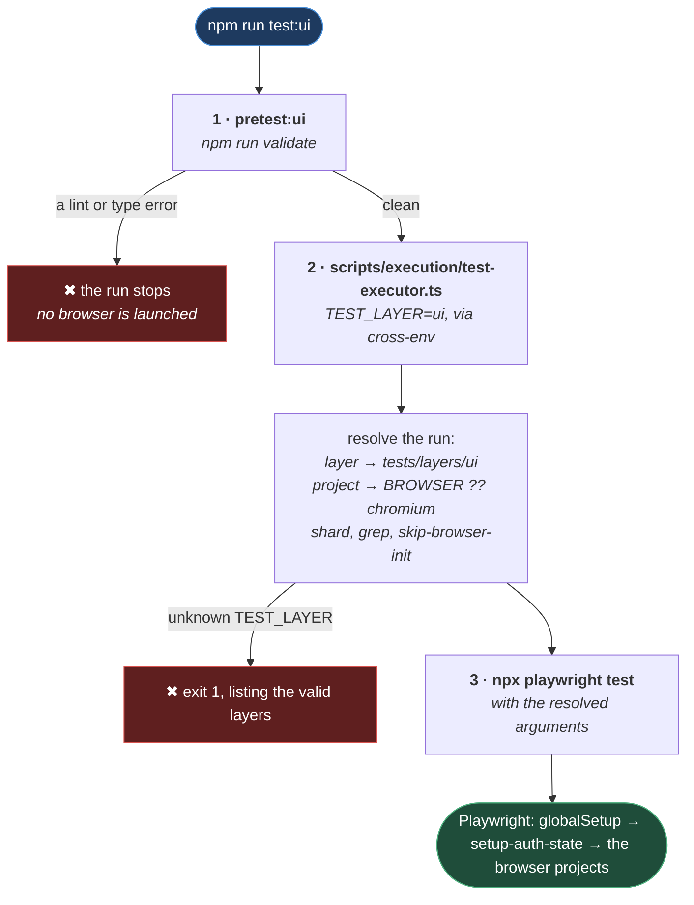

# Execution Commands

**[← Back to Commands](README.md)**

This page is the command reference for this repository: the quality commands, the test
commands, and every environment variable the framework reads at runtime.

It is the practical counterpart to
[03-core/execution/](../03-core/execution/README.md), which explains _how_ the run is
configured internally. This page is about what you type.

> **Nothing here has been run end to end.** `tests/` is empty — there is no spec and no
> `.setup.ts` file. Every command below is real and every flag is genuinely read by the code,
> but the suite they would execute does not exist yet. Treat this as a map, not a trail report.

## Table of Contents

- [Quality Commands](#quality-commands)
- [Test Commands](#test-commands)
- [What Happens When You Run test:ui](#what-happens-when-you-run-testui)
- [Execution Templates](#execution-templates)
- [Runtime Flags](#runtime-flags)
  - [ENV Forgives Case, Not Typos](#env-forgives-case-not-typos)
  - [WORKER_PERCENTAGE Fails Loudly](#worker_percentage-fails-loudly)
  - [SKIP_BROWSER_INIT Overrides The Layer](#skip_browser_init-overrides-the-layer)
  - [CI-Only Flags](#ci-only-flags)
- [Practical Outcome](#practical-outcome)

## Quality Commands

`validate` is the one to remember. It composes every check the repository has, and it is the
same gate CI runs:

```powershell
npm run validate
```

That runs `typecheck`, `lint`, `format:check`, `lint:md`, `verify:rules` and `verify:docs`, in
that order, stopping at the first failure. `npm run quality` and `npm run ci` are aliases of it.

To fix what can be fixed automatically:

```powershell
npm run fix
```

That runs `lint:fix` then `format`. `npm run quality:fix` is an alias.

The individual checks, when you want one on its own:

| Command                           | Does                                                         |
| --------------------------------- | ------------------------------------------------------------ |
| `npm run typecheck`               | `tsc --noEmit`                                               |
| `npm run lint` / `lint:fix`       | ESLint, zero warnings tolerated                              |
| `npm run format` / `format:check` | Prettier                                                     |
| `npm run lint:md`                 | markdownlint                                                 |
| `npm run verify:names`            | Filename conventions across the whole tree                   |
| `npm run verify:guards`           | Secrets, `.only`, `console.log`, conflict markers, file size |
| `npm run verify:rules`            | `alwaysApply: true` ⇔ imported by `CLAUDE.md`                |
| `npm run verify:docs`             | Every page linked from its folder's README                   |
| `npm run verify:msg`              | A commit message against the format rules                    |

`verify:names` and `verify:guards` are **not** part of `validate` — they run in the pre-commit
hook instead, where they can inspect staged files. See
[QUALITY_ARCHITECTURE.md](../02-tooling/QUALITY_ARCHITECTURE.md).

Set `NO_COLOR` to strip the colour from any validator's output — useful when piping it
somewhere that does not understand ANSI codes.

## Test Commands

| Command                      | Does                                                 |
| ---------------------------- | ---------------------------------------------------- |
| `npm run test:ui`            | Run the UI layer.                                    |
| `npm run test:api`           | Run the API layer. No browser is launched.           |
| `npm run test:db`            | Run the DB layer. No browser is launched.            |
| `npm run test:failed`        | Re-run only what failed last time (`--last-failed`). |
| `npm run ui`                 | Playwright's interactive UI mode.                    |
| `npm run debug`              | Playwright inspector, step by step.                  |
| `npm run codegen`            | Record a test by clicking through the app.           |
| `npm run report`             | Open Playwright's own HTML report.                   |
| `npm run ortoni-report`      | Serve the Ortoni report on the first free port.      |
| `npm run ortoni-report:stop` | Kill any Ortoni server left holding a port.          |

`test:api` and `test:db` will run, but there is nothing under `tests/layers/api/` or
`tests/layers/db/` for them to find — and no `src/layers/api/` either. The executor supports
those layers; the code does not exist yet.

The two report commands are the subject of
[REPORTING.md](../03-core/execution/REPORTING.md#serving-the-report).

## What Happens When You Run test:ui

More than you might expect. The npm script is one line, but there are three stages before
Playwright sees a test:



**Why it is built this way.** Stage 1 is the surprise: **`npm run test:ui` runs the full
`validate` gate first**, because npm executes a `pretest:ui` script automatically before
`test:ui`. A type error or a lint violation stops the run before a browser is launched.

That is deliberate. A test run against code that does not compile is a waste of several
minutes and produces a failure that says nothing about the application. Catching it in seconds,
before Playwright starts, is worth the delay — but it does mean that a run can "fail" without
a single test having executed, and the reason will be a lint message rather than an assertion.

Stage 2 is why there is an executor at all rather than a bare `npx playwright test`. It reads
the layer, maps it to a test directory, decides the project, translates `SHARD_INDEX`/`TEST_TAGS`
into Playwright's own flags, and resolves whether a browser is needed — then prints all of it
before it runs anything. The log block it prints is the fastest way to check that a flag you
passed was actually seen.

Extra arguments are forwarded. `npm run test:ui -- --grep @smoke` reaches Playwright unchanged.

## Execution Templates

Flags are passed with `cross-env` so they work identically in PowerShell, cmd and bash.

Run the UI suite against QA:

```powershell
npx cross-env ENV=qa npm run test:ui
```

Watch it happen, filtered to one tag:

```powershell
npx cross-env ENV=qa HEADED=true TEST_TAGS=@smoke npm run test:ui
```

Run on a different browser:

```powershell
npx cross-env ENV=qa BROWSER=firefox npm run test:ui
```

Give the run half the machine:

```powershell
npx cross-env ENV=qa WORKER_PERCENTAGE=50 npm run test:ui
```

## Runtime Flags

Every variable the framework reads when you run a test. Anything not listed here is not read by
anything.

| Flag                | Values                            | Default                | Sets                                                                    |
| ------------------- | --------------------------------- | ---------------------- | ----------------------------------------------------------------------- |
| `ENV`               | `dev` · `qa` · `uat` · `preprod`  | `dev`                  | Which `.env` file loads, and the console log level.                     |
| `BROWSER`           | `chromium` · `firefox` · `webkit` | `chromium`             | The Playwright project. Becomes `--project=<value>`.                    |
| `HEADED`            | `true` · `false`                  | `false`                | Whether you can see the browser.                                        |
| `TEST_TAGS`         | any `@tag`                        | none — everything runs | A `--grep` filter, and the report's title.                              |
| `WORKER_PERCENTAGE` | `10` · `25` · `50` · `75` · `100` | `10`                   | How much of the machine the run may use.                                |
| `SKIP_BROWSER_INIT` | `true` · `false`                  | by layer               | Removes the browser projects **and the login** from the run.            |
| `TEST_LAYER`        | `ui` · `api` · `db`               | `ui`                   | Which `tests/layers/<layer>/` runs. Set by the npm script, not by hand. |

Each of those is explained where it is implemented — `WORKER_PERCENTAGE` in
[WORKER_ALLOCATION.md](../03-core/execution/WORKER_ALLOCATION.md), `SKIP_BROWSER_INIT` in
[PLAYWRIGHT_PROJECTS.md](../03-core/execution/PLAYWRIGHT_PROJECTS.md#the-flag-that-empties-everything),
`TEST_TAGS` and the report title in [REPORTING.md](../03-core/execution/REPORTING.md), and the
`.env` files `ENV` selects in [LOADING.md](../03-core/environment/LOADING.md). This page does
not repeat those arguments.

What follows is only what the table cannot say: the three flags that **behave unexpectedly at
the command line**.

### ENV Forgives Case, Not Typos

**Case does not matter.** `ENV=QA`, `ENV=qa` and `ENV=Qa` are the same stage — the value is
trimmed and lower-cased before it is validated.

**A stage that does not exist stops the run.** `ENV=devv`, `ENV=staging`, `ENV=qa2` — all
rejected, at `globalSetup`, before a browser opens:

```text
Invalid ENV: "devv". Valid stages are: dev, qa, uat, preprod.
```

The two are treated differently on purpose. `QA` is unambiguous; `devv` is a typo, and a typo
that resolved to a default would be the worst outcome available — if an `envs/.env.dev`
happened to exist, the suite would **pass, against the wrong environment**, and nothing would
tell you. A false green is worse than a red.

`ENV` unset still means `dev`. So does an unrecognised `NODE_ENV`, which is _not_ rejected —
that variable belongs to other tooling, and a suite that refused to start because someone had
`NODE_ENV=development` exported would be failing on a variable that is none of its business.
[RESOLUTION.md](../03-core/environment/RESOLUTION.md#environmentdetector) has the full table.

In CI the pairing of `ENV` to the branch is enforced by the pipeline —
[BRANCHING_STRATEGY.md](../01-rules/BRANCHING_STRATEGY.md#environment-pairing).

### WORKER_PERCENTAGE Fails Loudly

The opposite behaviour, and worth knowing precisely because it differs from `ENV`: an invalid
value **stops the run**, listing the five it accepts. It is not clamped and not defaulted.

`WORKER_PERCENTAGE=1000` would otherwise allocate ten times the machine's cores, and
`WORKER_PERCENTAGE=0` would allocate none — a run that executes nothing and reports success.

### SKIP_BROWSER_INIT Overrides The Layer

You rarely set this: `npm run test:api` sets it for you. The precedence, when you do
([test-executor.ts:27-35](../../scripts/execution/test-executor.ts#L27-L35)):

1. An explicit `SKIP_BROWSER_INIT` wins.
2. Otherwise the layer decides — `ui` launches a browser, `api` and `db` do not.

`BROWSER` has no validation at all, by contrast. An unknown value is handed to Playwright,
which rejects it with its own "project not found" error listing the real ones — which is a
perfectly good error, so nothing here duplicates it.

### CI-Only Flags

Set by the pipeline, not typed by a human:

| Flag                          | Effect                                                                                                |
| ----------------------------- | ----------------------------------------------------------------------------------------------------- |
| `CI`                          | Doubles every timeout, switches the reporter to `blob`, enables retries, forbids `test.only`.         |
| `SHARD_INDEX` / `SHARD_TOTAL` | Splits the run. **Both** must be set or neither counts. Also gives the shard its own auth-state file. |
| `REPORTER_MERGE`              | Re-enters the config with no tests, to rebuild the human-readable reports from the shards' blobs.     |

You do not normally set `CI` yourself: `EnvironmentDetector` also recognises `GITHUB_ACTIONS`,
`GITLAB_CI`, `TRAVIS`, `CIRCLECI`, `JENKINS_URL` and `BITBUCKET_BUILD_NUMBER`. **The timeouts
are the exception** — they check the bare `CI` variable only, so on a runner that sets just
`JENKINS_URL` they would not scale
([TIMEOUTS.md](../03-core/execution/TIMEOUTS.md#the-multiplier)).

## Practical Outcome

Every flag that changes a run is an environment variable, passed the same way, listed in one
table. The executor prints what it resolved before it starts, so a flag that did not take
effect is visible in the first ten lines of output rather than inferred from a strange result.

The inputs that decide _which_ environment you are testing fail loudly rather than quietly: a
mis-cased `ENV` is understood, and an `ENV` naming no real stage stops the run by name. The one
thing that still surprises people is the `pretest` gate — a run can end before a single test
executes, with a lint message as the reason.
