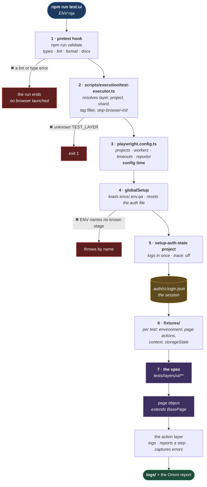

# Architecture

**[← Back to Main Documentation](../README.md)**

This page is the map of the **whole framework**: what actually happens between typing a command
and reading a report, which folder is responsible for each step, and which page documents it.

It exists because every other page is deliberately narrow. `03-core/DEPENDENCY_MAP.md` shows the
import graph of `src/` and nothing else. Each section README covers its own corner. Nothing
shows how the pieces meet — and the pieces meeting is the framework.

Read this first if you are new. Read the pages it points at when you need one.

## Table of Contents

- [The Seven Moving Parts](#the-seven-moving-parts)
- [What Happens When A Test Runs](#what-happens-when-a-test-runs)
- [Why The Order Is The Way It Is](#why-the-order-is-the-way-it-is)
- [Where Everything Is Documented](#where-everything-is-documented)
- [The Three Rules That Shape It](#the-three-rules-that-shape-it)
- [What Is Not Built Yet](#what-is-not-built-yet)
- [Practical Outcome](#practical-outcome)

## The Seven Moving Parts

| Folder                 | Is                                                            | Documented in                                                    |
| ---------------------- | ------------------------------------------------------------- | ---------------------------------------------------------------- |
| `scripts/execution/`   | The CLI that starts a run and resolves the flags.             | [05-commands/EXECUTION.md](05-commands/EXECUTION.md)             |
| `playwright.config.ts` | The run's shape: projects, workers, timeouts, reporters.      | [03-core/execution/](03-core/execution/README.md)                |
| `src/config/`          | Configuration the run needs: logger, environment, auth state. | [03-core/](03-core/README.md)                                    |
| `src/utils/`           | Machinery everything uses: errors, files, paths, sanitizing.  | [03-core/](03-core/README.md)                                    |
| `src/layers/ui/`       | The test-facing API: page actions, browser context, login.    | [04-layers/ui/](04-layers/ui/README.md)                          |
| `fixtures/`            | What each test is handed before its first line runs.          | [04-layers/ui/AUTHENTICATION.md](04-layers/ui/AUTHENTICATION.md) |
| `tests/`               | The specs. **Empty today.**                                   | —                                                                |

`scripts/quality/` is a separate concern entirely — it checks the code rather than running it,
and it is the subject of [02-tooling/](02-tooling/README.md).

## What Happens When A Test Runs

One command, seven stages, and three places it can stop before a browser ever opens.

**Why it is built this way.** The three red exits are the point of the diagram, not a footnote.
A framework that only draws its happy path teaches you nothing about the mornings you will
actually lose.

Each one fails _before_ the expensive thing:

- **Stage 1** stops a run against code that does not compile. A browser launched against a
  type error produces a failure that says nothing about the application.
- **Stage 2** stops an unknown layer immediately, listing the real ones.
- **Stage 4** stops an `ENV` that names no stage — `ENV=devv` — rather than falling back to a
  default and testing an environment you did not ask for. A green suite that ran somewhere else
  is a false signal, and a false signal is worse than a red one.

## Why The Order Is The Way It Is

Two orderings in that diagram are constraints, not choices, and both catch people out.

**Stage 3 happens before stage 4.** Playwright must read the config to discover that a global
setup exists at all — so at config time **no `.env` file has been loaded yet**. That is why
`playwright.config.ts` reads only real process variables (`CI`, `HEADED`, `SHARD_INDEX`) and
never `PORTAL_BASE_URL`. The rule that falls out of it:

> **Config time may read the process. Only test time may read the `.env` file.**

Anything needing a configured value belongs in a fixture. [03-core/environment/LOADING.md](03-core/environment/LOADING.md)
has the full sequence.

**Stage 5 happens before stage 7, and Playwright enforces it.** The browser projects declare
`dependencies: [setup-auth-state]`, so the login is not a convention that runs first — it is a
precondition the runner refuses to skip. If it fails, the browser projects do not run at all,
which is correct: every one of them would have failed anyway, and they would have failed
complaining about missing elements rather than about the login.

## Where Everything Is Documented

The fastest way to find the page from the file.

| Code                                                           | Page                                                                                       |
| -------------------------------------------------------------- | ------------------------------------------------------------------------------------------ |
| `src/config/logger/`                                           | [03-core/foundation/LOGGING.md](03-core/foundation/LOGGING.md)                             |
| `src/utils/sanitization/`                                      | [03-core/foundation/SANITIZATION.md](03-core/foundation/SANITIZATION.md)                   |
| `src/utils/error-handling/`                                    | [03-core/foundation/ERROR_HANDLING.md](03-core/foundation/ERROR_HANDLING.md)               |
| `src/utils/file-manager/`                                      | [03-core/utilities/FILE_MANAGERS.md](03-core/utilities/FILE_MANAGERS.md)                   |
| `src/utils/path-resolver/`                                     | [03-core/utilities/PATH_RESOLVERS.md](03-core/utilities/PATH_RESOLVERS.md)                 |
| `src/utils/shared/`                                            | [03-core/utilities/SHARED_UTILS.md](03-core/utilities/SHARED_UTILS.md)                     |
| `src/config/environment/`                                      | [03-core/environment/](03-core/environment/README.md) — three pages                        |
| `src/config/projects/`, `flags/`                               | [03-core/execution/PLAYWRIGHT_PROJECTS.md](03-core/execution/PLAYWRIGHT_PROJECTS.md)       |
| `src/config/runtime/workers/`                                  | [03-core/execution/WORKER_ALLOCATION.md](03-core/execution/WORKER_ALLOCATION.md)           |
| `src/config/authentication/`                                   | [03-core/execution/AUTHENTICATION_STORAGE.md](03-core/execution/AUTHENTICATION_STORAGE.md) |
| `src/config/timeouts/`                                         | [03-core/execution/TIMEOUTS.md](03-core/execution/TIMEOUTS.md)                             |
| `src/config/reports/`, `scripts/reports/`                      | [03-core/execution/REPORTING.md](03-core/execution/REPORTING.md)                           |
| `src/layers/ui/base/`                                          | [04-layers/ui/PAGE_ACTIONS.md](04-layers/ui/PAGE_ACTIONS.md)                               |
| `src/layers/ui/context/`                                       | [04-layers/ui/CONTEXT.md](04-layers/ui/CONTEXT.md)                                         |
| `src/layers/ui/authentication/`, `fixtures/`                   | [04-layers/ui/AUTHENTICATION.md](04-layers/ui/AUTHENTICATION.md)                           |
| `scripts/execution/`, the npm scripts                          | [05-commands/EXECUTION.md](05-commands/EXECUTION.md)                                       |
| `scripts/quality/`, `src/config/quality/`, `eslint.config.mjs` | [02-tooling/QUALITY_ARCHITECTURE.md](02-tooling/QUALITY_ARCHITECTURE.md)                   |
| Which module may import which                                  | [03-core/DEPENDENCY_MAP.md](03-core/DEPENDENCY_MAP.md)                                     |

## The Three Rules That Shape It

Everything above is a consequence of three decisions. If you understand these, the rest of the
framework stops being surprising.

**1. Dependencies point one way.** A module may import from the layers below it, never from the
layer above. The logger is at the bottom and imports nothing at runtime; the UI layer is at the
top and imports everything. That is why `EnvironmentResolver` reaches `LoginCoordinator` as a
constructor argument rather than an import.
[03-core/DEPENDENCY_MAP.md](03-core/DEPENDENCY_MAP.md) draws it.

**2. Failures are recorded once, in one shape.** Every `catch` in `src/` calls
`ErrorHandler.captureError`, which sanitizes the value, deduplicates it, and writes one
structured JSON entry. No call site has its own `try`/`catch` convention, and no secret reaches
a log — because masking happens on the way _out_, at the last possible moment.
[03-core/foundation/ERROR_HANDLING.md](03-core/foundation/ERROR_HANDLING.md).

**3. Configuration is data; mechanism is code.** The naming rules, the commit format, the
environment stages, the sanitized field names, the timeout values — each is a list in one file,
read by an executor that never changes. Adding a stage is one array entry, and every consumer
follows. [02-tooling/QUALITY_ARCHITECTURE.md](02-tooling/QUALITY_ARCHITECTURE.md) is the
worked example.

## What Is Not Built Yet

Stated plainly, because the diagram above draws stages that currently have nothing in them:

- **`tests/` is empty.** No spec. Stage 7 has no content.
- **No `.setup.ts` file exists**, so the `setup-auth-state` project matches nothing. Stage 5
  runs and passes without logging in — and the browser projects then read the empty `{}` auth
  state, so every test would run **signed out**, failing on missing elements with nothing saying
  the login never happened.
- **No page object exists.** `src/layers/ui/pages/` is not there, nothing extends `BasePage`,
  and the `LoginExecutor` interface has no implementation.

So the framework has never run end to end. Everything in `src/` is built and documented; what is
missing is the first spec, and the four steps to get there are the login page object, the setup
spec, a filled-in `envs/.env.qa`, and one assertion against a signed-in page.

## Practical Outcome

You can see the whole framework on one page: what runs, in what order, what stops it, and where
each part is written down. From here, every question has a next page — and the parts that do not
exist yet are named rather than drawn as though they do.
