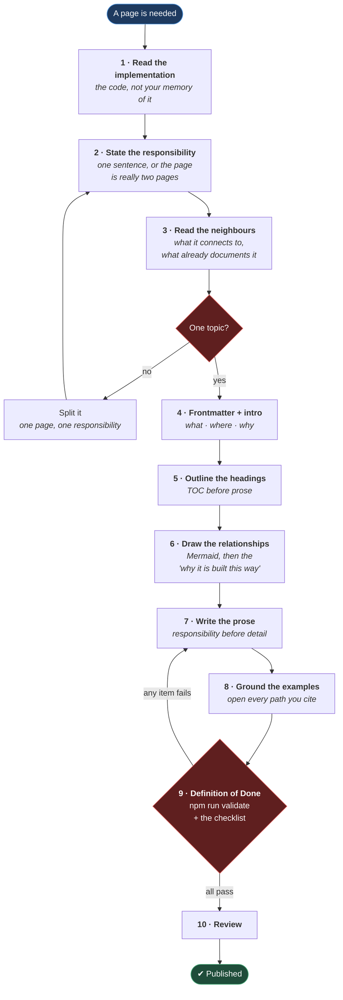

# Documentation Prompt Guide

**[← Back to Main Documentation](../README.md)**

This page is the documentation standard for this repository. It defines how a page
is produced, what shape it must have, and when it is allowed to be called finished.

It is written for three readers:

- contributors writing a page by hand
- contributors drafting a page with an AI assistant
- reviewers deciding whether a page is done

It is a standard, not a suggestion. Where a rule says **must**, a page that breaks
it is not finished, and part of the standard is enforced mechanically: the
pre-commit hook rejects a badly named document before it reaches a branch.

## Table of Contents

- [Why This Guide Exists](#why-this-guide-exists)
- [The Documentation Workflow](#the-documentation-workflow)
- [Page Structure](#page-structure)
- [Frontmatter](#frontmatter)
  - [When alwaysApply is true](#when-alwaysapply-is-true)
- [Heading Rules](#heading-rules)
- [Content Rules](#content-rules)
- [Writing Style](#writing-style)
- [File Naming](#file-naming)
  - [Executable Skills Are Not Documentation](#executable-skills-are-not-documentation)
- [Diagram Rules](#diagram-rules)
  - [Which Diagram Type To Use](#which-diagram-type-to-use)
  - [What Makes A Diagram Earn Its Place](#what-makes-a-diagram-earn-its-place)
- [What To Avoid](#what-to-avoid)
- [Page Template](#page-template)
- [Working With An AI Assistant](#working-with-an-ai-assistant)
  - [AI Rules](#ai-rules)
  - [How To Attach Files In Prompts](#how-to-attach-files-in-prompts)
  - [Prompt Template For Drafting A Page](#prompt-template-for-drafting-a-page)
  - [Prompt Template For Editing A Page](#prompt-template-for-editing-a-page)
- [Definition Of Done](#definition-of-done)
- [Practical Outcome](#practical-outcome)

## Why This Guide Exists

The documentation in `docs/` is deliberately repetitive in structure. That
consistency is what makes it scannable, maintainable, and trustworthy to someone
who has just joined — and it is what lets the docs grow without the tone or the
shape changing from page to page.

A style guide alone does not produce that. A style guide describes the finished
article and leaves every contributor to invent their own route to it, which is why
style guides drift. This guide therefore states three things instead of one:

- the **workflow** — how a page gets produced
- the **standard** — what the page must contain
- the **definition of done** — what must be true before it is finished

The parts that can be checked by a machine are checked by a machine. The rest is
checked against the [Definition Of Done](#definition-of-done) before review.

## The Documentation Workflow

A page is written in this order. The order is not arbitrary: the first three steps
are all reading, because the single most common failure in documentation is a page
that is fluent, well-structured, and describes something the repository does not do.



**Why it is built this way.** Reading comes before writing because a documentation
page is a claim about the repository, and an unverified claim is worse than no page
at all — a missing page sends the reader to the code, while a wrong page sends them
somewhere confidently and leaves them there. Step 8 is separate from step 7 for the
same reason: grounding the examples is a distinct pass in which every path you have
written down gets opened, not a thing you trust yourself to have done correctly
while writing prose.

The two loops back into earlier steps are the load-bearing part. A page that turns
out to cover two topics goes back to step 2 and gets split, and a page that fails a
single item of the definition of done goes back to step 7. Neither is a formality
that can be waived because the page "looks finished".

## Page Structure

**Every page under `docs/` must follow this shape.** A page that departs from it
must say why in its own introduction:

1. Frontmatter
2. `#` title
3. Back link to the main README
4. Short introduction
5. `## Table of Contents`
6. Main sections, in reading order
7. A closing outcome or summary section

The introduction must answer three questions:

- **what** this page covers
- **where** the code it describes lives
- **why** the topic matters

## Frontmatter

**Every page under `docs/` must open with frontmatter carrying exactly three keys,
in this order:**

```yaml
---
name: quality-architecture
description: How the quality tooling fits together — policy as data in src/config/, executors in scripts/, and the gates that enforce it.
alwaysApply: false
---
```

- **`name`** — kebab-case, naming the topic. Not the filename.
- **`description`** — one sentence saying what the page covers and why someone
  would open it. Write it so that a reader who sees only this line knows whether
  the page answers their question. It is a summary, not the title restated.
- **`alwaysApply`** — **`false` by default.**

Do not add further keys. A `version` or `lastReviewed` field is tempting and should
be resisted: git already records when a page changed and who changed it, and a
hand-maintained review date is wrong the first time someone forgets to update it —
at which point it is worse than absent, because it is now a false assurance that
the page is current.

### When alwaysApply is true

Set `alwaysApply: true` only for a page that must govern **every** interaction —
the branching strategy, the commit workflow, the task-planning rule. Those are
standing rules rather than reference material, and **every one of them lives in
`docs/03-rules/`**, with no exceptions.

Everything else is `false`. A reference page is something you go and read when you
need it; marking it always-apply claims it must be obeyed at all times, which for
an architecture overview or a style guide is simply untrue.

The default is `false` because the cost is asymmetric. A reference page wrongly
marked `true` is noise on every task; a rule wrongly marked `false` is a rule that
quietly stops being one. Neither is good, but the first is the failure you will
actually notice.

> **`alwaysApply` is inert on its own.** No tool reads the key. What actually puts
> a rule in front of Claude Code is an `@import` line in `CLAUDE.md` at the
> repository root — so a rule is in force when it is imported there, and nowhere
> else.

The two must agree, and `scripts/quality/validate-always-apply.mjs` enforces that
they do, in both directions:

```text
alwaysApply: true   ⟺   imported by CLAUDE.md
```

Declared but not imported is a rule nothing obeys. Imported but not declared is a
document silently governing every session. Both fail `npm run verify:rules`, which
runs as part of `npm run validate`.

## Heading Rules

Use a predictable hierarchy:

- `#` for the page title, once
- `##` for main sections
- `###` for subsections
- `####` only when the page genuinely needs a fourth level

**The Table of Contents must match the real heading structure**, at the levels the
page actually uses. It must not flatten `###` into `##`, and it must not list a
heading the page does not have.

Headings must be descriptive. Prefer `## Why This Layer Exists`, `## Main Files`,
`## Practical Outcome`. Never `## Notes`, `## Misc`, or `## Other` — a heading that
does not say what is under it is a heading a reader has to open to evaluate.

## Content Rules

When documenting a topic:

- state the framework role before the implementation detail
- explain the responsibility before showing an example
- explain the connections, not only the isolated file
- use real paths and filenames, and open each one before citing it
- keep every example grounded in the repository as it exists today

A good page answers these questions:

- what is this
- why is it here
- what files are involved
- how does it work
- what does it connect to
- why should a contributor care

**Be honest about scope.** If an area is planned but not built, say so plainly.
Describing an aspiration in the present tense is the one documentation failure that
cannot be recovered from by reading further, because nothing in the page tells the
reader they have been misled.

## Writing Style

Clear, direct, calm, instructional, specific to this framework. Short paragraphs.
Simple sentences over dense ones. Bullet lists for responsibilities, files, rules,
and examples.

Useful phrasings:

- "This page explains…"
- "This group contains…"
- "This is useful because…"
- "The flow works like this…"

Language to avoid entirely: "best-in-class", "powerful", "robust", "seamless",
"leverage". Framework docs are not marketing copy, and an adjective that could be
applied to any project carries no information about this one.

Use one term for one concept, for the whole page and across pages. If the tooling
calls it a _guard_, the documentation calls it a guard — not a check, a hook, or a
validator.

## File Naming

**Naming is not defined here.** Every filename and folder rule in the repository —
including the ones for documents and skill docs — lives in
[CONVENTIONS.md](03-rules/CONVENTIONS.md), and is enforced by `.husky/pre-commit`.
Check a name with `npm run verify:names`.

The short version, for a page you are about to create: **UPPERCASE with
underscores** (`QUALITY_ARCHITECTURE.md`), and a page documenting a skill takes the
`_SKILL` suffix (`REFACTOR_SKILL.md`, never a bare `SKILL.md`).

What matters _here_ is the distinction those rules rest on.

### Executable Skills Are Not Documentation

An **executable** skill — one Claude Code actually runs — lives at
`.claude/skills/<name>/SKILL.md`, and that filename is mandatory: Claude Code
discovers skills by looking for exactly it.

The two are told apart by their **content**, not their location:

|              | Executable skill                       | Documentation page                   |
| ------------ | -------------------------------------- | ------------------------------------ |
| Lives at     | `.claude/skills/<name>/SKILL.md`       | `docs/**/NAME.md`                    |
| Addressed to | a model                                | a human                              |
| Frontmatter  | `name`, `description`, `argument-hint` | `name`, `description`, `alwaysApply` |
| Contains     | instructions, often `$ARGUMENTS`       | prose, diagrams, examples            |

**None of the rules in this guide apply to an executable skill** — not the title,
the back link, the table of contents, or the diagrams. Every one of them would be
fed to the model as part of the prompt, where it is at best noise.

Supporting documents that sit _beside_ a skill are ordinary docs and take the plain
UPPERCASE form.

## Diagram Rules

**Every page that describes a relationship must show it as a Mermaid diagram.**

Prose is good at explaining why something exists and bad at explaining what connects
to what. A dependency between four files is either a paragraph the reader has to
hold in their head, or a picture they can look at. When a page describes how things
relate, the diagram is not decoration — it is the primary content, and the prose
explains it.

A diagram is required whenever a page covers:

- a chain of files where one feeds the next (policy → mechanism → gate)
- an execution order that can be got wrong (what runs before what, and why)
- two things that overlap, where a reader would reasonably ask why both exist
- a layer boundary (what each layer may and may not see)

**Do not add a diagram to a page documenting a single file in isolation.** A box
with no arrows is noise.

### Which Diagram Type To Use

So that two pages describing the same kind of relationship look the same:

| The page describes                          | Use                              | Reference                                                       |
| ------------------------------------------- | -------------------------------- | --------------------------------------------------------------- |
| An ordered path that can fail               | `flowchart TD`                   | The commit path, §2 of `docs/01-config/QUALITY_ARCHITECTURE.md` |
| Layers and what crosses between them        | `graph TD` with `subgraph`       | The layers, §1 of `QUALITY_ARCHITECTURE.md`                     |
| Two things that look duplicated but are not | `graph LR`                       | ESLint vs. the guards, §4 of `QUALITY_ARCHITECTURE.md`          |
| A promotion or hand-off chain               | `graph LR`                       | `docs/03-rules/BRANCHING_STRATEGY.md`                           |
| A decision with distinct outcomes           | `flowchart TD` from a `{ }` node | Skipping a test, §8 of `QUALITY_ARCHITECTURE.md`                |

`docs/01-config/QUALITY_ARCHITECTURE.md` is the reference implementation. Copy its
patterns rather than inventing a new visual language.

### What Makes A Diagram Earn Its Place

- **Label every node with the real file path**, not an abstraction.
- **Draw the failure edges, not only the happy path.** A gate that can reject is a
  gate whose rejections belong in the picture — the rejection is the reason the gate
  exists.
- **Follow every diagram with a "Why it is built this way" paragraph.** A diagram
  that shows structure without explaining the reasoning is half a page. This is the
  rule most often skipped and the one that matters most: structure without rationale
  is exactly the documentation that gets confidently "simplified" by the next person.
- **One idea per diagram.** Several small diagrams beat one large one.

## What To Avoid

Do not:

- write documentation so generic it could describe any project
- dump a large code block where a short explanation would do
- explain the code without explaining why it matters
- mix unrelated topics into one page
- use inconsistent terminology for one concept
- promise behaviour the framework does not actually have
- rewrite a whole documentation tree when one page needs work

The last one deserves emphasis. Prefer the smallest useful improvement that brings
a page in line with this standard. A large rewrite is hard to review, which means
it gets approved rather than read.

## Page Template

```md
---
name: page-topic
description: One sentence saying what this page covers and why someone would open it.
alwaysApply: false
---

# Page Title

**[← Back to Main Documentation](../../README.md)**

This page explains…

## Table of Contents

- [Section One](#section-one)
- [Section Two](#section-two)
  - [Subsection](#subsection)
- [Practical Outcome](#practical-outcome)

## Section One

The responsibility, before the detail.

## Section Two

The structure, the flow, or the rules — with a Mermaid diagram if this section
describes a relationship, followed by why it is built that way.

### Subsection

Examples, grouped files, or a focused breakdown.

## Practical Outcome

What this part of the framework gives a contributor.
```

Adjust the relative `README.md` path to the file's depth: `../README.md` from
`docs/`, and `../../README.md` from `docs/01-config/` or `docs/03-rules/`.

## Working With An AI Assistant

### AI Rules

An AI assistant drafting or editing documentation in this repository must follow
these rules. They are not stylistic preferences — each one names a failure mode
that AI-drafted documentation reliably produces.

**Always:**

- read the implementation before writing about it
- read the existing pages first, and reuse their terminology
- prefer extending a page over rewriting it
- preserve the existing structure where it already works
- explain why something exists before explaining how it works
- keep every example consistent with the current repository
- draw every relationship as a Mermaid diagram, and explain the reasoning under it
- state plainly when an area is planned rather than built

**Never:**

- invent a file, a directory, or a path — open it, or do not cite it
- describe a planned feature as though it were implemented
- introduce a new term for a concept the repository already names
- pad a page with a section that has nothing to say
- produce a large rewrite when a small edit was asked for

The first "never" is the important one, and it is not hypothetical: an earlier
version of this very guide illustrated its examples with `src/layers/ui/pages/`,
`fixtures/test.fixture.ts`, and `docs/framework/02-rules/`, none of which have ever
existed in this repository. A page that instructs the reader to use real paths while
citing invented ones teaches the invented ones, because examples are what people
copy.

### How To Attach Files In Prompts

Always attach the relevant files before asking a question. Without them the
assistant answers from general knowledge rather than from this framework's actual
rules, and cannot check whether the code already follows the pattern it is being
asked about.

**Reference a file with `@`, and nothing else.** One syntax, everywhere — in a
prompt, and in a `CLAUDE.md` import line:

```text
@docs/03-rules/COMMIT_MESSAGES.md write a commit message for the changes in @src/config/quality/naming.mjs
```

```text
@docs/DOCUMENTATION_PROMPT_GUIDE.md does @docs/01-config/QUALITY_ARCHITECTURE.md meet the definition of done?
```

Several files can be attached at once:

```text
@docs/01-config/QUALITY_ARCHITECTURE.md @src/config/quality/guards.mjs I want to add a guard for hardcoded URLs — where does it belong, and what else has to change?
```

`@` is the real mechanism: it loads the file, and in `CLAUDE.md` it is the line
`scripts/quality/validate-always-apply.mjs` parses to decide which standing rules are
actually in force. Do **not** invent a wrapper tag for a path — an
`<filepath>…</filepath>` around a path is ordinary text that loads nothing, and it
reads as a mechanism while behaving like a decoration.

Everywhere else a path appears, the rule is:

| Where                              | Write it as                                 |
| ---------------------------------- | ------------------------------------------- |
| A prompt, or a `CLAUDE.md` import  | `@docs/03-rules/CONVENTIONS.md`             |
| A link between documentation pages | `[CONVENTIONS.md](03-rules/CONVENTIONS.md)` |
| A file named in prose              | `` `src/config/quality/naming.mjs` ``       |

If MCP servers are connected, `@server:resource` pulls in external data; the exact
form depends on the server.

### Prompt Template For Drafting A Page

```text
Write a Markdown documentation page for this Playwright automation framework.

Read these first, and follow them:
@docs/DOCUMENTATION_PROMPT_GUIDE.md
@docs/01-config/QUALITY_ARCHITECTURE.md

Rules:
- Open with frontmatter: name (kebab-case), description (one sentence), alwaysApply: false.
  Only a standing rule that must govern every interaction sets alwaysApply: true, and it
  must also be @imported by CLAUDE.md.
- Title, back link to the README, short introduction saying what the page covers, where the
  code lives, and why it matters.
- A Table of Contents that matches the real heading levels.
- Explain what the area is, why it exists, how it is structured, and what it connects to.
- Draw every relationship as a Mermaid diagram, using the diagram type the guide specifies.
  Label nodes with real file paths, draw the failure branches as well as the happy path, and
  follow each diagram with a paragraph explaining why it is built that way.
- Do not add a diagram to a page that documents one file in isolation.
- Never cite a path you have not opened. If an area is planned rather than built, say so.
- Name the file in UPPERCASE_WITH_UNDERSCORES.md. A page documenting a skill is NAME_SKILL.md.
- End with a Practical Outcome section.

Before finishing, check the page against the Definition Of Done in the guide.

Topic:
[insert topic]

Files to read:
[insert real paths]

Constraints:
[insert constraints]
```

### Prompt Template For Editing A Page

```text
@docs/DOCUMENTATION_PROMPT_GUIDE.md @[the page]

Bring this page in line with the documentation standard.

- Make the smallest useful change. Do not rewrite what already works.
- Keep the existing structure and terminology.
- Verify every path the page cites actually exists, and fix the ones that do not.
- Tell me what you changed and why, before changing it.
```

## Definition Of Done

A page is finished when every item below is true. Not "mostly" — a page failing one
item goes back to step 7 of the workflow.

**Checked by `npm run validate`:**

- `npm run lint:md` passes — markdown structure is valid
- `npm run format:check` passes — Prettier is satisfied
- `npm run verify:names` passes — the filename matches the enforced pattern
- `npm run verify:rules` passes — `alwaysApply` and `CLAUDE.md` agree

**Checked by you:**

- ✓ Frontmatter carries exactly `name`, `description`, `alwaysApply`, in that order
- ✓ `alwaysApply: false` unless the page is a standing rule that `CLAUDE.md` imports
- ✓ The back link resolves from this page's actual depth
- ✓ Every heading appears in the Table of Contents, at the right level
- ✓ Every heading says what is under it
- ✓ **Every file path in the page has been opened and exists**
- ✓ Every example reflects the repository as it is today, not as it is planned
- ✓ Every relationship the page describes is drawn as a Mermaid diagram
- ✓ Every diagram is followed by why it is built that way
- ✓ Every diagram labels its nodes with real paths and draws its failure edges
- ✓ One term per concept, consistent with the rest of `docs/`
- ✓ Nothing is duplicated from another page that could have been linked instead
- ✓ The page covers one topic
- ✓ A new contributor could read it and act on it without opening the code first

The bolded item is the one that fails most often and matters most. A page whose
prose is excellent and whose paths are invented is worse than no page: it is
confidently wrong, and confidence is what the reader is relying on.

## Practical Outcome

Following this guide produces documentation that reads as one coherent manual
rather than a collection of unrelated writing, and — more importantly — documentation
whose claims are true.

The standard is enforced where it can be. The filename patterns, the frontmatter
contract, and the standing-rule invariant are all checked by the pre-commit hook, so
they cannot quietly rot. The rest — the honesty of an example, the reasoning under a
diagram — is checked by the definition of done, which is why the definition of done
is a gate rather than a suggestion.
